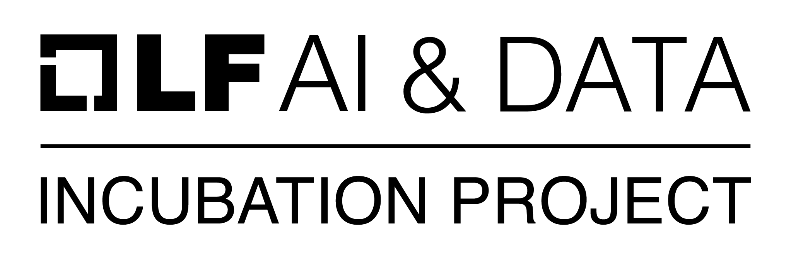
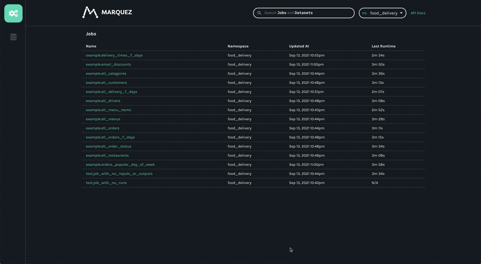

<div align="center">
  
  <a href="https://lfaidata.foundation/projects">
    
  </a>
</div>

Marquez is an open source **metadata service** for the **collection**, **aggregation**, and **visualization** of a data ecosystem's metadata. It maintains the provenance of how datasets are consumed and produced, provides global visibility into job runtime and frequency of dataset access, centralization of dataset lifecycle management, and much more. Marquez was released and open sourced by [WeWork](https://www.wework.com).

## Badges

[](https://circleci.com/gh/MarquezProject/marquez/tree/main)
[](https://codecov.io/gh/MarquezProject/marquez/branch/main)
[](#status)
[](http://bit.ly/MarquezSlack)
[](https://raw.githubusercontent.com/MarquezProject/marquez/main/LICENSE)
[](CODE_OF_CONDUCT.md)
[](https://search.maven.org/search?q=g:io.github.marquezproject)
[](https://hub.docker.com/r/marquezproject/marquez)
[](https://snyk.io/test/github/MarquezProject/marquez)
[](https://bestpractices.coreinfrastructure.org/projects/5160)

## Status

Marquez is an [LF AI & Data Foundation](https://lfaidata.foundation/projects/marquez) incubation project under active development and we'd love your help!

## Adopters

Want to be added? Send a pull request our way!

* [Astronomer](https://astronomer.io)
* [Datakin](https://datakin.com)
* [Northwestern Mutual](https://www.northwesternmutual.com)

## Try it!

[](https://gitpod.io/#https://github.com/MarquezProject/marquez)

## Quickstart

Marquez provides a simple way to collect and view _dataset_, _job_, and _run_ metadata using [OpenLineage](https://openlineage.io). The easiest way to get up and running is with Docker. From the base of the Marquez repository run:

```
$ ./docker/up.sh
```

> **Tip:** Use the `--build` flag to build images from source, and/or `--seed` to start Marquez with sample lineage metadata. For a more complete example using the sample metadata, please follow our [quickstart](https://marquezproject.github.io/marquez/quickstart.html) guide.

> **Note:** Port 5000 is now reserved for MacOS. If running locally on MacOS, you can run `./docker/up.sh --api-port 9000` to configure the API to listen on port 9000 instead. Keep in mind that you will need to update the URLs below with the appropriate port number.

**`WEB UI`**

You can open [http://localhost:3000](http://localhost:3000) to begin exploring the Marquez Web UI. The UI enables you to discover dependencies between jobs and the datasets they produce and consume via the lineage graph, view run metadata of current and previous job runs, and much more!

<p align="center">
  
</p>

**`HTTP API`**

The Marquez [HTTP API](https://marquezproject.github.io/marquez/openapi.html) listens on port `5000` for all calls and port `5001` for the admin interface. The admin interface exposes helpful endpoints like `/healthcheck` and `/metrics`. To verify the HTTP API server is running and listening on `localhost` browse to [http://localhost:5001](http://localhost:5001). To begin collecting lineage metadata as OpenLineage events, use the [LineageAPI](https://marquezproject.github.io/marquez/openapi.html#tag/Lineage/paths/~1lineage/post), or an OpenLineage [integration](https://openlineage.io/integration).

> **Note:** By default, the HTTP API does not require any form of authentication or authorization.

**`GRAPHQL`**

To explore metadata via graphql, browse to [http://localhost:5000/graphql-playground](http://localhost:5000/graphql-playground). The graphql endpoint is currently in _beta_ and is located at [http://localhost:5000/api/v1-beta/graphql](http://localhost:5000/api/v1-beta/graphql).

## Documentation

We invite everyone to help us improve and keep documentation up to date. Documentation is maintained in this repository and can be found under [`docs/`](https://github.com/MarquezProject/marquez/tree/main/docs).

> **Note:** To begin collecting metadata with Marquez, follow our [quickstart](https://marquezproject.github.io/marquez/quickstart.html) guide. Below you will find the steps to get up and running from source.

## Modules

Marquez uses a _multi_-project structure and contains the following modules:

* [`api`](https://github.com/MarquezProject/marquez/tree/main/api): core API used to collect metadata
* [`web`](https://github.com/MarquezProject/marquez/tree/main/web): web UI used to view metadata
* [`clients`](https://github.com/MarquezProject/marquez/tree/main/clients): clients that implement the HTTP [API](https://marquezproject.github.io/marquez/openapi.html)
* [`chart`](https://github.com/MarquezProject/marquez/tree/main/chart): helm chart

> **Note:** The `integrations` module was removed in [`0.21.0`](https://github.com/MarquezProject/marquez/blob/main/CHANGELOG.md#removed), please use an OpenLineage [integration](https://openlineage.io/integration) to easily collect lineage events.

## Requirements

* [Java 17](https://adoptium.net)
* [PostgreSQL 12.1](https://www.postgresql.org/download)

> **Note:** To connect to your running PostgreSQL instance, you will need the standard [`psql`](https://www.postgresql.org/docs/9.6/app-psql.html) tool.

## Building

To build the entire project run:

```bash
./gradlew build
```

The executable can be found under `api/build/libs/`

## Configuration

To run Marquez, you will have to define `marquez.yml`. The configuration file is passed to the application and used to specify your database connection. The configuration file creation steps are outlined below.

### Step 1: Create Database

When creating your database using [`createdb`](https://www.postgresql.org/docs/12/app-createdb.html), we recommend calling it `marquez`:

```bash
$ createdb marquez
```

### Step 2: Create `marquez.yml`

With your database created, you can now copy [`marquez.example.yml`](https://github.com/MarquezProject/marquez/blob/main/marquez.example.yml):

```
$ cp marquez.example.yml marquez.yml
```

You will then need to set the following environment variables (we recommend adding them to your `.bashrc`): `POSTGRES_DB`, `POSTGRES_USER`, and `POSTGRES_PASSWORD`. The environment variables override the equivalent option in the configuration file.

By default, Marquez uses the following ports:

* TCP port `8080` is available for the HTTP API server.
* TCP port `8081` is available for the admin interface.

> **Note:** All of the configuration settings in `marquez.yml` can be specified either in the configuration file or in an environment variable.

## Running the [HTTP API](https://github.com/MarquezProject/marquez/blob/main/src/main/java/marquez/MarquezApp.java) Server

```bash
$ ./gradlew :api:runShadow
```
Marquez listens on port `8080` for all API calls and port `8081` for the admin interface. To verify the HTTP API server is running and listening on `localhost` browse to [http://localhost:8081](http://localhost:8081). We encourage you to familiarize yourself with the [data model](https://marquezproject.github.io/marquez/#data-model) and [APIs](https://marquezproject.github.io/marquez/openapi.html) of Marquez. To run the web UI, please follow the steps outlined [here](https://github.com/MarquezProject/marquez/tree/main/web#development).

> **Note:** By default, the HTTP API does not require any form of authentication or authorization.

## Related Projects

* [`OpenLineage`](https://github.com/OpenLineage/OpenLineage): open standard for metadata and lineage collection

## Getting Involved

* Website: https://marquezproject.ai
* Source: https://github.com/MarquezProject/marquez
* Chat: [https://marquezproject.slack.com](http://bit.ly/MarquezSlack)
* Twitter: [@MarquezProject](https://twitter.com/MarquezProject)

## Contributing

See [CONTRIBUTING.md](https://github.com/MarquezProject/marquez/blob/main/CONTRIBUTING.md) for more details about how to contribute.
