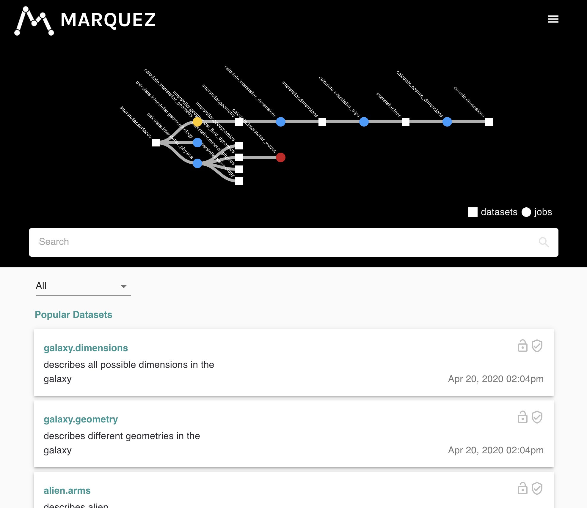

# Marquez Web UI

[](https://circleci.com/gh/MarquezProject/marquez-web/tree/master)
[](#status)
[](https://gitter.im/marquez-project/community)
[](https://raw.githubusercontent.com/MarquezProject/marquez/master/LICENSE)
[](https://hub.docker.com/r/marquezproject/marquez-web)

Marquez is an open source **metadata service** for the **collection**, **aggregation**, and **visualization** of a data ecosystem's metadata.

This web UI is used to view metadata collected and cataloged by [Marquez](https://github.com/MarquezProject/marquez).

<figure align="center">
  
</figure>

### Status

This project is under active development at [WeWork](https://www.we.co) (in collaboration with many others organizations).

### Requirements

To develop on this project, you need to have Node version 10.16.3 installed. In order to easily switch between node versions, we recommend using node version manager like [nvm](https://github.com/nvm-sh/nvm/blob/master/README.md)

### Development

1. Install dependencies:

   ```
   $ npm install
   ```

2. Run webpack (with development server):

   ```
   $ npm run dev
   ```

### Running with [Docker](./Dockerfile)

1. Build image:

   ```
   $ docker build -t marquez-web .
   ```

2. Run image:

   ```
   $ docker run -p 3000:3000 -d marquez-web
   ```

You can open http://localhost:3000 to begin exploring the web UI.

### Testing

1. Run tests in watch mode:

   ```
   $ npm run test-watch
   ```

2. Run all tests:

   ```
   $ npm run test
   ```

### Deployment

(to-do)

### Testing Setup

- [Jest](https://jestjs.io/en/) is our testing framework. It is the test runner; it provides testing language (describe, it, beforeEach), mocking, snapshot, code coverage.
- [Enzyme](https://github.com/airbnb/enzyme) - testing utility for testing React components. Provides methods for (mock) rendering components & DOM traversal.
- run tests by doing `yarn run test`
- config files:
  - jest.config.js
  - setupEnzyme.ts
- For testing Redux Sagas, we are using `Redux Saga Test Plan`. This library gives us both unit testing and integration test functionality. Check out the [docs](http://redux-saga-test-plan.jeremyfairbank.com/).

### Typescript

This project is written in typescript because it is awesome. See [tsconfig.json](tsconfig.json) for our setup.

Our types are defined in the `src/types` folder

#### Linting

This project uses [ESLint with TypeScript support](https://github.com/typescript-eslint/typescript-eslint).

If you have not already done so, you should [setup eslint with your editor of choice](https://eslint.org/docs/user-guide/integrations)

You can add / edit the linting rules within the [eslintrc.js](eslintrc.js) file.

### Prettifying

We are using [Prettier](https://prettier.io/docs/en/install.html) to ensure uniform code style / formatting. Specifically, we are [using ESLint to run Prettier](https://prettier.io/docs/en/integrating-with-linters.html).

1. Please set up [Prettier integration](https://prettier.io/docs/en/editors.html) with your editor of choice. (Also, be sure to disable any other prettifier, like HookyQR's Beautify tool, for this workspace.)

2. Ensure that your editor formats on save.

3. See [.prettierrc.js](.prettierrc.js) for our Prettier settings. See information on configuration settings [here](https://prettier.io/docs/en/configuration.html)

### Iconography:

We are leveraging [Material UI's SvgIcon components](https://material-ui.com/components/icons/#svg-icons)

Specifically, we are using Icons to represent tags on datasets. In order to customize your app's badges, you can edit `src/config/tag-to-badge.tsx`

### Seeding data

Mock data can be found in the `docker/db/data` folder.
Feel free to edit the mock data if you like. (Grant worked really hard on making it pretty.)

#### Logging

We are using [Rollbar](https://rollbar.com/WeWork/Marquez-UI/) for front-end logging.

If you are also using Rollbar, be sure to add your Rollbar config as the first `<script/>` in `<head></head>` of `index.prod.html`. (See [Rollbar docs](https://docs.rollbar.com/docs/browser-js) for more info)

If you are NOT using Rollbar, be sure to change the global `__ROLLBAR__` variable in `webpack.prod.js` to `JSON.stringify(false)` (this will disable any functionality in the `createRollbarMessage` function in `src/helpers`)

#### Customization

We encourage you to make Marquez your own! Feel free to change styles, add new components, etc.

To get feedback on your customized version of Marquez, update the **FEEDBACK_FORM_URL** variable in the "plugins" section of `./webpack.prod.js`

### Contributing

See [CONTRIBUTING.md](https://github.com/MarquezProject/marquez-web/blob/master/CONTRIBUTING.md) for more details about how to contribute.
