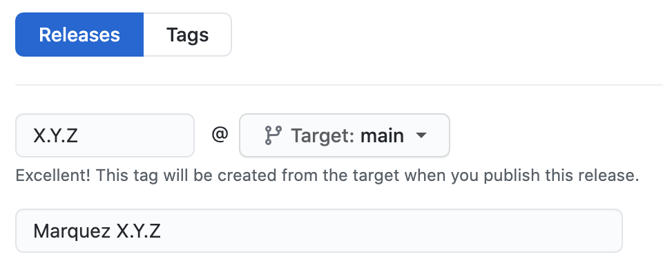

# Releasing

1. Update [`CHANGELOG.md`](CHANGELOG.md)
2. Update [_Versions and OpenLineage Compatibility_](https://github.com/MarquezProject/marquez/blob/main/README.md#versions-and-openlineage-compatibility) following compatibility guidelines
3. Make sure you've installed the required dependencies (see [`new-version.sh`](new-version.sh)).
4. Tag the release and prepare for the next version with:

   ```bash
   $ ./new-version.sh --release-version X.Y.Z --next-version X.Y.Z --no-push
   ```

   > **Tip:** Use `--help` to see script usage

5. Push the tag with the command supplied by the script.
6. Visit [CI](https://app.circleci.com/pipelines/github/MarquezProject/marquez?branch=main) to see the progress of the release! :rocket:
7. Visit [sonatype](https://oss.sonatype.org) to promote _java_ artifacts
8. Draft a [new release](https://github.com/MarquezProject/marquez/releases/new) using the release notes for `X.Y.Z` in **step 1** as the release description:

   

# Release Cadence

A release will be initiated on the 15th day of each month unless this falls on a Friday, Saturday, Sunday or US holiday, in which case the release will commence on the following business day.

# Voting on Releases

Anyone may request a new release of the project in the #general Slack channel.

After one is proposed, committers have 48 hours to give a +1 or -1.

A total of three +1s, taking into account -1s and excluding votes by the proposer, authorize the release.

Alternatively, if after 2 days the release has received at least one +1 and no -1s, the release is also authorized.

If the proposed release receives no +1s in two days, it is not authorized and the proposer must make a new request to reset the clock.

Once a release is authorized, it will be initiated within two business days. Releases will not be made on a Friday unless doing so will address an important defect, an issue with project infrastructure, or a security vulnerability.

----
SPDX-License-Identifier: Apache-2.0
Copyright 2018-2023 contributors to the Marquez project.
