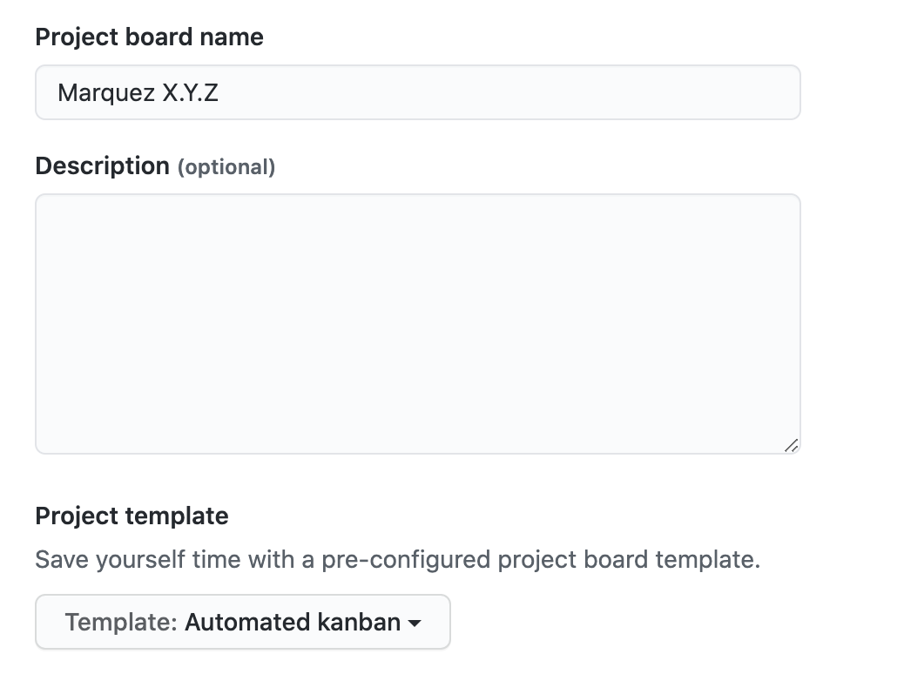

# Releasing

1. Update [`CHANGELOG.md`](CHANGELOG.md)
2. Tag the release and prepare for the next version with:

   ```bash
   $ ./new-version.sh --release-version X.Y.Z --next-version X.Y.Z
   ```

   > **Tip:** Use `--help` to see script usage

3. Visit [CI](https://app.circleci.com/pipelines/github/MarquezProject/marquez?branch=main) to see the progress of the release! :rocket:
4. Visit [sonatype](https://oss.sonatype.org) to promote _java_ artifacts
5. Create a [new project](https://github.com/MarquezProject/marquez/projects/new) board for the _next_ release using the _automated kanban_ template:

   

6. Before closing the project board for the _current_ release, move any open issues to the project board created in **step 5**
7. Draft a [new release](https://github.com/MarquezProject/marquez/releases/new) using the release notes for `X.Y.Z` in **step 1** as the release description:

   

# Voting on Releases

Anyone may request a new release of the project in the #general Slack channel.

After one is proposed, committers have 48 hours to give a +1 or -1.

A total of three +1s, taking into account -1s and excluding votes by the proposer, authorize the release.

Alternatively, if after 2 days the release has received at least one +1 and no -1s, the release is also authorized.

If the proposed release receives no +1s in two days, it is not authorized and the proposer must make a new request to reset the clock.

Once a release is authorized, it will be initiated within two business days. Releases will not be made on a Friday unless doing so will address an important defect, an issue with project infrastructure, or a security vulnerability.