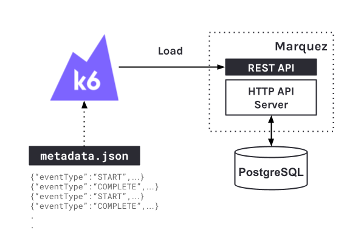

# Load Testing with [`k6`](https://k6.io)

**k6** is a developer-centric, free and open-source load testing tool built for making performance testing a productive and enjoyable experience. Below, we'll walk you through running a load test on Marquez using [OpenLineage](https://github.com/OpenLineage/OpenLineage) and `k6` to:

* Performance test `POST` `/lineage` (HTTP requests _blocked_, _waiting_, _duration_, etc)
* Understand query performance on database

To view the built-in metrics automatically collects by `k6`, see [_Metrics_](https://k6.io/docs/using-k6/metrics/#http-specific-built-in-metrics).

## Setup [`k6 `](https://k6.io)

```bash
$ brew install k6
```

## Architecture

<figure align="center">
  
</figure>

> **Figure 1:** Using [`k6`](https://k6.io) to load test Marquez with [OpenLineage](https://github.com/OpenLineage/OpenLineage) events defined in `metadata.json` generated by the [`metadata`](https://github.com/MarquezProject/marquez/blob/main/api/src/main/java/marquez/cli/MetadataCommand.java) command.

#### COMPONENTS

| Component        | Image                                                                               | Description                                                                                                            |
|------------------|-------------------------------------------------------------------------------------|------------------------------------------------------------------------------------------------------------------------|
| Marquez HTTP API | [marquezproject/marquez](https://hub.docker.com/r/marquezproject/marquez)           | The core API used to collect metadata using [OpenLineage](https://openlineage.io).                                     |
| Database         | [bitnami/postgresql](https://hub.docker.com/r/bitnami/postgresql) or cloud provided | A PostgreSQL instance used to store metadata.                                                                          |


## Create `metadata.json`

Use the [`metadata`](https://github.com/MarquezProject/marquez/blob/main/api/src/main/java/marquez/cli/MetadataCommand.java) command to generate random _dataset_, _job_, and _run_ metadata. Below, we generate `metadata.json` with `128` runs (`20` events in total), where each `START` event will have a size of `~16384` bytes:

```bash
$ java -jar marquez-api.jar metadata --runs 10 --bytes-per-event 16384
```

> **Tip**: You may specify the location of `metadata.json` with `--output`.

> **Note:** You may need to manually [build](https://github.com/MarquezProject/marquez/tree/feature/load-testing-docs#building) `marquez-api.jar`.

## Create `load.js`

```js
import { SharedArray } from 'k6/data';
import http from 'k6/http';
import { check, sleep } from 'k6';
import { Rate } from 'k6/metrics';

export const errorRate = new Rate('errors');

const metadata = new SharedArray('metadata', function () {
  return JSON.parse(open('./metadata.json'));
});

export default function () {
  const url = 'http://localhost:8080/api/v1/lineage';
  const params = {
    headers: {
      'Content-Type': 'application/json',
    },
  };

  var ol_event = metadata[__VU-1]

  check(http.post(url, JSON.stringify(ol_event), params), {
    'status is 201': (r) => r.status == 201,
  }) || errorRate.add(1);

  sleep(1);
}
```

## Running Load Test with `k6` Locally

1. Make sure you've created [`marquez.yml`](https://github.com/MarquezProject/marquez#configuration), then start Marquez HTTP server with:

   ```bash
   $ ./gradlew :api:runShadow
   ```

2. Run load test:

   ```bash
   $ k6 run --vus 25 --duration 30s load.js
   ```

   > **Note:** To learn how to run tests locally with `k6`, see [_Running k6_](https://k6.io/docs/getting-started/running-k6).

----
SPDX-License-Identifier: Apache-2.0
Copyright 2018-2023 contributors to the Marquez project.
