# public.dataset_facets_view

## Description

<details>
<summary><strong>Table Definition</strong></summary>

```sql
CREATE VIEW dataset_facets_view AS (
 SELECT dataset_facets.created_at,
    dataset_facets.dataset_uuid,
    dataset_facets.dataset_version_uuid,
    dataset_facets.run_uuid,
    dataset_facets.lineage_event_time,
    dataset_facets.lineage_event_type,
    dataset_facets.type,
    dataset_facets.name,
    dataset_facets.facet
   FROM dataset_facets
)
```

</details>

## Referenced Tables

- [public.dataset_facets](public.dataset_facets.md)

## Columns

| Name | Type | Default | Nullable | Children | Parents | Comment |
| ---- | ---- | ------- | -------- | -------- | ------- | ------- |
| created_at | timestamp with time zone |  | true |  |  |  |
| dataset_uuid | uuid |  | true |  |  |  |
| dataset_version_uuid | uuid |  | true |  |  |  |
| run_uuid | uuid |  | true |  |  |  |
| lineage_event_time | timestamp with time zone |  | true |  |  |  |
| lineage_event_type | varchar(64) |  | true |  |  |  |
| type | varchar(64) |  | true |  |  |  |
| name | varchar(255) |  | true |  |  |  |
| facet | jsonb |  | true |  |  |  |

## Relations

```mermaid
erDiagram


"public.dataset_facets_view" {
  timestamp_with_time_zone created_at
  uuid dataset_uuid
  uuid dataset_version_uuid
  uuid run_uuid
  timestamp_with_time_zone lineage_event_time
  varchar_64_ lineage_event_type
  varchar_64_ type
  varchar_255_ name
  jsonb facet
}
```



---

> Generated by [tbls](https://github.com/k1LoW/tbls)
