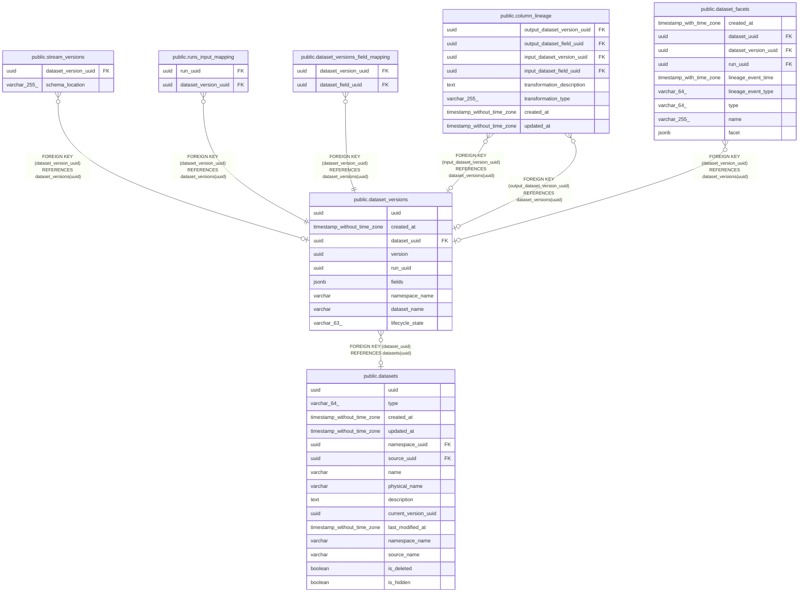

# public.dataset_versions

## Description

## Columns

| Name | Type | Default | Nullable | Children | Parents | Comment |
| ---- | ---- | ------- | -------- | -------- | ------- | ------- |
| uuid | uuid |  | false | [public.stream_versions](public.stream_versions.md) [public.runs_input_mapping](public.runs_input_mapping.md) [public.dataset_versions_field_mapping](public.dataset_versions_field_mapping.md) [public.column_lineage](public.column_lineage.md) [public.dataset_facets](public.dataset_facets.md) |  |  |
| created_at | timestamp without time zone |  | false |  |  |  |
| dataset_uuid | uuid |  | true |  | [public.datasets](public.datasets.md) |  |
| version | uuid |  | false |  |  |  |
| run_uuid | uuid |  | true |  |  |  |
| fields | jsonb |  | true |  |  |  |
| namespace_name | varchar |  | true |  |  |  |
| dataset_name | varchar |  | true |  |  |  |
| lifecycle_state | varchar(63) |  | true |  |  |  |

## Constraints

| Name | Type | Definition |
| ---- | ---- | ---------- |
| dataset_versions_dataset_uuid_fkey | FOREIGN KEY | FOREIGN KEY (dataset_uuid) REFERENCES datasets(uuid) |
| dataset_versions_pkey | PRIMARY KEY | PRIMARY KEY (uuid) |
| dataset_versions_dataset_uuid_version_key | UNIQUE | UNIQUE (dataset_uuid, version) |
| dataset_versions_version | UNIQUE | UNIQUE (version) |

## Indexes

| Name | Definition |
| ---- | ---------- |
| dataset_versions_pkey | CREATE UNIQUE INDEX dataset_versions_pkey ON public.dataset_versions USING btree (uuid) |
| dataset_versions_dataset_uuid_version_key | CREATE UNIQUE INDEX dataset_versions_dataset_uuid_version_key ON public.dataset_versions USING btree (dataset_uuid, version) |
| datasetversion_datasetid_idx | CREATE INDEX datasetversion_datasetid_idx ON public.dataset_versions USING btree (dataset_uuid) |
| dataset_versions_version | CREATE UNIQUE INDEX dataset_versions_version ON public.dataset_versions USING btree (version) |
| dataset_versions_run_uuid | CREATE INDEX dataset_versions_run_uuid ON public.dataset_versions USING btree (run_uuid) |
| dataset_versions_name | CREATE INDEX dataset_versions_name ON public.dataset_versions USING btree (dataset_name, namespace_name, created_at DESC) |

## Relations

---

> Generated by [tbls](https://github.com/k1LoW/tbls)
