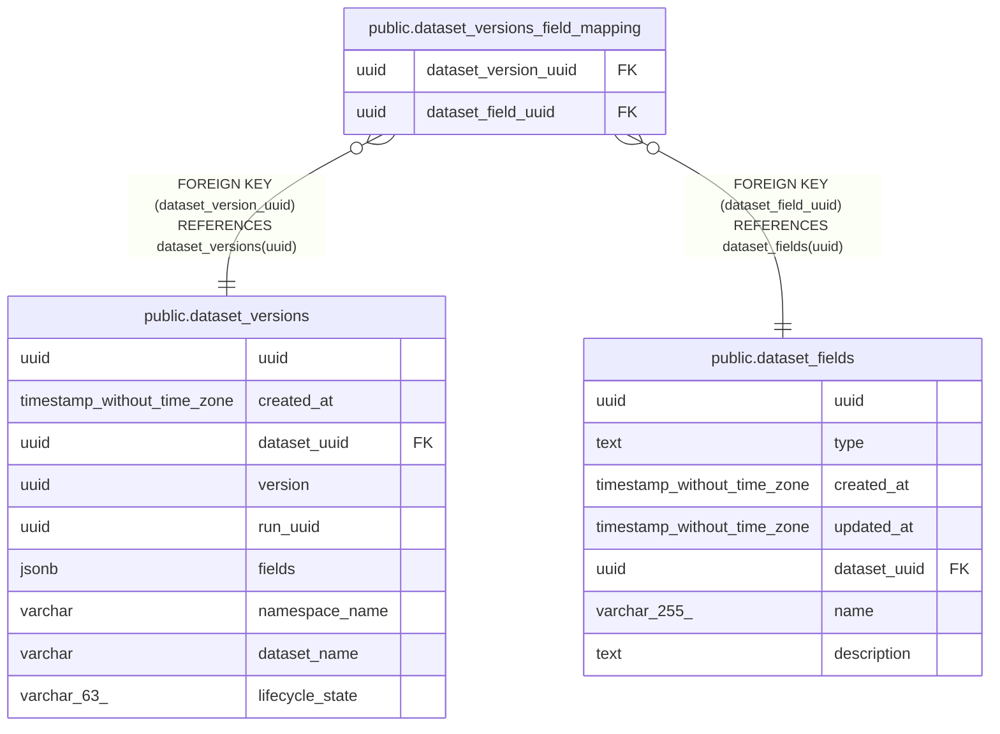

# public.dataset_versions_field_mapping

## Description

## Columns

| Name | Type | Default | Nullable | Children | Parents | Comment |
| ---- | ---- | ------- | -------- | -------- | ------- | ------- |
| dataset_version_uuid | uuid |  | false |  | [public.dataset_versions](public.dataset_versions.md) |  |
| dataset_field_uuid | uuid |  | false |  | [public.dataset_fields](public.dataset_fields.md) |  |

## Constraints

| Name | Type | Definition |
| ---- | ---- | ---------- |
| dataset_versions_field_mapping_dataset_version_uuid_fkey | FOREIGN KEY | FOREIGN KEY (dataset_version_uuid) REFERENCES dataset_versions(uuid) |
| dataset_versions_field_mapping_dataset_field_uuid_fkey | FOREIGN KEY | FOREIGN KEY (dataset_field_uuid) REFERENCES dataset_fields(uuid) |
| dataset_versions_field_mapping_pkey | PRIMARY KEY | PRIMARY KEY (dataset_version_uuid, dataset_field_uuid) |

## Indexes

| Name | Definition |
| ---- | ---------- |
| dataset_versions_field_mapping_pkey | CREATE UNIQUE INDEX dataset_versions_field_mapping_pkey ON public.dataset_versions_field_mapping USING btree (dataset_version_uuid, dataset_field_uuid) |
| dataset_versions_field_mapping_index | CREATE INDEX dataset_versions_field_mapping_index ON public.dataset_versions_field_mapping USING btree (dataset_field_uuid) |

## Relations

---

> Generated by [tbls](https://github.com/k1LoW/tbls)
