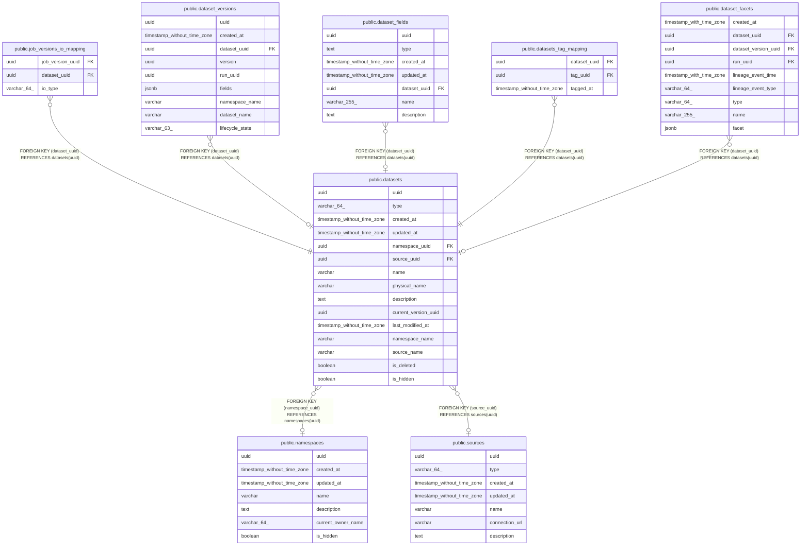

# public.datasets

## Description

## Columns

| Name | Type | Default | Nullable | Children | Parents | Comment |
| ---- | ---- | ------- | -------- | -------- | ------- | ------- |
| uuid | uuid |  | false | [public.job_versions_io_mapping](public.job_versions_io_mapping.md) [public.dataset_versions](public.dataset_versions.md) [public.dataset_fields](public.dataset_fields.md) [public.datasets_tag_mapping](public.datasets_tag_mapping.md) [public.dataset_facets](public.dataset_facets.md) |  |  |
| type | varchar(64) |  | false |  |  |  |
| created_at | timestamp without time zone |  | false |  |  |  |
| updated_at | timestamp without time zone |  | false |  |  |  |
| namespace_uuid | uuid |  | true |  | [public.namespaces](public.namespaces.md) |  |
| source_uuid | uuid |  | true |  | [public.sources](public.sources.md) |  |
| name | varchar |  | false |  |  |  |
| physical_name | varchar |  | false |  |  |  |
| description | text |  | true |  |  |  |
| current_version_uuid | uuid |  | true |  |  |  |
| last_modified_at | timestamp without time zone |  | true |  |  |  |
| namespace_name | varchar |  | true |  |  |  |
| source_name | varchar |  | true |  |  |  |
| is_deleted | boolean | false | true |  |  |  |
| is_hidden | boolean | false | true |  |  |  |

## Constraints

| Name | Type | Definition |
| ---- | ---- | ---------- |
| datasets_namespace_uuid_fkey | FOREIGN KEY | FOREIGN KEY (namespace_uuid) REFERENCES namespaces(uuid) |
| datasets_source_uuid_fkey | FOREIGN KEY | FOREIGN KEY (source_uuid) REFERENCES sources(uuid) |
| datasets_pkey | PRIMARY KEY | PRIMARY KEY (uuid) |
| datasets_namespace_uuid_name_key | UNIQUE | UNIQUE (namespace_uuid, name) |

## Indexes

| Name | Definition |
| ---- | ---------- |
| datasets_pkey | CREATE UNIQUE INDEX datasets_pkey ON public.datasets USING btree (uuid) |
| datasets_namespace_uuid_name_key | CREATE UNIQUE INDEX datasets_namespace_uuid_name_key ON public.datasets USING btree (namespace_uuid, name) |
| dataset_name_index | CREATE UNIQUE INDEX dataset_name_index ON public.datasets USING btree (name, namespace_name) |

## Relations

---

> Generated by [tbls](https://github.com/k1LoW/tbls)
