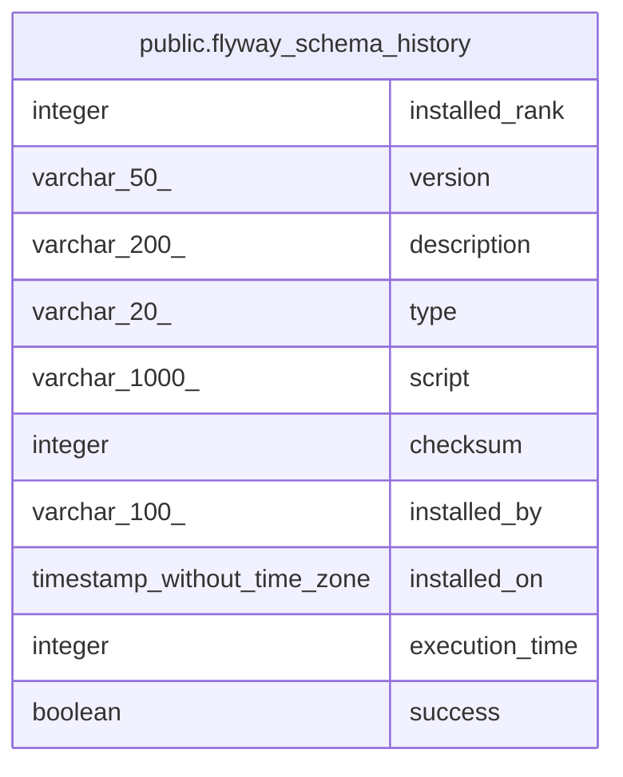

# public.flyway_schema_history

## Description

## Columns

| Name | Type | Default | Nullable | Children | Parents | Comment |
| ---- | ---- | ------- | -------- | -------- | ------- | ------- |
| installed_rank | integer |  | false |  |  |  |
| version | varchar(50) |  | true |  |  |  |
| description | varchar(200) |  | false |  |  |  |
| type | varchar(20) |  | false |  |  |  |
| script | varchar(1000) |  | false |  |  |  |
| checksum | integer |  | true |  |  |  |
| installed_by | varchar(100) |  | false |  |  |  |
| installed_on | timestamp without time zone | now() | false |  |  |  |
| execution_time | integer |  | false |  |  |  |
| success | boolean |  | false |  |  |  |

## Constraints

| Name | Type | Definition |
| ---- | ---- | ---------- |
| flyway_schema_history_pk | PRIMARY KEY | PRIMARY KEY (installed_rank) |

## Indexes

| Name | Definition |
| ---- | ---------- |
| flyway_schema_history_pk | CREATE UNIQUE INDEX flyway_schema_history_pk ON public.flyway_schema_history USING btree (installed_rank) |
| flyway_schema_history_s_idx | CREATE INDEX flyway_schema_history_s_idx ON public.flyway_schema_history USING btree (success) |

## Relations

---

> Generated by [tbls](https://github.com/k1LoW/tbls)
