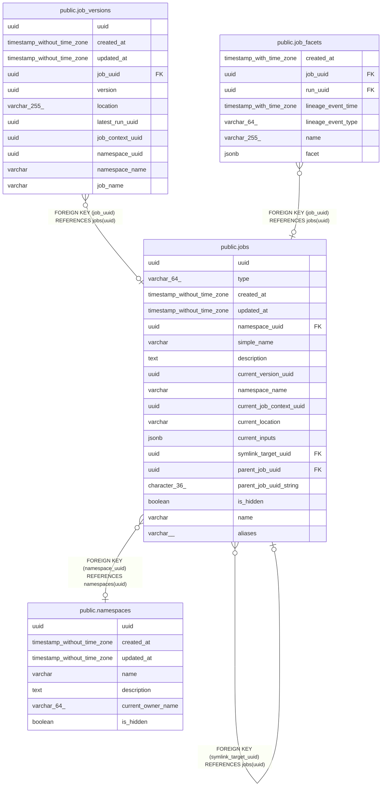

# public.jobs

## Description

## Columns

| Name | Type | Default | Nullable | Children | Parents | Comment |
| ---- | ---- | ------- | -------- | -------- | ------- | ------- |
| uuid | uuid |  | false | [public.jobs](public.jobs.md) [public.job_versions](public.job_versions.md) [public.job_facets](public.job_facets.md) |  |  |
| type | varchar(64) |  | false |  |  |  |
| created_at | timestamp without time zone |  | false |  |  |  |
| updated_at | timestamp without time zone |  | false |  |  |  |
| namespace_uuid | uuid |  | true |  | [public.namespaces](public.namespaces.md) |  |
| simple_name | varchar |  | false |  |  |  |
| description | text |  | true |  |  |  |
| current_version_uuid | uuid |  | true |  |  |  |
| namespace_name | varchar |  | true |  |  |  |
| current_job_context_uuid | uuid |  | true |  |  |  |
| current_location | varchar |  | true |  |  |  |
| current_inputs | jsonb |  | true |  |  |  |
| symlink_target_uuid | uuid |  | true |  | [public.jobs](public.jobs.md) |  |
| parent_job_uuid | uuid |  | true |  | [public.jobs](public.jobs.md) |  |
| parent_job_uuid_string | character(36) | ''::bpchar | true |  |  |  |
| is_hidden | boolean | false | true |  |  |  |
| name | varchar |  | false |  |  |  |
| aliases | varchar[] |  | true |  |  |  |

## Constraints

| Name | Type | Definition |
| ---- | ---- | ---------- |
| jobs_namespace_uuid_fkey | FOREIGN KEY | FOREIGN KEY (namespace_uuid) REFERENCES namespaces(uuid) |
| jobs_parent_fk_jobs | FOREIGN KEY | FOREIGN KEY (parent_job_uuid) REFERENCES jobs(uuid) |
| jobs_pkey | PRIMARY KEY | PRIMARY KEY (uuid) |
| jobs_symlink_target_uuid_fkey | FOREIGN KEY | FOREIGN KEY (symlink_target_uuid) REFERENCES jobs(uuid) |
| unique_jobs_namespace_uuid_name_parent | UNIQUE | UNIQUE (namespace_uuid, name) |

## Indexes

| Name | Definition |
| ---- | ---------- |
| jobs_pkey | CREATE UNIQUE INDEX jobs_pkey ON public.jobs USING btree (uuid) |
| jobs_symlinks | CREATE INDEX jobs_symlinks ON public.jobs USING btree (symlink_target_uuid) INCLUDE (uuid, namespace_name, simple_name) WHERE (symlink_target_uuid IS NOT NULL) |
| jobs_name_parent | CREATE UNIQUE INDEX jobs_name_parent ON public.jobs USING btree (simple_name, namespace_name, parent_job_uuid) |
| jobs_current_version_uuid_index | CREATE INDEX jobs_current_version_uuid_index ON public.jobs USING btree (current_version_uuid) WHERE (current_version_uuid IS NOT NULL) |
| jobs_symlink_target_uuid_index | CREATE INDEX jobs_symlink_target_uuid_index ON public.jobs USING btree (symlink_target_uuid) WHERE (symlink_target_uuid IS NOT NULL) |
| jobs_current_job_context_uuid_index | CREATE INDEX jobs_current_job_context_uuid_index ON public.jobs USING btree (current_job_context_uuid) |
| unique_jobs_namespace_uuid_name_parent | CREATE UNIQUE INDEX unique_jobs_namespace_uuid_name_parent ON public.jobs USING btree (namespace_uuid, name) |

## Relations

---

> Generated by [tbls](https://github.com/k1LoW/tbls)
