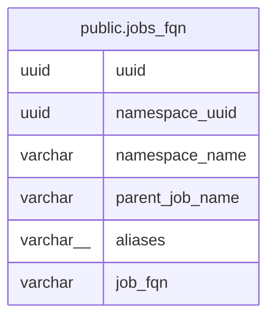

# public.jobs_fqn

## Description

## Columns

| Name | Type | Default | Nullable | Children | Parents | Comment |
| ---- | ---- | ------- | -------- | -------- | ------- | ------- |
| uuid | uuid |  | false |  |  |  |
| namespace_uuid | uuid |  | false |  |  |  |
| namespace_name | varchar |  | false |  |  |  |
| parent_job_name | varchar |  | true |  |  |  |
| aliases | varchar[] |  | true |  |  |  |
| job_fqn | varchar |  | false |  |  |  |

## Constraints

| Name | Type | Definition |
| ---- | ---- | ---------- |
| jobs_fqn_pkey | PRIMARY KEY | PRIMARY KEY (uuid) |

## Indexes

| Name | Definition |
| ---- | ---------- |
| jobs_fqn_pkey | CREATE UNIQUE INDEX jobs_fqn_pkey ON public.jobs_fqn USING btree (uuid) |
| jobs_fqn_namespace_name_job_fqn_idx | CREATE INDEX jobs_fqn_namespace_name_job_fqn_idx ON public.jobs_fqn USING btree (namespace_name, job_fqn) |

## Relations

---

> Generated by [tbls](https://github.com/k1LoW/tbls)
