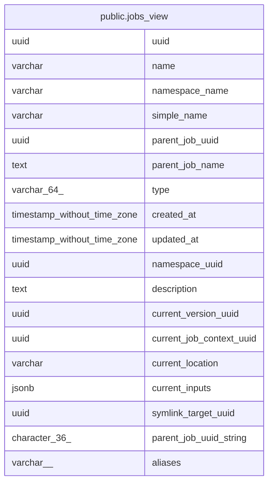

# public.jobs_view

## Description

<details>
<summary><strong>Table Definition</strong></summary>

```sql
CREATE VIEW jobs_view AS (
 SELECT j.uuid,
    j.name,
    j.namespace_name,
    j.simple_name,
    j.parent_job_uuid,
    (p.name)::text AS parent_job_name,
    j.type,
    j.created_at,
    j.updated_at,
    j.namespace_uuid,
    j.description,
    j.current_version_uuid,
    j.current_job_context_uuid,
    j.current_location,
    j.current_inputs,
    j.symlink_target_uuid,
    (j.parent_job_uuid)::character(36) AS parent_job_uuid_string,
    j.aliases
   FROM (jobs j
     LEFT JOIN jobs p ON ((j.parent_job_uuid = p.uuid)))
  WHERE ((j.is_hidden IS FALSE) AND (j.symlink_target_uuid IS NULL))
)
```

</details>

## Referenced Tables

- [public.jobs](public.jobs.md)

## Columns

| Name | Type | Default | Nullable | Children | Parents | Comment |
| ---- | ---- | ------- | -------- | -------- | ------- | ------- |
| uuid | uuid |  | true |  |  |  |
| name | varchar |  | true |  |  |  |
| namespace_name | varchar |  | true |  |  |  |
| simple_name | varchar |  | true |  |  |  |
| parent_job_uuid | uuid |  | true |  |  |  |
| parent_job_name | text |  | true |  |  |  |
| type | varchar(64) |  | true |  |  |  |
| created_at | timestamp without time zone |  | true |  |  |  |
| updated_at | timestamp without time zone |  | true |  |  |  |
| namespace_uuid | uuid |  | true |  |  |  |
| description | text |  | true |  |  |  |
| current_version_uuid | uuid |  | true |  |  |  |
| current_job_context_uuid | uuid |  | true |  |  |  |
| current_location | varchar |  | true |  |  |  |
| current_inputs | jsonb |  | true |  |  |  |
| symlink_target_uuid | uuid |  | true |  |  |  |
| parent_job_uuid_string | character(36) |  | true |  |  |  |
| aliases | varchar[] |  | true |  |  |  |

## Triggers

| Name | Definition |
| ---- | ---------- |
| update_symlinks | CREATE TRIGGER update_symlinks INSTEAD OF INSERT OR UPDATE ON public.jobs_view FOR EACH ROW EXECUTE FUNCTION rewrite_jobs_fqn_table() |

## Relations



---

> Generated by [tbls](https://github.com/k1LoW/tbls)
