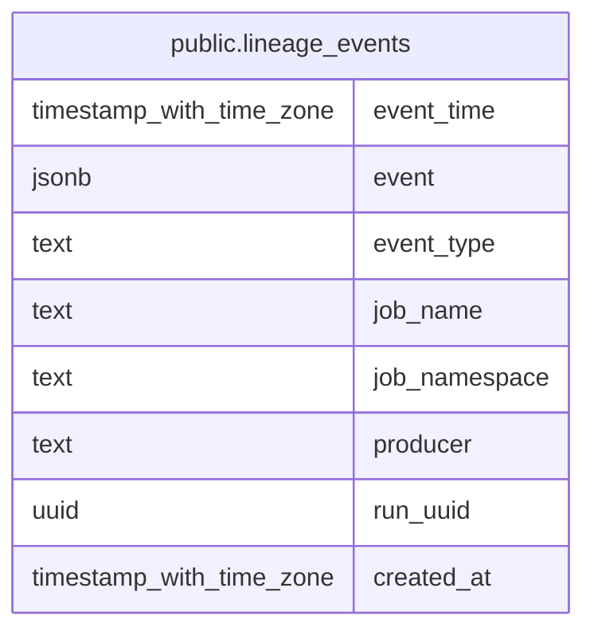

# public.lineage_events

## Description

## Columns

| Name | Type | Default | Nullable | Children | Parents | Comment |
| ---- | ---- | ------- | -------- | -------- | ------- | ------- |
| event_time | timestamp with time zone |  | false |  |  |  |
| event | jsonb |  | false |  |  |  |
| event_type | text |  | true |  |  |  |
| job_name | text |  | true |  |  |  |
| job_namespace | text |  | true |  |  |  |
| producer | text |  | true |  |  |  |
| run_uuid | uuid |  | true |  |  |  |
| created_at | timestamp with time zone | (timezone('UTC'::text, now()))::timestamp with time zone | true |  |  |  |

## Indexes

| Name | Definition |
| ---- | ---------- |
| lineage_events_run_id_index | CREATE INDEX lineage_events_run_id_index ON public.lineage_events USING btree (run_uuid) |
| lineage_events_job_name_index | CREATE INDEX lineage_events_job_name_index ON public.lineage_events USING btree (job_name, job_namespace) |
| lineage_events_event_time | CREATE INDEX lineage_events_event_time ON public.lineage_events USING btree (event_time DESC) |
| lineage_events_created_at_index | CREATE INDEX lineage_events_created_at_index ON public.lineage_events USING btree (created_at DESC NULLS LAST) |

## Relations

---

> Generated by [tbls](https://github.com/k1LoW/tbls)
