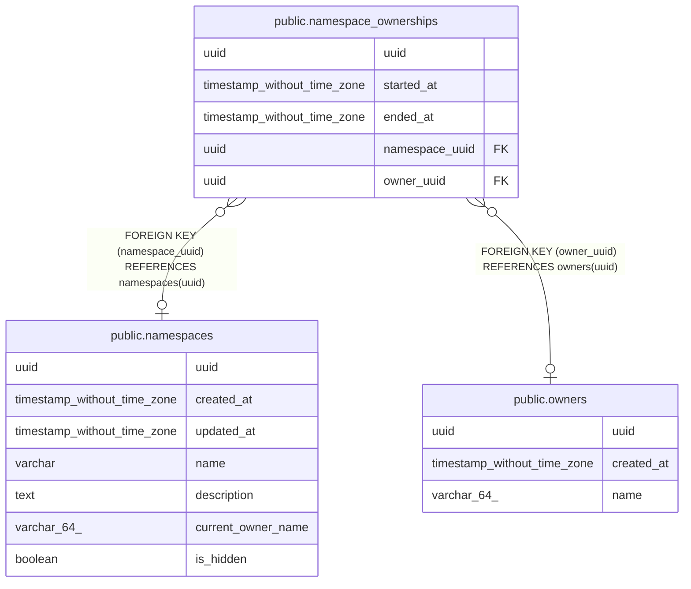

# public.namespace_ownerships

## Description

## Columns

| Name | Type | Default | Nullable | Children | Parents | Comment |
| ---- | ---- | ------- | -------- | -------- | ------- | ------- |
| uuid | uuid |  | false |  |  |  |
| started_at | timestamp without time zone |  | false |  |  |  |
| ended_at | timestamp without time zone |  | true |  |  |  |
| namespace_uuid | uuid |  | true |  | [public.namespaces](public.namespaces.md) |  |
| owner_uuid | uuid |  | true |  | [public.owners](public.owners.md) |  |

## Constraints

| Name | Type | Definition |
| ---- | ---- | ---------- |
| namespace_ownerships_namespace_uuid_fkey | FOREIGN KEY | FOREIGN KEY (namespace_uuid) REFERENCES namespaces(uuid) |
| namespace_ownerships_owner_uuid_fkey | FOREIGN KEY | FOREIGN KEY (owner_uuid) REFERENCES owners(uuid) |
| namespace_ownerships_pkey | PRIMARY KEY | PRIMARY KEY (uuid) |
| namespace_ownerships_namespace_uuid_owner_uuid_key | UNIQUE | UNIQUE (namespace_uuid, owner_uuid) |

## Indexes

| Name | Definition |
| ---- | ---------- |
| namespace_ownerships_pkey | CREATE UNIQUE INDEX namespace_ownerships_pkey ON public.namespace_ownerships USING btree (uuid) |
| namespace_ownerships_namespace_uuid_owner_uuid_key | CREATE UNIQUE INDEX namespace_ownerships_namespace_uuid_owner_uuid_key ON public.namespace_ownerships USING btree (namespace_uuid, owner_uuid) |

## Relations

---

> Generated by [tbls](https://github.com/k1LoW/tbls)
