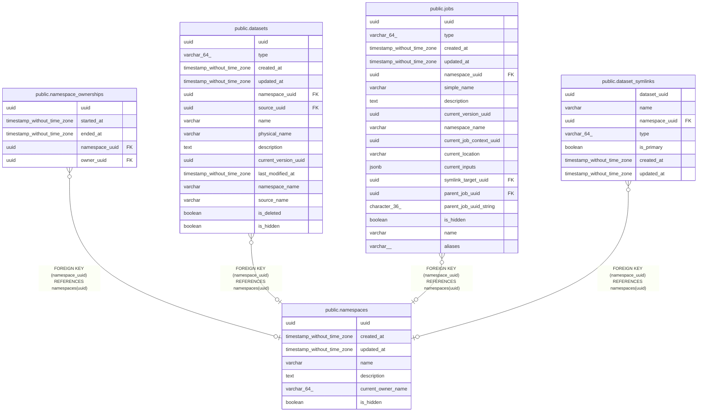

# public.namespaces

## Description

## Columns

| Name | Type | Default | Nullable | Children | Parents | Comment |
| ---- | ---- | ------- | -------- | -------- | ------- | ------- |
| uuid | uuid |  | false | [public.namespace_ownerships](public.namespace_ownerships.md) [public.datasets](public.datasets.md) [public.jobs](public.jobs.md) [public.dataset_symlinks](public.dataset_symlinks.md) |  |  |
| created_at | timestamp without time zone |  | false |  |  |  |
| updated_at | timestamp without time zone |  | false |  |  |  |
| name | varchar |  | false |  |  |  |
| description | text |  | true |  |  |  |
| current_owner_name | varchar(64) |  | true |  |  |  |
| is_hidden | boolean | false | true |  |  |  |

## Constraints

| Name | Type | Definition |
| ---- | ---- | ---------- |
| namespaces_pkey | PRIMARY KEY | PRIMARY KEY (uuid) |
| namespaces_name_key | UNIQUE | UNIQUE (name) |

## Indexes

| Name | Definition |
| ---- | ---------- |
| namespaces_pkey | CREATE UNIQUE INDEX namespaces_pkey ON public.namespaces USING btree (uuid) |
| namespaces_name_key | CREATE UNIQUE INDEX namespaces_name_key ON public.namespaces USING btree (name) |

## Relations

---

> Generated by [tbls](https://github.com/k1LoW/tbls)
