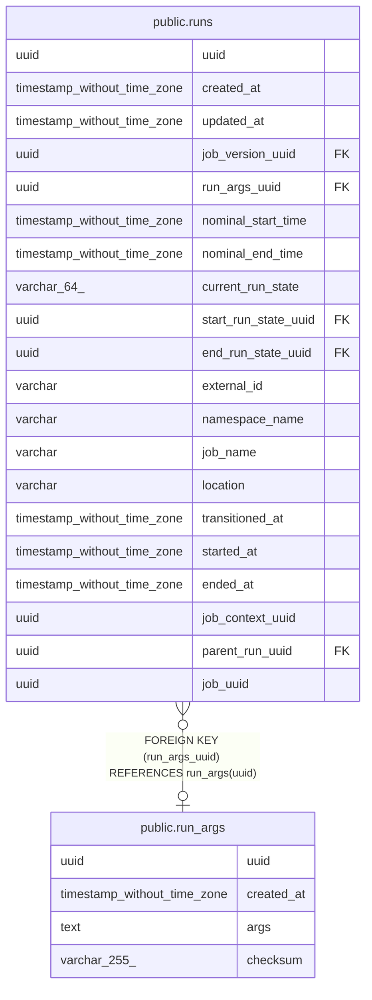

# public.run_args

## Description

## Columns

| Name | Type | Default | Nullable | Children | Parents | Comment |
| ---- | ---- | ------- | -------- | -------- | ------- | ------- |
| uuid | uuid |  | false | [public.runs](public.runs.md) |  |  |
| created_at | timestamp without time zone |  | false |  |  |  |
| args | text |  | false |  |  |  |
| checksum | varchar(255) |  | false |  |  |  |

## Constraints

| Name | Type | Definition |
| ---- | ---- | ---------- |
| run_args_pkey | PRIMARY KEY | PRIMARY KEY (uuid) |
| run_args_checksum_key | UNIQUE | UNIQUE (checksum) |

## Indexes

| Name | Definition |
| ---- | ---------- |
| run_args_pkey | CREATE UNIQUE INDEX run_args_pkey ON public.run_args USING btree (uuid) |
| run_args_checksum_key | CREATE UNIQUE INDEX run_args_checksum_key ON public.run_args USING btree (checksum) |

## Relations

---

> Generated by [tbls](https://github.com/k1LoW/tbls)
