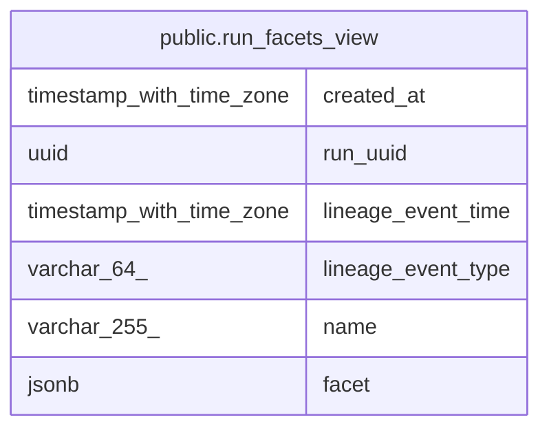

# public.run_facets_view

## Description

<details>
<summary><strong>Table Definition</strong></summary>

```sql
CREATE VIEW run_facets_view AS (
 SELECT run_facets.created_at,
    run_facets.run_uuid,
    run_facets.lineage_event_time,
    run_facets.lineage_event_type,
    run_facets.name,
    run_facets.facet
   FROM run_facets
)
```

</details>

## Referenced Tables

- [public.run_facets](public.run_facets.md)

## Columns

| Name | Type | Default | Nullable | Children | Parents | Comment |
| ---- | ---- | ------- | -------- | -------- | ------- | ------- |
| created_at | timestamp with time zone |  | true |  |  |  |
| run_uuid | uuid |  | true |  |  |  |
| lineage_event_time | timestamp with time zone |  | true |  |  |  |
| lineage_event_type | varchar(64) |  | true |  |  |  |
| name | varchar(255) |  | true |  |  |  |
| facet | jsonb |  | true |  |  |  |

## Relations



---

> Generated by [tbls](https://github.com/k1LoW/tbls)
