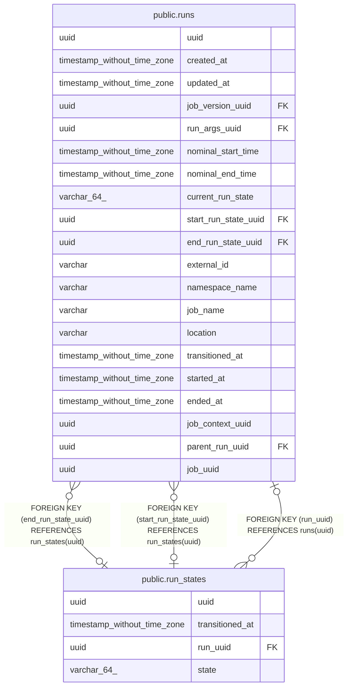

# public.run_states

## Description

## Columns

| Name | Type | Default | Nullable | Children | Parents | Comment |
| ---- | ---- | ------- | -------- | -------- | ------- | ------- |
| uuid | uuid |  | false | [public.runs](public.runs.md) |  |  |
| transitioned_at | timestamp without time zone |  | false |  |  |  |
| run_uuid | uuid |  | true |  | [public.runs](public.runs.md) |  |
| state | varchar(64) |  | false |  |  |  |

## Constraints

| Name | Type | Definition |
| ---- | ---- | ---------- |
| run_states_run_uuid_fkey | FOREIGN KEY | FOREIGN KEY (run_uuid) REFERENCES runs(uuid) |
| run_states_pkey | PRIMARY KEY | PRIMARY KEY (uuid) |

## Indexes

| Name | Definition |
| ---- | ---------- |
| run_states_pkey | CREATE UNIQUE INDEX run_states_pkey ON public.run_states USING btree (uuid) |

## Relations

---

> Generated by [tbls](https://github.com/k1LoW/tbls)
