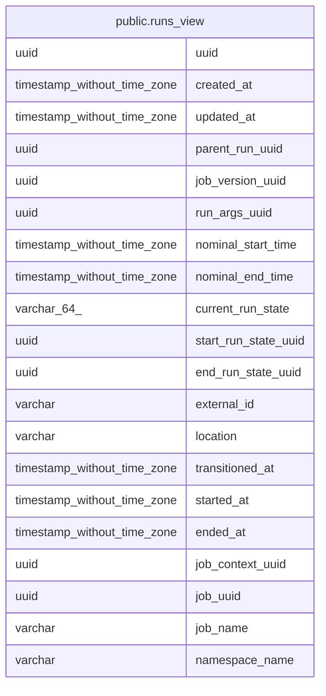

# public.runs_view

## Description

<details>
<summary><strong>Table Definition</strong></summary>

```sql
CREATE VIEW runs_view AS (
 SELECT r.uuid,
    r.created_at,
    r.updated_at,
    r.parent_run_uuid,
    r.job_version_uuid,
    r.run_args_uuid,
    r.nominal_start_time,
    r.nominal_end_time,
    r.current_run_state,
    r.start_run_state_uuid,
    r.end_run_state_uuid,
    r.external_id,
    r.location,
    r.transitioned_at,
    r.started_at,
    r.ended_at,
    r.job_context_uuid,
    r.job_uuid,
    COALESCE(s.name, j.name) AS job_name,
    COALESCE(s.namespace_name, j.namespace_name) AS namespace_name
   FROM ((runs r
     JOIN jobs j ON ((j.uuid = r.job_uuid)))
     LEFT JOIN jobs_view s ON ((j.symlink_target_uuid = s.uuid)))
)
```

</details>

## Referenced Tables

- [public.runs](public.runs.md)
- [public.jobs](public.jobs.md)
- [public.jobs_view](public.jobs_view.md)

## Columns

| Name | Type | Default | Nullable | Children | Parents | Comment |
| ---- | ---- | ------- | -------- | -------- | ------- | ------- |
| uuid | uuid |  | true |  |  |  |
| created_at | timestamp without time zone |  | true |  |  |  |
| updated_at | timestamp without time zone |  | true |  |  |  |
| parent_run_uuid | uuid |  | true |  |  |  |
| job_version_uuid | uuid |  | true |  |  |  |
| run_args_uuid | uuid |  | true |  |  |  |
| nominal_start_time | timestamp without time zone |  | true |  |  |  |
| nominal_end_time | timestamp without time zone |  | true |  |  |  |
| current_run_state | varchar(64) |  | true |  |  |  |
| start_run_state_uuid | uuid |  | true |  |  |  |
| end_run_state_uuid | uuid |  | true |  |  |  |
| external_id | varchar |  | true |  |  |  |
| location | varchar |  | true |  |  |  |
| transitioned_at | timestamp without time zone |  | true |  |  |  |
| started_at | timestamp without time zone |  | true |  |  |  |
| ended_at | timestamp without time zone |  | true |  |  |  |
| job_context_uuid | uuid |  | true |  |  |  |
| job_uuid | uuid |  | true |  |  |  |
| job_name | varchar |  | true |  |  |  |
| namespace_name | varchar |  | true |  |  |  |

## Relations



---

> Generated by [tbls](https://github.com/k1LoW/tbls)
