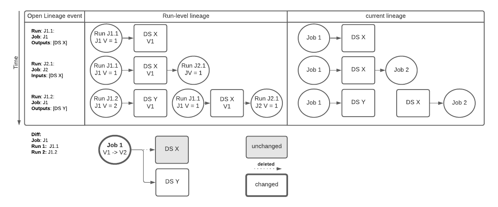
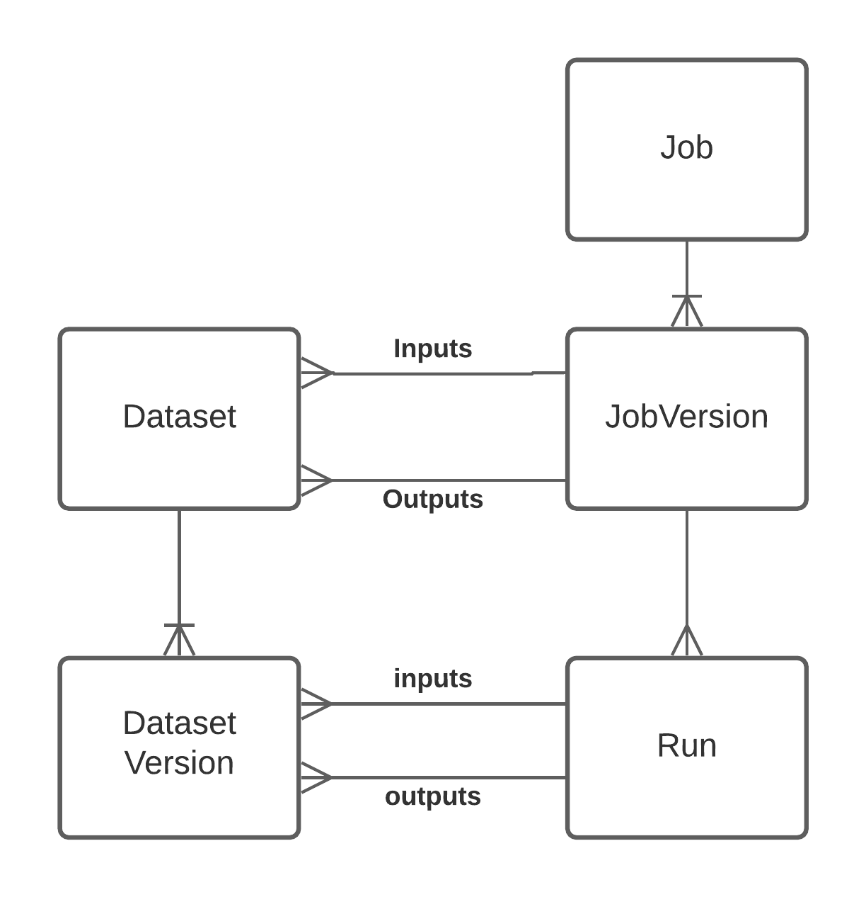
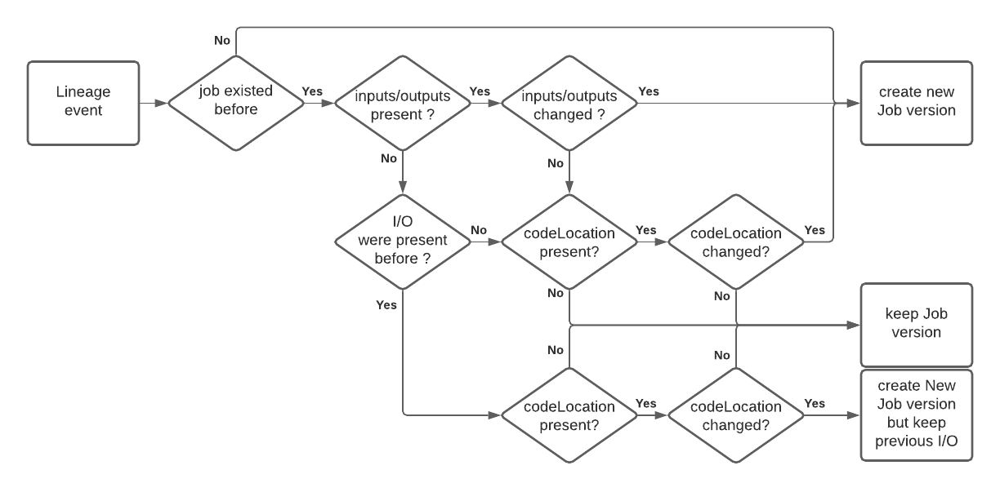
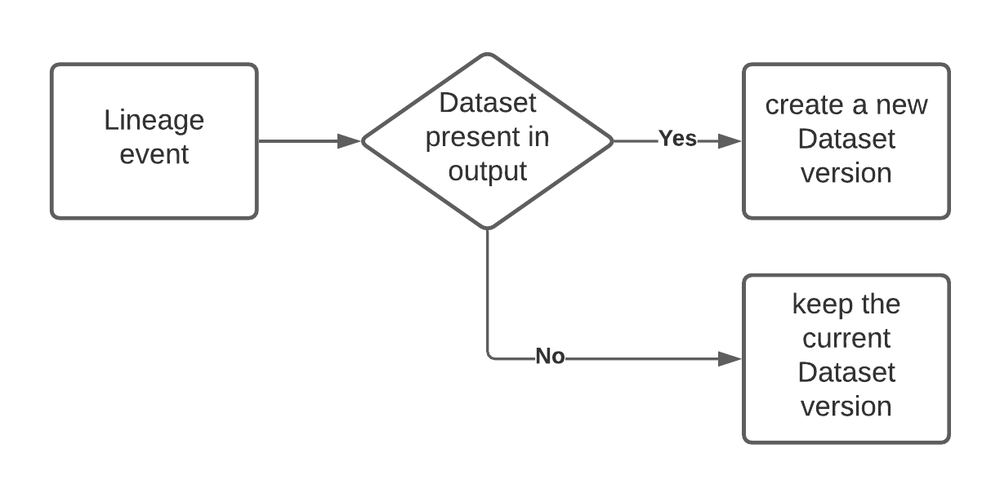

# _Current_ Lineage graph

# Intro

The _current_ lineage graph is a **map of data pipelines** represented by a bigraph of jobs and datasets. We capture lineage at the run level and extract a “current” lineage view which intuitively represents the lineage of jobs and datasets as of their last run. This definition is actually subjective and this document intends to be a formal definition to remove ambiguity and give more context to the trade off.


# Requirements

* **The current lineage graph looks the same independently from where we started.** Users might search for a job or dataset and start exploring the graph from there. There could be several disjointed graphs but each connected component of the graph will look exactly the same irrespective of which of its nodes we started from. I.E. there is a deterministic transformation from the run-level graph to the current lineage graph.
* **The current lineage graph reflects for each job node the inputs and outputs that a user would see as the currently running definition of their job.** (for example by looking at their scheduler or their spark job definition). For example if Job A currently writes to Dataset X (as of its last run), then this link should be in the current lineage graph. Conversely, if Job A stopped writing to Dataset X and now writes to Dataset Y, then the current lineage graph should **not** show ```A -> X``` and should show ```A -> Y``` instead.


# Trade-offs


* **The current lineage graph does not reflect the lineage of a dataset as it was consumed by a given run.**

Given the following lineage: ```Job A -> DS X -> Job B```

If Job A is modified to write to DS Y instead.

The current lineage becomes two disconnected graphs:

```
Job A -> DS Y
DS X -> Job B
```

This does not show how DS X was initially produced.

An exploration of the run level lineage and identifying stale dataset would allow visualizing this.





* **Job whose inputs/outputs change every run will show only the lineage of the latest run**

    We need to make sure we model inputs and outputs appropriately so that:

    * Partitions in the same dataset are not mistaken for different datasets
    * Private Temporary storage that is not accessed outside a logical job is identified as such.


# Definitions


## OpenLineage events

OpenLineage events for a given run track the following information:

* The unique run id
* The unique job identifier (a namespace/name pair): this identifies multiple/recurring runs of the same job
* The input and output datasets identified by their unique identifiers (a namespace/name pair)
* The start and end time of the identified run.

This captures what the lineage of a job is for a given run. Datasets inputs and outputs are in the vast majority of cases the same ones for successive runs of a given recurring job. (for example: we identify the table as a dataset here and not the partition)

Metadata facets are attached to those entities:

* Job facets: metadata related to a job definition that does not usually vary from run to run. For example the git sha the job was deployed from.
* Run facet: metadata related to the run that changes every run. For example the query profile
* Dataset Facet: metadata related to a Dataset definition that does not usually vary from run to run. For example the schema of a table.
* Input Facet: metadata related to that specific input of that specific run. For example: how many rows were consumed. What subset (partition) of the input was read.
* Output facet: metadata related to that specific output of that specific run. For example: how many rows were produced. What subset (partition) of the output was updated.


## Run-level lineage graph and Job versioning

The run level lineage graph is derived from the OpenLineage events defined above.

It tracks for each run what version of the job produced a given version of the output datasets and consumed a given version of the input datasets. This lineage is derived from the OpenLineage events defined above. The materialization of the run level lineage defines when to create a new job version or dataset version and keeps track of lineage evolution over the job versions.

Run:

* Id => the id of the run provided in the OpenLineage run event
* Job version => the version of the job as decided by the job versioning bellow
* Array[Input dataset **version**] => The dataset versions consumed (as described below)
* Array[Output dataset **version**] => The new Dataset versions produced.

JobVersion:

* Version id => the version of the job as decided by the job versioning bellow
* Job id (namespace/name) => the id of the job as provided by the openlineage event
* Array[Input dataset] => the input datasets as provided by the OpenLineage events
* Array[Output dataset] => the output datasets as provided by the OpenLineage events

DatasetVersion:

* Version Id => the id of the version created by a run writing to this dataset
* Dataset Id (namespace/name) => the dataset id as provided by the OpenLineage events
* Run id that produced it => provided by the OpenLineage event that wrote to this dataset

    


### Versioning rules:

Collection of lineage events:

* We define the versioning logic (see below) as of when the job completes.
* The job name must be the same for all events of the same runid
* We consider the result of coalescing all the lineage events: produce the union of all the inputs and output datasets
* For each entity in those events (run, job, input dataset, output dataset), we  combine all the facets by facet name. A facet is atomic and we keep the last instance of a given facet for a given entity.

When a run completes:

#### **Job versioning** : 
We create a new version of a job if the following has changed from the previously identified current version of a job.
    
* If the job did not exist before
* **If present:** a change in the list of input or output datasets. This is considered a change in the definition of the job. (the last version of the job tracks the current lineage)
* **If present:** If the job code version (through git sha metadata or similar) is available and has changed. if inputs and outputs are missing and were previously present but the code version has changed. We should not remove the lineage but keep the existing lineage from the previous version (copy input/output from previous). A lineageUnknown field reflects the missing lineage.
* The status (complete or failed) is not a criteria. (if a spark job fails we still know the inputs and outputs, if a bigquery job fails, they are unknown. What matters is whether we know what the inputs and outputs were)





#### **Dataset versioning**:

* **Input datasets** are not modified by a run reading them. Currently we assume the latest version of the input dataset is the version we are reading. As we capture more specific Dataset version metadata (for example from Delta Lake and Iceberg) we will have a more precise dataset input version resolution by matching the storage snapshot id to the metadata we have for each version in Marquez.
* **Output datasets** get versioned every time the job runs. This tracks what run produced a specific version of a Dataset.



## Current Lineage graph

The current lineage graph is derived from the run-level lineage graph. For each job it reflects the latest (or current) version of the job lineage. Which is also the lineage as of the last run (as defined by the run-level lineage graph above).

This is simply the information for the latest JobVersion for each job:

Job:

* Job Id (namespace/name)
* Array[Input dataset]
* Array[Output dataset]

