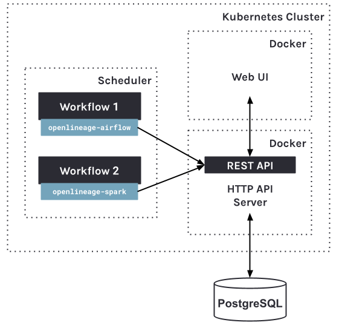

# Deployment Overview

## Helm Chart

Marquez uses [Helm](https://helm.sh) to manage deployments onto [Kubernetes](https://kubernetes.io) in a cloud environment. The chart and templates for the [HTTP API](https://github.com/MarquezProject/marquez/tree/main/api) server and [Web UI](https://github.com/MarquezProject/marquez/tree/main/web) are maintained in the Marquez [repository](https://github.com/MarquezProject/marquez) and can be found in the [chart](https://github.com/MarquezProject/marquez/tree/main/chart) directory. The chart's base `values.yaml` file includes an option to easily override deployment [settings](https://github.com/MarquezProject/marquez/tree/main/chart#configuration).

> **Note:** The Marquez HTTP API server and Web UI images are publshed to [DockerHub](https://hub.docker.com/r/marquezproject/marquez).

## Database

The Marquez [HTTP API](https://marquezproject.github.io/marquez/openapi.html) server relies only on PostgreSQL to store dataset, job, and run metadata allowing for minimal operational overhead. We recommend a cloud provided databases, such as AWS [RDS](https://aws.amazon.com/rds/postgresql), when deploying Marquez onto Kubernetes.

## Architecture

#### DOCKER

<figure align="center">
  
</figure>

> **Figure 1:** Minimal Marquez deployment via Docker.

#### KUBERNETES

<figure align="center">
  
</figure>

> **Figure 2:** Marquez deployment via Kubernetes.

#### COMPONENTS

| Component        | Image                                                                               | Description                                                                                                            |
|------------------|-------------------------------------------------------------------------------------|------------------------------------------------------------------------------------------------------------------------|
| Marquez Web UI   | [marquezproject/marquez-web](https://hub.docker.com/r/marquezproject/marquez-web)   | The web UI used to view metadata.                                                                                      |
| Marquez HTTP API | [marquezproject/marquez](https://hub.docker.com/r/marquezproject/marquez)           | The core API used to collect metadata using [OpenLineage](https://openlineage.io).                                     |
| Database         | [bitnami/postgresql](https://hub.docker.com/r/bitnami/postgresql) or cloud provided | A PostgreSQL instance used to store metadata.                                                                          |
| Scheduler        | User-provided                                                                       | A scheduler used to run a workflow on a particular schedule (ex: [Airflow](https://airflow.apache.org))                |
| Workflow         | User-provided                                                                       | A workflow using an OpenLineage [integration](https://openlineage.io/integration) to send lineage metadata to Marquez. |

## Authentication

Our [clients](https://github.com/MarquezProject/marquez/tree/main/clients) support authentication by automatically sending an API key on each request via [_Bearer Auth_](https://datatracker.ietf.org/doc/html/rfc6750) when configured on client instantiation. By default, the Marquez HTTP API does not require any form of authentication or authorization.

## Next Steps

The following guides will help you and your team effectively deploy and manage Marquez in a cloud environment:

* [Running Marquez on AWS](running-on-aws.html)
