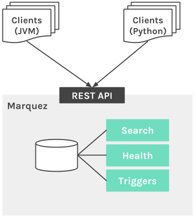

## Overview

Marquez is an open source **metadata service** for the **collection**, **aggregation**, and **visualization** of a data ecosystem's metadata. It maintains the provenance of how datasets are consumed and produced, provides global visibility into job runtime and frequency of dataset access, centralization of dataset lifecycle management, and much more.

## Why Marquez?

* Centralized metadata management
  * Jobs
  * Datasets
* Modular
  * Data discovery
  * Data health
  * Data triggers

## Design

Marquez consists of the following core architectural components:

* **Metadata Repository**: stores all dataset metadata, including job state (total execution time, success/failure, etc).
* **Metadata API**: RESTful API enabling a diverse set of clients to begin collecting metadata around data production and consumption.
* **Metadata UI**: used for dataset discovery, connecting multiple datasets and exploring their dependency graph.

 

  

To ease adoption and enable a diverse set of data processing applications (Clients) to build metadata collection as a core requirement into their design, we will provide language-specific SDKs that implement the Metadata API. In our initial release, we will provide support for Python.

The Metadata API is an abstraction for recording information around the production and consumption of datasets. It needs to be a low-latency, highly-available stateless layer responsible for encapsulating both metadata persistence and aggregation of lineage information. The API will allow clients to collect and/or obtain dataset information to/from the Metadata Repository.

Metadata needs to be collected, organized and stored in a way to allow for rich exploratory queries via the [Marquez UI](https://github.com/MarquezProject/marquez-web). The **Metadata Repository** will serve as a catalog of dataset information encapsulated and cleanly abstracted away by the [Marquez API]().

## Data Model

The diagram below shows the metadata collected by Marquez at different points i 
 ensuring mutations are track of job and dataset mutations.

  

**Job**: A job has a unique _name_, a _description_ and an _owner_ (team-based), with one or more input/out _datasets_. It's possible for a job to have only a input datasets

**Job Version:** A read-only immutable _version_ of a job, with a unique referenceable versioned artifact preserving the reproducibility of builds from source. Marquez uses versio []. In the digram above, `v1` to `v2`

**Dataset:** A dataset has a hierarchical unique _name_ and is . It has multiple versions as it gets mutated by changing the pointer to the current version. 

**Dataset Version:** A given version of a dataset. Each version can be read independently and has a unique version number for the corresponding dataset. A Version is immutable. Marquez uses dataset versions to ensure things like forward and backward compatibility and reproducibility of job runs.

## Roadmap

* [Airflow](https://airflow.apache.org) interfation
* [Icerberg](http://iceberg.incubator.apache.org) support
* Steaming integration ([Kafka](https://kafka.apache.org))
* Event-based triggers
* Define modules

## Contributing

We're excited you're interested in contributing to Marquez! We'd love your help, and there are plenty of ways to contribute:

* Fix or [report](https://github.com/MarquezProject/marquez/issues/new) a bug
* Fix or improve documentation
* Pick up a ["good first issue"](https://github.com/MarquezProject/marquez/labels/good%20first%20issue), then send a pull request our way

We feel that a welcoming community is important and we ask that you follow the [Contributor Covenant Code of Conduct](https://github.com/MarquezProject/marquez/blob/master/CODE_OF_CONDUCT.md) in all interactions with the community.

## Marquez Talks

* [Marquez: A Metadata Service for Data Abstraction, Data Lineage, and Event-based Triggers](https://www.datacouncil.ai/speaker/marquez-a-metadata-service-for-data-abstraction-data-lineage-and-event-based-triggers) by Willy Lulciuc at DataEngConf NYC '18
