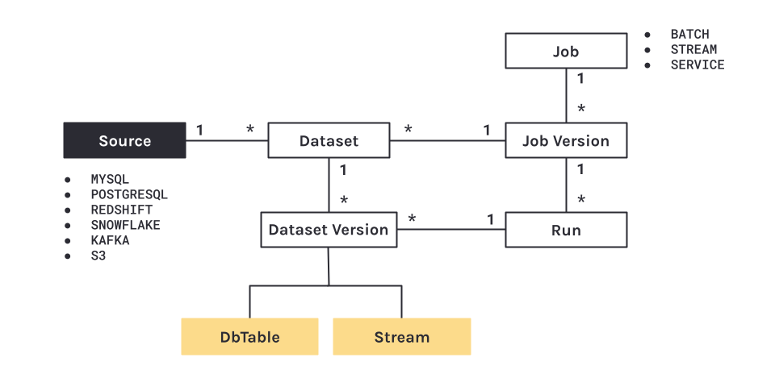
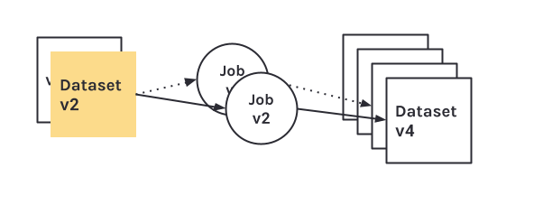
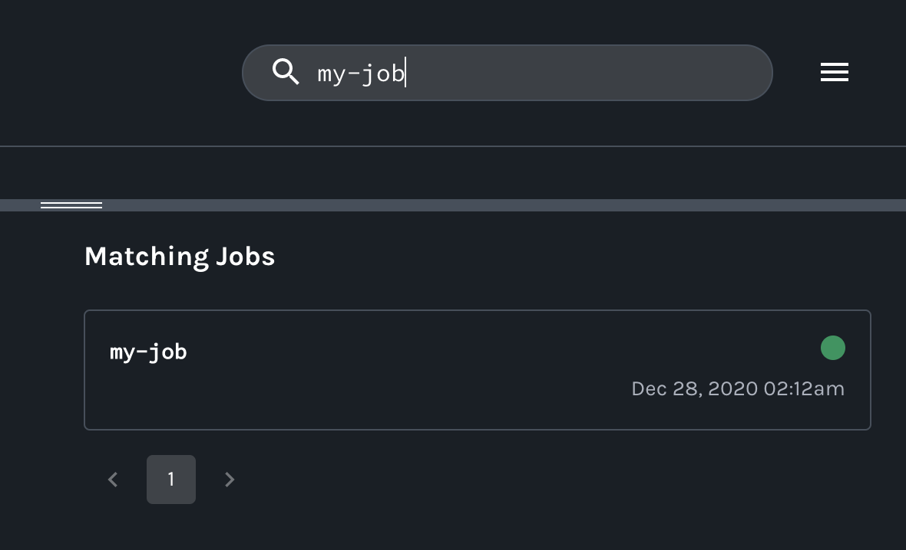
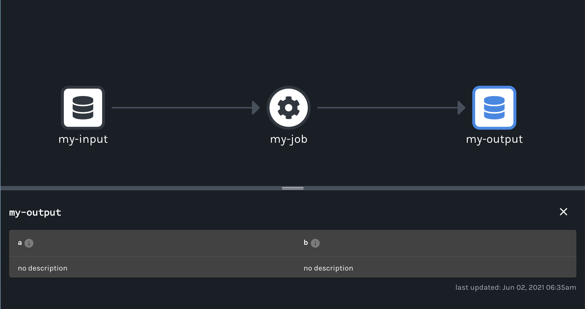

# Quickstart

* [Marquez Data Model](#marquez-data-model)
* [Write Sample Lineage Metadata to Marquez](#write-sample-lineage-metadata-to-marquez)
* [Explore Sample Lineage Metadata using Marquez](#explore-sample-lineage-metadata-using-marquez)
* [Collect Run-Level Metadata using OpenLineage](#collect-run-level-metadata-using-openlineage)
* [Summary](#summary)
* [Next Steps](#next-steps)

This guide covers how you can quickly get started collecting _dataset_, _job_, and _run_ metadata using Marquez. We'll first introduce you to Marquez’s data model, show how to write sample lineage metadata to a running Marquez instance, then explore the sample lineage metadata via the web UI.

#### PREREQUISITES

Before you begin, make sure you have installed:

* [Docker 17.05](https://docs.docker.com/install)+
* [Docker Compose](https://docs.docker.com/compose/install)

> Note: In this guide, we'll be running the Marquez HTTP server via Docker.

#### GET MARQUEZ

To checkout the Marquez source code, run:

```
$ git clone https://github.com/MarquezProject/marquez && cd marquez
```

## Marquez Data Model

##### METADATA STORAGE

Marquez's _centralized_ data model provides a normalized representation of the end-to-end metadata of your pipelines (composed of multiple jobs) with built-in metadata versioning support. The data model also enables highly flexible data lineage queries across all datasets, while reliably and efficiently associating (_upstream_, _downstream_) dependencies between jobs and the datasets they produce and consume. We encourage you to familiarize yourself with the data model below:

<figure align="center">
  
</figure>

> **Figure 1:** Marquez's metadata storage model.

The above data model generalizes very well when you start collecting basic metadata from multiple sources, schedulers and/or data processing frameworks. With metadata changes tracked, you can easily, for example, query the history of schema changes for a given dataset and compare a _previous_ schema version with the _latest_ schema version. Note this is especially useful for auditing or troubleshooting impacted jobs downstream of a schema change.

##### METADATA VERSIONING

<figure align="center">
  
</figure>

> **Figure 2:** Marquez's metadata versioning model.

Run-level metadata is tracked via HTTP API calls to `/lineage` using [OpenLineage](https://github.com/OpenLineage/OpenLineage). A **run** has a unique ID and records it's code version, inputs and outputs, run args, and run state transitions. When a run transitions to a **complete** state, the output datasets for the run are created if not already registered with Marquez. A **dataset** _version_ pointer is present for each input and output dataset and maintained by Marquez keeping track of the historical set of metadata changes. Each _immutable_ dataset version is mapped to a metadata change and the run ID that modifyed the dataset preserving it's state at some given point in time. A **job** _version_ pointer is also present and mapped to a unique referenceable link to code, the _latest_ run ID, and one or more versioned input and output datasets.

## Write Sample Lineage Metadata to Marquez

In this example, we'll be using sample dataset, job, and run metadata for a hypothetical _Food Delivery_ website. The sample metadata consists of hourly and daily ETL jobs that query tables in a `postgres` database used for reporting and analytics. So, let's get started!

To start Marquez with sample metadata that will be used and referenced in later sections, run the following script from the base of the Marquez repository (the `--seed` flag will execute the `marquez seed` [command](https://github.com/MarquezProject/marquez/blob/main/api/src/main/java/marquez/cli/SeedCommand.java)):

```
$ ./docker/up.sh --seed
```

> **Tip:** Use the `--build` flag to build images from source, or `--tag X.Y.Z` to use a tagged image.

To view the Marquez UI and verify it's running, open [http://localhost:3000](http://localhost:3000). The UI enables you to discover dependencies between jobs and the datasets they produce and consume via the lineage graph, view run-level metadata of current and previous job runs, and much more!

## Explore Sample Lineage Metadata using Marquez

##### SEARCH JOB METADATA

To view lineage metadata collected by Marquez, browse to the UI by visiting [http://localhost:3000](http://localhost:3000). Then, use the search bar in the upper right-side of the page and search for the job `etl_delivery_7_days`. To view lineage metadata for `etl_delivery_7_days`, click on the job from the drop-down list:

<figure align="center">
  
</figure>

##### VIEW JOB METADATA

You should see the job `namespace`, `name`, `input` and `output` datasets, and the job run marked as `COMPLETED`: 

<figure align="center">
  
</figure>

##### VIEW INPUT DATASET METADATA

Finally, click on the output dataset `public.delivery_7_days` for `etl_delivery_7_days`. You should see the dataset `name`, `schema`, and `description`:

<figure align="center">
  
</figure>

## Collect Run-Level Metadata using OpenLineage

To collect _run-level_ metadata as [OpenLineage](https://github.com/OpenLineage/OpenLineage) events using Marquez as the [HTTP backend](https://github.com/OpenLineage/OpenLineage#scope), see the OpenLineage [getting started](https://openlineage.io/getting-started) guide!

## Summary

In this simple example, we showed you how to write sample lineage metadata to a running Marquez instance, then explored the sample lineage metadata for the job `etl_delivery_7_days` via the web UI.

## Next Steps

* Take a look at our Airflow [example](https://github.com/MarquezProject/marquez/tree/main/examples/airflow) to learn how to enable metadata collection for Airflow DAGs and troubleshoot failing DAGs using Marquez.
* Listen to [Solving Data Lineage Tracking And Data Discovery At WeWork](https://www.dataengineeringpodcast.com/marquez-data-lineage-episode-111).
* Listen to [Unlocking The Power of Data Lineage In Your Platform with OpenLineage](https://www.dataengineeringpodcast.com/openlineage-data-lineage-specification-episode-187).
* Watch [A Metadata Service for Data Abstraction, Data Lineage & Event-based Triggers](https://www.youtube.com/watch?v=dRaRKob-lRQ).

## Feedback

What did you think of this guide? You can reach out to us on [slack](http://bit.ly/MarquezSlack) and leave us feedback, or [open a pull request](https://github.com/MarquezProject/marquez/blob/main/CONTRIBUTING.md#submitting-a-pull-request) with your suggestions!  
