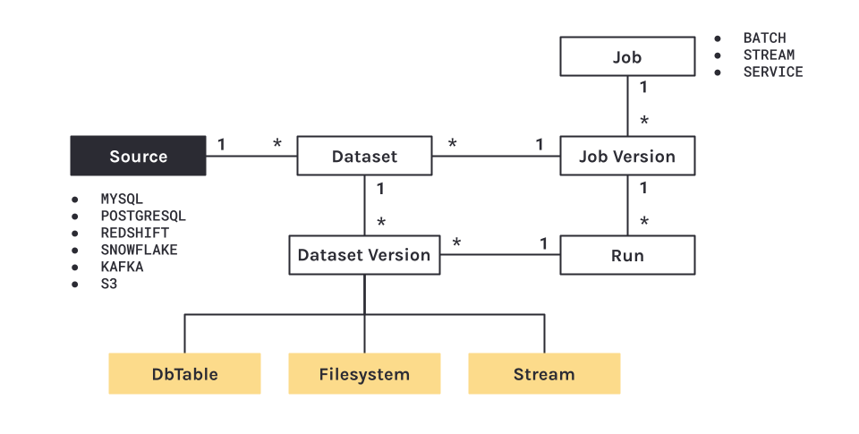

# Quickstart

* [Data Model](#data-model)
* [Collect Run-Level Metadata using OpenLineage](#collect-run-level-metadata-using-openlineage)
* [View Collected Lineage Metadata](#view-collected-lineage-metadata)
* [Summary](#summary)
* [Next Steps](#next-steps)

This guide covers how you can quickly get started collecting _dataset_ and _job_ metadata using Marquez. We'll first introduce you to Marquez’s data model, show how to collect _run-level_ metadata using [OpenLineage](https://github.com/OpenLineage/OpenLineage) events, then explore the lineage graph via the web UI.

#### PREREQUISITES

Before you begin, make sure you have installed:

* [Docker 17.05](https://docs.docker.com/install)+
* [Docker Compose](https://docs.docker.com/compose/install)

#### SETUP

To checkout the Marquez source code, run:

```
$ git clone git@github.com:MarquezProject/marquez.git && cd marquez
```

#### RUNNING WITH [DOCKER](https://github.com/MarquezProject/marquez/blob/main/Dockerfile)

The easiest way to get up and running is with Docker. From the base of the Marquez repository, run:

```
$ ./docker/up.sh
```

> **Tip:** Use the `--build` flag to build images from source, or `--pull` to pull a tagged image.

To view the Marquez UI and verify it's running, open http://localhost:3000. The UI enables you to discover dependencies between jobs and the datasets they produce and consume via the lineage graph, view run-level metadata of current and previous job runs, and much more! 

## Data Model

Marquez's _centralized_ data model provides a normalized representation of the end-to-end metadata of your pipelines (composed of multiple jobs) with built-in metadata versioning support. The data model also enables highly flexible data lineage queries across all datasets, while reliably and efficiently associating (_upstream_, _downstream_) dependencies between jobs and the datasets they produce and consume. We encourage you to familiarize yourself with the [data model](https://marquezproject.github.io/marquez/#data-model) below:

<figure align="center">
  
</figure>

The above data model generalizes very well when you start collecting basic metadata from multiple sources, schedulers and/or data processing frameworks. With metadata changes tracked, you can easily, for example, query the history of schema changes for a given dataset and compare a _previous_ schema version with the _latest_ schema version. Note this is especially useful for auditing or troubleshooting impacted jobs downstream of a schema change.

## Collect Run-Level Metadata using OpenLineage

Run-level metadata is tracked via HTTP API calls to `/lineage`. A **run** has a unique ID and records it's code version, inputs and outputs, run args, and run state transitions. When a run transitions to a **complete** state, the output datasets for the run are created if not already registered with Marquez. A dataset _version_ pointer is also present for each output dataset and maintained by Marquez keeping track of the historical set of metadata changes. Each dataset version is mapped to a metadata change and the run ID that modifyed the dataset preserving it's state at some given point in time.

In this example, we show how you can collect dataset and job metadata using Marquez. Using the [LineageAPI](https://marquezproject.github.io/marquez/openapi.html#tag/Lineage), metadata will be collected as OpenLineage events using the run ID `d46e465b-d358-4d32-83d4-df660ff614dd`. The run ID will enable the tracking of run-level metadata over time for the job `my-job`. So, let's get started!

> **Note:** The example shows how to collect metadata via direct HTTP API calls using `curl`. But, you can also get started using our client library for [Java](https://github.com/MarquezProject/marquez/tree/main/clients/java) or [Python](https://github.com/MarquezProject/marquez/tree/main/clients/python).

#### STEP 1: START A RUN

Use `d46e465b-d358-4d32-83d4-df660ff614dd` to **start** the run for `my-job` with `my-input` as the input dataset:

##### REQUEST

```bash
$ curl -X POST http://localhost:5000/api/v1/lineage \
  -H 'Content-Type: application/json' \
  -d '{
        "eventType": "START",
        "eventTime": "2020-12-28T19:52:00.001+10:00",
        "run": {
          "runId": "d46e465b-d358-4d32-83d4-df660ff614dd"
        },
        "job": {
          "namespace": "my-namespace",
          "name": "my-job"
        },
        "inputs": [{
          "namespace": "my-namespace",
          "name": "my-input"
        }],  
        "producer": "https://github.com/OpenLineage/OpenLineage/blob/v1-0-0/client"
      }'
```

##### RESPONSE

**`201 CREATED`**

#### STEP 2: COMPLETE A RUN

Use `d46e465b-d358-4d32-83d4-df660ff614dd` to **complete** the run for `my-job` with `my-output` as the output dataset. We also specify the [`schema` facet](https://github.com/OpenLineage/OpenLineage/blob/main/spec/OpenLineage.md#dataset-facets) to collect the schema for `my-output` before marking the run as completed. Note, you don't have to specify the input dataset `my-input` again since it already has been associated with the run ID:

##### REQUEST

```bash
$ curl -X POST http://localhost:5000/api/v1/lineage \
  -H 'Content-Type: application/json' \
  -d '{
        "eventType": "COMPLETE",
        "eventTime": "2020-12-28T20:52:00.001+10:00",
        "run": {
          "runId": "d46e465b-d358-4d32-83d4-df660ff614dd"
        },
        "job": {
          "namespace": "my-namespace",
          "name": "my-job"
        },
        "outputs": [{
          "namespace": "my-namespace",
          "name": "my-output",
          "facets": {
            "schema": {
              "_producer": "https://github.com/OpenLineage/OpenLineage/blob/v1-0-0/client",
              "_schemaURL": "https://github.com/OpenLineage/OpenLineage/blob/v1-0-0/spec/OpenLineage.json#/definitions/SchemaDatasetFacet",
              "fields": [
                { "name": "a", "type": "VARCHAR"},
                { "name": "b", "type": "VARCHAR"}
              ]
            }
          }
        }],     
        "producer": "https://github.com/OpenLineage/OpenLineage/blob/v1-0-0/client"
      }'
```

##### RESPONSE

**`201 CREATED`**

## View Collected Lineage Metadata

##### SEARCH JOB METADATA

To view lineage metadata collected by Marquez, browse to the UI by visiting http://localhost:3000. Then, use the search bar in the upper right-side of the page and search for the job `my-job`. To view lineage metadata for `my-job`, click on the job from the drop-down list:

<figure align="center">
  
</figure>

##### VIEW JOB METADATA

You should see the job `namespace`, `name`, `my-input` as an input dataset and `my-output` as an output dataset in the lineage graph and the job run marked as `COMPLETED `: 

<figure align="center">
  
</figure>

##### VIEW INPUT DATASET METADATA

Finally, click on the output dataset `my-output` for `my-job`. You should see the dataset `name`, `schema`, and `description`:

<figure align="center">
  
</figure>

## Summary

In this simple example, we showed you how to use Marquez to collect dataset and job metadata with OpenLineage. We also walked you through the set of HTTP [API](https://marquezproject.github.io/marquez/openapi.html) calls to successfully mark a run as **complete** and view the lineage metadata collected.

## Next Steps

* Take a look at our [`Airflow`](https://github.com/MarquezProject/marquez/tree/main/examples/airflow) example to learn how to enable metadata collection for Airflow DAGs and troubleshoot failing DAGs using Marquez.
* Listen to [Solving Data Lineage Tracking And Data Discovery At WeWork](https://www.dataengineeringpodcast.com/marquez-data-lineage-episode-111).
* Listen to [Unlocking The Power of Data Lineage In Your Platform with OpenLineage](https://www.dataengineeringpodcast.com/openlineage-data-lineage-specification-episode-187).