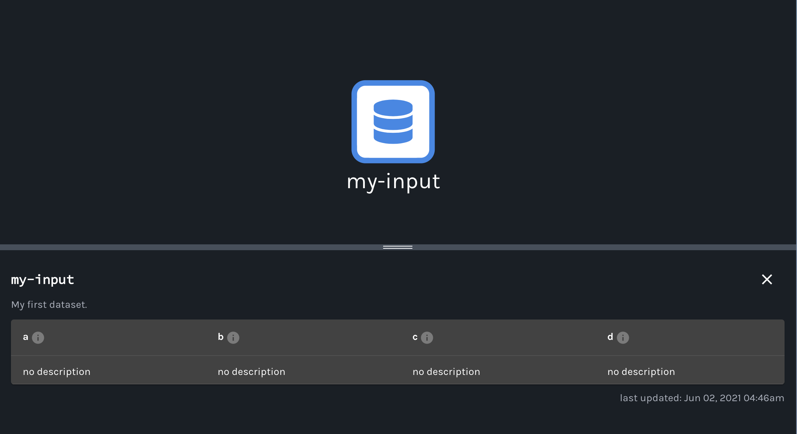
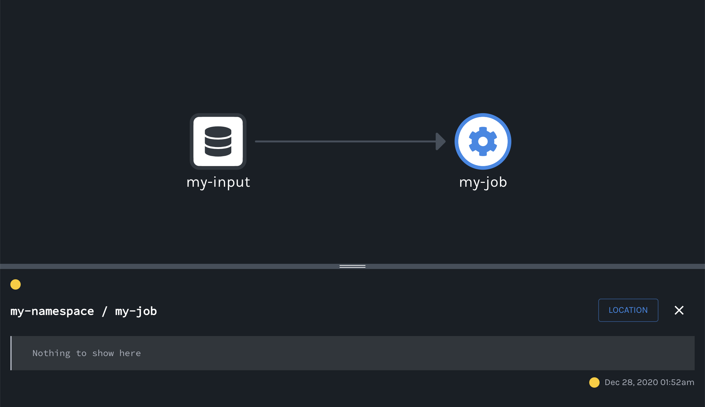

# Quickstart

* [Data Model](#data-model)
* [Example](#example)
* [Summary](#summary)
* [Next Steps](#next-steps)

This guide covers how you can quickly get started collecting _dataset_ and _job_ metadata using Marquez. We'll first introduce you to Marquez’s data model, show how to collect _run-level_ metadata using [OpenLineage](https://github.com/OpenLineage/OpenLineage) events, then explore the lineage graph via the web UI.

#### PREREQUISITES

Before you begin, make sure you have installed:

* [Docker 17.05](https://docs.docker.com/install)+
* [Docker Compose](https://docs.docker.com/compose/install)

#### SETUP

To checkout the Marquez source code, run:

```
$ git clone git@github.com:MarquezProject/marquez.git && cd marquez
```

#### RUNNING WITH [DOCKER](https://github.com/MarquezProject/marquez/blob/main/Dockerfile)

The easiest way to get up and running is with Docker. From the base of the Marquez repository, run:

```
$ ./docker/up.sh
```

> **Tip:** Use the `--build` flag to build images from source, or `--pull` to pull a tagged image.

To view the Marquez UI and verify it's running, open http://localhost:3000. The UI enables you to discover dependencies between jobs and the datasets they produce and consume via the lineage graph, view run-level metadata of current and previous job runs, and much more! 

## Data Model

Marquez's _centralized_ data model provides a normalized representation of the end-to-end metadata of your pipelines (composed of multiple jobs) with built-in metadata versioning support. The data model also enables highly flexible data lineage queries across all datasets, while reliably and efficiently associating (_upstream_, _downstream_) dependencies between jobs and the datasets they produce and consume. We encourage you to familiarize yourself with the below [data model](https://marquezproject.github.io/marquez/#data-model):

<figure align="center">
  
</figure>

The above data model generalizes very well when you start collecting basic metadata from multiple sources, schedulers and/or data processing frameworks. With metadata changes tracked, you can easily, for example, query the history of schema changes for a given dataset and compare a _previous_ schema version with the _latest_ schema version. Note this is especially useful for auditing or troubleshooting impacted jobs downstream of a schema change.

## Example

In this example, we show how you can collect dataset and job metadata using Marquez. Using the [LineageAPI](https://marquezproject.github.io/marquez/openapi.html#tag/Lineage), metadata will be collected as [OpenLineage](https://github.com/OpenLineage/OpenLineage) events using the run ID `d46e465b-d358-4d32-83d4-df660ff614dd`. The run ID will enable the tracking of run-level metadata for the job `my-job`. Let's get started!

> **Note:** The example shows how to collect metadata via direct HTTP API calls using `curl`. But, you can also get started using our client library for [Java](https://github.com/MarquezProject/marquez/tree/main/clients/java) or [Python](https://github.com/MarquezProject/marquez/tree/main/clients/python).

#### STEP 1: CREATE A NAMESPACE

Before we can begin collecting metadata, we must first create a _namespace_. A `namespace` helps you organize related dataset and job metadata. Note that datasets and jobs are unique within a namespace, but not across namespaces. For example, the job `my-job` may exist in the namespace `this-namespace` and `other-namespace`, or both. In this example, we'll use the namespace `my-namespace`:

##### REQUEST

```bash
$ curl -X PUT http://localhost:5000/api/v1/namespaces/my-namespace \
  -H 'Content-Type: application/json' \
  -d '{
        "ownerName": "me",
        "description": "My first namespace."
      }'
```

##### RESPONSE

```bash
{
  "name": "my-namespace",
  "createdAt": "2020-06-30T20:29:53.521534Z",
  "updatedAt": "2020-06-30T20:29:53.525528Z",
  "ownerName": "me",
  "description": "My first namespace."
}
```

**`200 OK`**

> **Note:** Marquez provides a `default` namespace to collect metadata, but we encourage you to create your own.

#### STEP 2: CREATE A SOURCE

Each dataset must be associated with a _source_. A `source` is the physical location of a dataset, such as a table in a database, or a file on cloud storage. A source enables the logical grouping and mapping of physical datasets to their physical source. Below, let's create the source `my-source` for the database `mydb`:

##### REQUEST

```bash
$ curl -X PUT http://localhost:5000/api/v1/sources/my-source \
  -H 'Content-Type: application/json' \
  -d '{
        "type": "POSTGRESQL",
        "connectionUrl": "jdbc:postgresql://localhost:5431/mydb",
        "description": "My first source."
      }'  
```

##### RESPONSE

```bash
{
  "type": "POSTGRESQL",
  "name": "my-source",
  "createdAt": "2020-06-30T20:30:56.535357Z",
  "updatedAt": "2020-06-30T20:30:56.535357Z",
  "connectionUrl": "jdbc:postgresql://localhost:5431/mydb",
  "description": "My first source."
}
```

**`200 OK`**

#### STEP 3: ADD INPUT DATASET TO NAMESPACE

Next, we need to create the dataset `my-input` used by `my-job` and associate it with the existing source `my-source`. In Marquez, datasets have both a _logical_ and _physical_ name. The logical name is how your dataset is known to Marquez, while the physical name is how your dataset is known to your source. In this example, we refer to `my-input` as the logical name and `public.mytable` (_format_:`schema.table`) as the physical name:

##### REQUEST

```bash
$ curl -X PUT http://localhost:5000/api/v1/namespaces/my-namespace/datasets/my-input \
  -H 'Content-Type: application/json' \
  -d '{ 
        "type": "DB_TABLE",
        "physicalName": "public.mytable",
        "sourceName": "my-source",
        "fields": [
          {"name": "a", "type": "INTEGER"},
          {"name": "b", "type": "TIMESTAMP"},
          {"name": "c", "type": "INTEGER"},
          {"name": "d", "type": "INTEGER"}
        ],
        "description": "My first dataset."
      }'
```

##### RESPONSE

```bash
{
  "id": {
    "namespace": "my-namespace",
    "name": "my-input"
  },
  "type": "DB_TABLE",
  "name": "my-input",
  "physicalName": "public.mytable",
  "createdAt": "2020-06-30T20:31:39.129483Z",
  "updatedAt": "2020-06-30T20:31:39.259853Z",
  "namespace": "my-namespace",
  "sourceName": "my-source",
  "fields": [
    {"name": "a", "type": "INTEGER", "tags": [], "description": null},
    {"name": "b", "type": "TIMESTAMP", "tags": [], "description": null},
    {"name": "c", "type": "INTEGER", "tags": [], "description": null},
    {"name": "d", "type": "INTEGER", "tags": [], "description": null}
  ],
  "tags": [],
  "lastModifiedAt": null,
  "description": "My first dataset."
}
```

**`200 OK`**

##### VIEW INPUT DATASET IN UI

Browse to http://localhost:3000/datasets/my-input to view the collected metadata for `my-input`. You should see the dataset `name`, `schema`, and `description`:

<figure align="left">
  
</figure>

#### STEP 4: START A RUN

Use `d46e465b-d358-4d32-83d4-df660ff614dd` to **start** the run for `my-job` with `my-input` as the input dataset:

##### REQUEST

```bash
$ curl -X POST http://localhost:5000/api/v1/lineage \
  -H 'Content-Type: application/json' \
  -d '{
        "eventType": "START",
        "eventTime": "2020-12-28T19:52:00.001+10:00",
        "run": {
          "runId": "d46e465b-d358-4d32-83d4-df660ff614dd"
        },
        "job": {
          "namespace": "my-namespace",
          "name": "my-job"
        },
        "inputs": [{
          "namespace": "my-namespace",
          "name": "my-input"
        }],
        "producer": "https://github.com/OpenLineage/OpenLineage/blob/v1-0-0/client"
      }'
```

##### RESPONSE

**`201 CREATED`**

##### VIEW RUNNING JOB IN UI

Browse to http://localhost:3000/jobs/my-job to view the collected run-level metadata for `my-job`. You should see the job `namespace`, `name`, `my-input` as an input dataset in the lineage graph and the job run marked as `RUNNING`: 

<figure align="left">
  
</figure>

#### STEP 5: COMPLETE A RUN

Use `d46e465b-d358-4d32-83d4-df660ff614dd` to **complete** the run for `my-job` with `my-output` as the output dataset. We also specify the [`schema` facet](https://github.com/OpenLineage/OpenLineage/blob/main/spec/OpenLineage.md#dataset-facets) to collect the schema for `my-output` before marking the run as completed. Note, you don't have to specify the input dataset `my-input` again since it already has been associated with the run ID:

##### REQUEST

```bash
$ curl -X POST http://localhost:5000/api/v1/lineage \
  -H 'Content-Type: application/json' \
  -d '{
        "eventType": "COMPLETE",
        "eventTime": "2020-12-28T20:52:00.001+10:00",
        "run": {
          "runId": "d46e465b-d358-4d32-83d4-df660ff614dd"
        },
        "job": {
          "namespace": "my-namespace",
          "name": "my-job"
        },
        "outputs": [{
          "namespace": "my-namespace",
          "name": "my-output",
          "facets": {
            "schema": {
              "_producer": "https://github.com/OpenLineage/OpenLineage/blob/v1-0-0/client",
              "_schemaURL": "https://github.com/OpenLineage/OpenLineage/blob/v1-0-0/spec/OpenLineage.json#/definitions/SchemaDatasetFacet",
              "fields": [
                { "name": "a", "type": "VARCHAR"},
                { "name": "b", "type": "VARCHAR"}
              ]
            }
          }
        }],     
        "producer": "https://github.com/OpenLineage/OpenLineage/blob/v1-0-0/client"
      }'
```

##### RESPONSE

**`201 CREATED`**

##### VIEW COMPLETED JOB IN UI

Browse to http://localhost:3000/jobs/my-job to view the collected run-level metadata for `my-job`. You should see the job `namespace`, `name`, `my-input` as an input dataset and `my-output` as an output dataset in the lineage graph and the job run marked as `COMPLETED `: 

<figure align="left">
  
</figure>

##### VIEW OUTPUT DATASET IN UI

Browse to http://localhost:3000/datasets/my-output to view the collected metadata for `my-output`. You should see the dataset `name`, `schema`, and `description`:

<figure align="left">
  
</figure>

## Summary

In this example, we showed you how to use Marquez to collect dataset and job metadata with OpenLineage. We also walked you through the set of [API](https://marquezproject.github.io/marquez/openapi.html) calls to successfully mark a run as complete.

## Next Steps

* Take a look at our [`Airflow`](https://github.com/MarquezProject/marquez/tree/main/examples/airflow) example