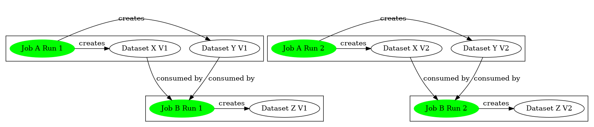
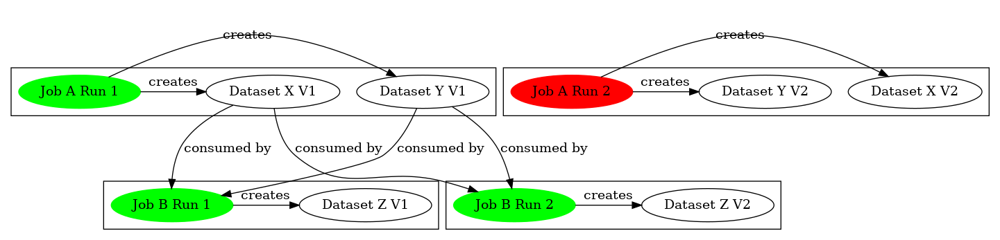
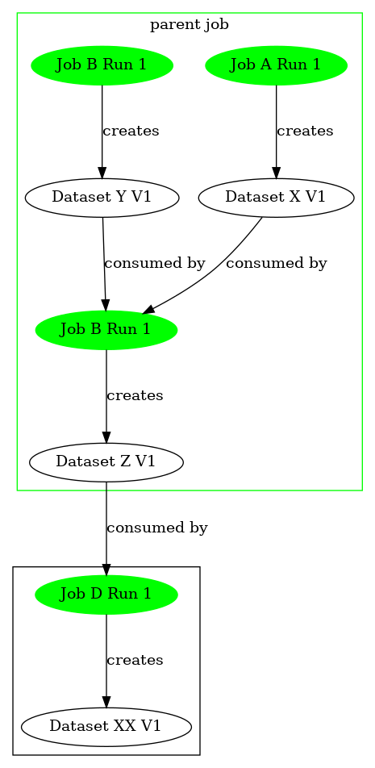
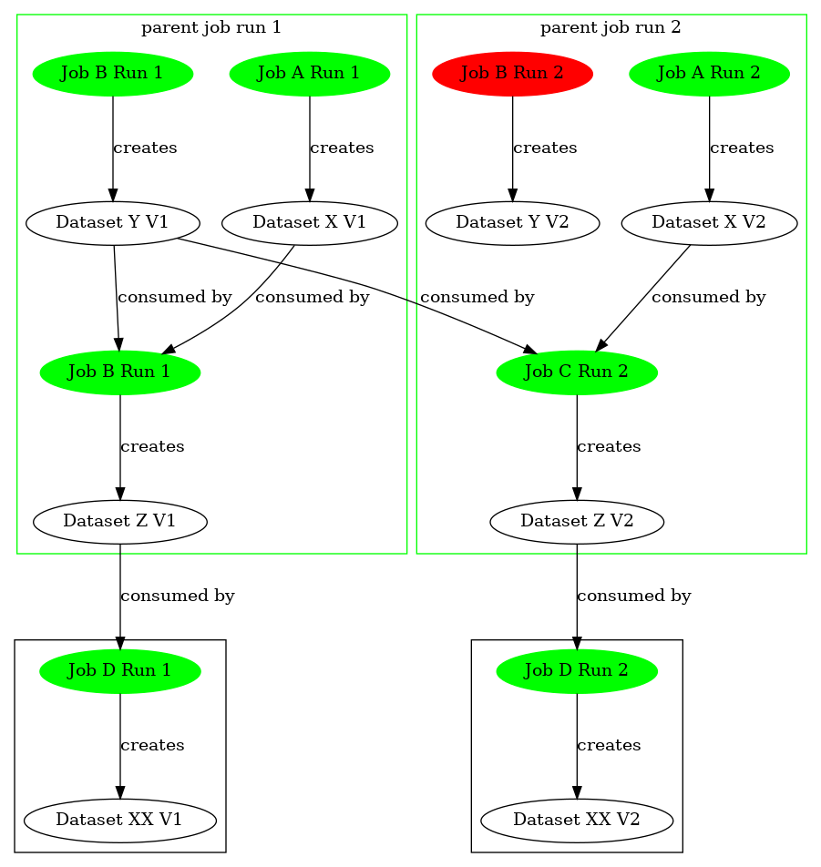
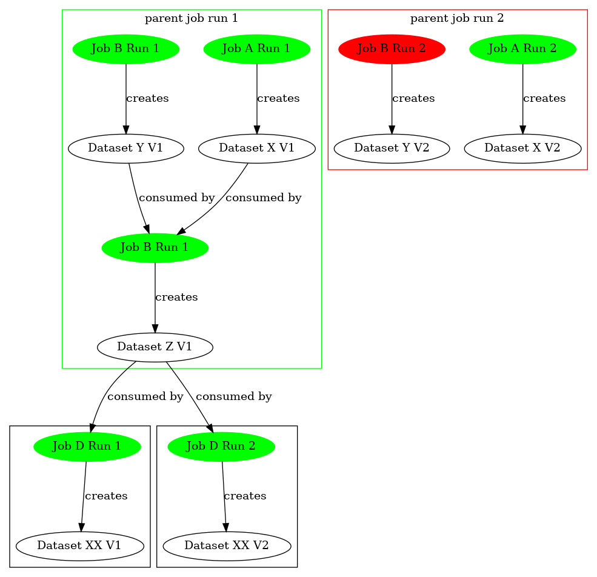

# Run State Transitions
Run states change based on the success or failure of a job run. The datasets consumed and/or produced
by a job run are immutable and do not change based on the success or failure of the run.

# Dataset Versioning Lifecycle
Dataset versions change based on the success or failure of job runs that consume or generate those 
datasets. Typically, Runs generate dataset versions as outputs, but sometimes a job run may result 
in an input dataset version being created if that dataset did not previously exist in the database.
Once a dataset exists, a new version will only be created if the dataset is the output of a job run.

As code:
```python
for dataset in jobRun.inputDatasets:
  if not exists(dataset):
    create(dataset)
    version = dataset.createVersion('version1')
    dataset.setCurrentVersion(version)
  jobRun.addInputVersion(dataset.getCurrentVersion())
  
for dataset in jobRun.outputDatasets:
  datasetVersion
  if not exists(dataset):
    create(dataset)
    datasetVersion = dataset.createVersion('version1')
  else:
    curVersion = dataset.getCurrentVersion()
    datasetVersion = datasetVersion.incrementVersion()
  jobRun.addOutputVersion(dataset.getCurrentVersion())
  if jobRun.suceeded:
    dataset.setCurrentVersion(datasetVersion)
```

### Definitions
Assume the following job graph
* JobA consumes no datasets and produces DatasetX
* JobB consumes DatasetX and produces DatasetY
* JobC consumes DatasetY and produces DatasetZ

### Produce a new dataset
* Given
  * JobA does not exist
  * DatasetX does not exist
* When
  * JobA@Run1 **succeeds**
  * JobA produces DatasetX
* Then
  * Create JobA V1
  * Create DatasetX@V1
  * Set DatasetX current version to V1
  * JobA@Run1 produces DatasetX@V1
  
### Consume a new dataset
* Given
  * JobB does not exist
  * DatasetX does not exist
* When
  * JobB@Run1 **succeeds**
  * JobB@Run1 consumes DatasetX
* Then
  * Create JobB@V1
  * Create DatasetX@V1
  * Set DatasetX current version to V1
  * JobB@Run1 consumes DatasetX@V1

### Successful Job Chain - Produce and Consume New Datasets
* Given
  * JobA does not exist
  * JobB does not exist
  * DatasetX does not exist
  * DatasetY does not exist
* When
  * JobA@Run1 **succeeds**
  * JobA produces DatasetX
  * JobB@Run1 **succeeds**
  * JobB consumes DatasetX
  * JobB produces DatasetY
* Then
  * Create JobA@Run1
  * Create DatasetX@V1
  * Set DatasetX current version to V1
  * JobA@Run1 produces DatasetX@V1
  * Create JobB@Run1
  * Create DatasetY@V1
  * Set DatasetY current version to V1
  * JobB@Run1 consumes DatasetX@V1
  * JobB@Run1 produces DatasetY@V1
    


### Successful Job Chain - Produce and Consume Existing Datasets
* Given
    * JobA@Run1 exists
    * JobB@Run1 exists
    * DatasetX@V1 exists
    * DatasetY@V1 exists
* When
    * JobA@Run1 **succeeds**
    * JobA produces DatasetX
    * JobB consumes DatasetX
    * JobB produces DatasetY
* Then
    * Create DatasetX@V2
    * Set DatasetX current version to V2
    * JobA@Run1 produces DatasetX@V2
    * Create DatasetY@V2
    * Set DatasetY current version to V2
    * JobB@Run1 consumes DatasetX@V2
    * JobB@Run1 produces DatasetY@V2

### Failed Job Chain - Produce and Consume Existing Datasets - Workflow Stops
* Given
    * JobA@Run1 exists
    * JobB@Run1 exists
    * DatasetX@V1 exists
    * DatasetY@V1 exists
    * JobA@Run1 produces DatasetX@V1
    * JobB@Run1 consumes DatasetX@V1
    * JobB@Run1 produces DatasetY@V1
* When
    * JobA@Run2 **fails**
    * JobA produces DatasetX
* Then
    * Create DatasetX@V2
    * DatasetX current version is V1
    * JobA@Run2 produces DatasetX@V2
    * DatasetY current version remains at V1
  
### Failed Job Chain - Produce and Consume Existing Datasets - Workflow Continues
* Given
    * JobA@Run1 exists
    * JobB@Run1 exists
    * DatasetX@V1 exists
    * DatasetY@V1 exists
    * JobA@Run1 produces DatasetX@V1
    * JobB@Run1 consumes DatasetX@V1
    * JobB@Run1 produces DatasetY@V1
* When
    * JobA@Run2 **fails**
    * JobA produces DatasetX
    * JobB@Run2 **succeeds**
    * JobB consumes DatasetX
    * JobB produces DatasetY
* Then
    * Create DatasetX@V2
    * DatasetX current version is V1
    * JobA@Run2 produces DatasetX@V2
    * JobB@Run2 consumes DatasetX@**V1**
    * JobB@Run2 produces DatasetY@V2



### Parent jobs with successful child jobs
Parent job success/failure does not impact the status of the datasets created by child jobs.
* Given
  * JobP@Run1 exists
  * DatasetX@V1 exists
  * DatasetY@V1 exists
  * DatasetZ@V1 exists
* When
  * JobB@Run1 reports JobP@Run1 as a parent job
  * JobB consumes DatasetX
  * JobB produces DatasetY
  * JobB@Run1 **succeeds**
  * JobP@Run1 **succeeds**
  * JobC@Run1 consumes DatasetY
  * JobC@Run1 produces DatasetZ
  * JobC@Run1 **succeeds**
* Then
  * Create DatasetY@V2
  * DatasetY current version is V2
  * JobB@Run1 consumes DatasetX@V1
  * JobB@Run1 produces DatasetY@V2
  * JobC@Run1 consumes DatasetY@V2
  * JobC@Run1 produces DatasetZ@V2



### Parent jobs with failed child jobs
Parent job failure does not impact the status of the datasets created by child jobs.
* Given
  * JobP@Run1 exists
  * DatasetX@V1 exists
  * DatasetY@V1 exists
  * DatasetZ@V1 exists
* When
  * JobB@Run1 reports JobP@Run1 as a parent job
  * JobB consumes DatasetX
  * JobB produces DatasetY
  * JobB@Run1 **fails**
  * JobP@Run1 **succeeds**
  * JobC@Run1 consumes DatasetY
  * JobC@Run1 produces DatasetZ
  * JobC@Run1 **succeeds**
* Then
  * Create DatasetY@V2
  * DatasetY current version is V2
  * JobB@Run1 consumes DatasetX@V1
  * JobC@Run1 consumes DatasetY@V1
  * JobC@Run1 produces DatasetZ@V2
  


### Parent jobs **fails**
Parent job failure does not impact the status of the datasets created by child jobs.
* Given
  * JobP@Run1 exists
  * DatasetX@V1 exists
  * DatasetY@V1 exists
  * DatasetZ@V1 exists
* When
  * JobB@Run1 reports JobP@Run1 as a parent job
  * JobB consumes DatasetX
  * JobB produces DatasetY
  * JobB@Run1 **succeeds**
  * JobP@Run1 **fails**
  * JobC@Run1 consumes DatasetY
  * JobC@Run1 produces DatasetZ
  * JobC@Run1 **succeeds**
* Then
  * Create DatasetY@V2
  * DatasetY current version is V2
  * JobB@Run1 consumes DatasetX@V1
  * JobB@Run1 produces DatasetY@V2
  * JobC@Run1 consumes DatasetY@V2
  * JobC@Run1 produces DatasetZ@V2
  

