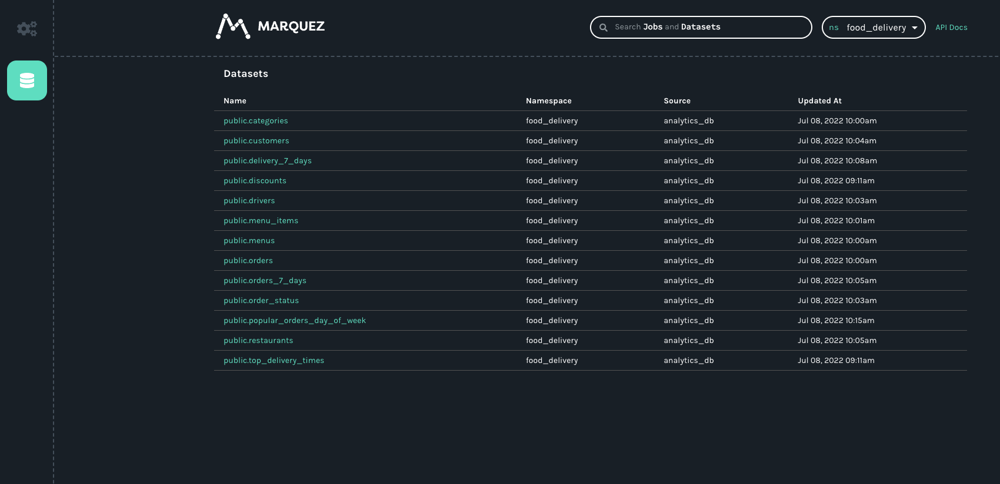

Read on to learn how to use the API behind Marquez to explore datasets, jobs, and lineage.

<!--truncate-->

## Background

If you’re a Marquez user, then you might already know that the project is an open source metadata service for the collection, aggregation, and visualization of a data ecosystem’s metadata. Based on the OpenLineage standard, it solves a hard problem: representing data pipeline lineage holistically and agnostically – or, more precisely, as holistically and agnostically as possible (lineage being above all else a pursuit).

But did you know that Marquez is also a metadata *server* that offers an OpenLineage-compatible endpoint for real-time metadata collection?

The key to the Marquez metadata server is the Marquez Lineage API, a REST API that offers users the ability to retrieve, modify, and add to the metadata about their pipelines in the Marquez database. In response to queries, the API emits JSON via HTTP.

## Marquez API Functionality

| *Namespace* | *Source* | *Dataset* | *Job* | *Lineage* | *Tags* | *Search* |
| --- | --- | --- | --- | --- | --- | --- |
| Retrieve a namespace | Retrieve a source | Retrieve a dataset | Retrieve a job | Record a single lineage event | Create a tag | Query all datasets and jobs |
| List all namespaces | List all sources | Retrieve a dataset version | List all jobs | Get a lineage graph | List all tags | |
| Create a namespace | | List all dataset versions | List all job versions | | | 
| | | List all datasets | Retrieve a run | | | |
| | | Tag a dataset | | | | |
| | | Tag a field | | | | |

## How to Use 

### Prerequisites

- Docker 17.05+
- Docker Compose 1.29.1+
- Git (preinstalled on most versions of MacOS; verify with `git version`)
- 4 GB of available memory (the minimum for Docker — more is strongly recommended)

### Install and Run Marquez 

1. Clone the Marquez Github [repository](https://github.com/MarquezProject/marquez): `git clone https://github.com/MarquezProject/marquez.git`
2. Start Docker
3. Run Marquez with seed data: `cd marquez && ./docker/up.sh --seed`

### Explore Marquez 

Point your browser to `http://localhost:3000`.

As you explore the UI, you’ll notice a namespace (`ns`) dropdown on the top and job and dataset icons on the left. Everything viewable here is also queryable via the API.



### Query the API

#### View all Namespaces

In the OpenLineage spec, the namespace is at the top of the naming hierarchy. Practically speaking, namespaces are global contexts for jobs and datasets. In the case of a job, the namespace is related to the scheduler. In the case of a dataset, the namespace is the unique name of the dataset’s datasource. 

To view all the currently available namespaces (prettified) in the terminal, you could use: `curl http://localhost:5000/api/v1/namespaces | jq`.

If you started Marquez with seed data, you will see `food_delivery` in the output along with key data points about the namespace.

#### Namespaces Query Output

```
{
  "namespaces": [
    {
      "name": "default",
      "createdAt": "2022-07-12T16:22:11.080346Z",
      "updatedAt": "2022-07-12T16:22:11.080346Z",
      "ownerName": "anonymous",
      "description": "The default global namespace for dataset, job, and run metadata not belonging to a user-specified namespace."
    },
    {
      "name": "food_delivery",
      "createdAt": "2022-07-12T16:22:12.518454Z",
      "updatedAt": "2022-07-12T16:22:23.724885Z",
      "ownerName": "owner@food.com",
      "description": "Food delivery example!"
    }
  ]
}
```
Every other API call has to include a namespace, so it’s important to know which namespace(s) you care about.

#### Specify a Known Namespace 

Let’s say you wanted more streamlined output and you already knew about the `food_delivery` namespace. Queries about known namespaces are also supported: `http://localhost:5000/api/v1/namespaces/{namespace}`.

For data about the `food_delivery` namespace, you could use: `curl http://localhost:5000/api/v1/namespaces/food_delivery | jq`.

In this case you’ll see the name, time of creation, time of last update, owner, and description of only the namespace you provided.

#### Namespace Output 
```
{
  "name": "food_delivery",
  "createdAt": "2022-07-12T16:22:12.518454Z",
  "updatedAt": "2022-07-12T16:22:23.724885Z",
  "ownerName": "owner@food.com",
  "description": "Food delivery example!"
}
```

#### View Key Data about a Dataset 

Knowing the available namespaces allows you to query the API for information about all the datasets in a namespace.

For example, to see all the datasets in the `food_delivery` namespace, you would use the following format: `http://localhost:5000/api/v1/namespaces/{namespace}/datasets`.

To view all the datasets in `food_delivery` you could use: `curl http://localhost:5000/api/v1/namespaces/food_delivery/datasets | jq`.

#### Datasets Query Output (excerpt)
```
{
  "totalCount": 13,
  "datasets": [
    {
      "id": {
        "namespace": "food_delivery",
        "name": "public.categories"
      },
      "type": "DB_TABLE",
      "name": "public.categories",
      "physicalName": "public.categories",
      "createdAt": "2022-07-12T16:22:12.792434Z",
      "updatedAt": "2022-07-12T16:24:33.355699Z",
      "namespace": "food_delivery",
      "sourceName": "analytics_db",
      "fields": [
        {
          "name": "id",
          "type": "INTEGER",
          "tags": [],
          "description": "The unique ID of the category."
        },
        {
          "name": "name",
          "type": "VARCHAR",
          "tags": [],
          "description": "The name of the category."
        },
        {
          "name": "menu_id",
          "type": "INTEGER",
          "tags": [],
          "description": "The ID of the menu related to the category."
        },
        {
          "name": "description",
          "type": "TEXT",
          "tags": [],
          "description": "The description of the category."
        }
      ],
      "tags": [],
      "lastModifiedAt": "2022-07-12T16:24:33.355699Z",
      "lastLifecycleState": null,
      "description": "A table for categories.",
      "currentVersion": "aeccd013-c99e-45cf-86ba-97ed8cd28075",
      "facets": {},
      "deleted": false
    },
  ]
} 
```

#### Alt: Specify a Dataset 

Queries about known datasets are also supported: `http://localhost:5000/api/v1/namespaces/{namespace}/datasets/{dataset}`.

To query the API concerning the `public.categories` dataset above, you would use: `curl http://localhost:5000/api/v1/namespaces/food_delivery/datasets/public.categories | jq`.

#### Dataset Query Output 

```
{
  "id": {
    "namespace": "food_delivery",
    "name": "public.categories"
  },
  "type": "DB_TABLE",
  "name": "public.categories",
  "physicalName": "public.categories",
  "createdAt": "2022-07-12T16:22:12.792434Z",
  "updatedAt": "2022-07-12T16:24:33.355699Z",
  "namespace": "food_delivery",
  "sourceName": "analytics_db",
  "fields": [
    {
      "name": "id",
      "type": "INTEGER",
      "tags": [],
      "description": "The unique ID of the category."
    },
    {
      "name": "name",
      "type": "VARCHAR",
      "tags": [],
      "description": "The name of the category."
    },
    {
      "name": "menu_id",
      "type": "INTEGER",
      "tags": [],
      "description": "The ID of the menu related to the category."
    },
    {
      "name": "description",
      "type": "TEXT",
      "tags": [],
      "description": "The description of the category."
    }
  ],
  "tags": [],
  "lastModifiedAt": "2022-07-12T16:24:33.355699Z",
  "lastLifecycleState": null,
  "description": "A table for categories.",
  "currentVersion": "aeccd013-c99e-45cf-86ba-97ed8cd28075",
  "facets": {},
  "deleted": false
}
```

#### View Key Data about Jobs 

The query to see all the jobs in the `food_delivery` namespace has the following format: `http://localhost:5000/api/v1/namespaces/{namespace}/jobs`.

To view all the jobs in `food_delivery` you could use: `curl http://localhost:5000/api/v1/namespaces/food_delivery/jobs | jq`.

#### Jobs Query Output 

```
{
  "totalCount": 15,
  "jobs": [
    {
      "id": {
        "namespace": "food_delivery",
        "name": "example.delivery_times_7_days"
      },
      "type": "BATCH",
      "name": "example.delivery_times_7_days",
      "createdAt": "2022-07-12T16:22:13.325864Z",
      "updatedAt": "2022-07-12T16:36:44.355699Z",
      "namespace": "food_delivery",
      "inputs": [
        {
          "namespace": "food_delivery",
          "name": "public.delivery_7_days"
        }
      ],
      "outputs": [],
      "location": "https://github.com/example/jobs/blob/2294bc15eb49071f38425dc927e48655530a2f2e/delivery_times_7_days.py",
      "context": {
        "sql": "INSERT INTO top_delivery_times (order_id, order_placed_on, order_dispatched_on, order_delivered_on, order_delivery_time,\n    customer_email, restaurant_id, driver_id)\n  SELECT order_id, order_placed_on, order_delivered_on, DATEDIFF(minute, order_placed_on, order_delivered_on) AS order_delivery_time,\n    customer_email, restaurant_id, driver_id\n    FROM delivery_7_days\nGROUP BY restaurant_id\nORDER BY order_delivery_time DESC\n   LIMIT 1;"
      },
      "description": "Determine weekly top delivery times by restaurant.",
      "latestRun": {
        "id": "5d75efd9-4ec6-4fcc-931a-0c67faec9f92",
        "createdAt": "2022-07-12T16:22:23.676635Z",
        "updatedAt": "2022-07-12T16:36:44.355699Z",
        "nominalStartTime": "2022-07-12T16:34:00Z",
        "nominalEndTime": "2022-07-12T16:36:00Z",
        "state": "FAILED",
        "startedAt": "2022-07-12T16:34:13.355699Z",
        "endedAt": "2022-07-12T16:36:44.355699Z",
        "durationMs": 151000,
        "args": {},
        "jobVersion": {
          "namespace": "food_delivery",
          "name": "example.delivery_times_7_days",
          "version": "e9eafa5b-e334-358d-a3b4-61c8d3de75f3"
        },
        "inputVersions": [
          {
            "namespace": "food_delivery",
            "name": "public.delivery_7_days",
            "version": "581a0b65-c46a-3087-8d27-4c6e9899c64c"
          }
        ],
        "outputVersions": [],
        "context": {
          "sql": "INSERT INTO top_delivery_times (order_id, order_placed_on, order_dispatched_on, order_delivered_on, order_delivery_time,\n    customer_email, restaurant_id, driver_id)\n  SELECT order_id, order_placed_on, order_delivered_on, DATEDIFF(minute, order_placed_on, order_delivered_on) AS order_delivery_time,\n    customer_email, restaurant_id, driver_id\n    FROM delivery_7_days\nGROUP BY restaurant_id\nORDER BY order_delivery_time DESC\n   LIMIT 1;"
        },
        "facets": {}
      },
      "facets": {},
      "currentVersion": "a4d1a0fc-1d6c-4904-a94c-7776f78f4435"
    }, 
  ]
}
```
As with datasets, you can query the API for a specific job by appending the job name to the query above.

#### Get a Lineage Graph 

The lineage graph is the basis of the UI’s visualization of a pipeline. To view a lineage graph, query the API with either a dataset or job specified as the `nodeId`. 

##### Job Query 
```
NODE=”job:food_delivery:example.etl_delivery_7_days”
curl -s "http://localhost:5000/api/v1/lineage?nodeId=$NODE" | jq –arg N “${NODE}” ‘.graph[] | select(.id==$N)’
```

##### Job Query Output 
```
{
  "id": "job:food_delivery:example.etl_delivery_7_days",
  "type": "JOB",
  "data": {
    "type": "BATCH",
    "id": {
      "namespace": "food_delivery",
      "name": "example.etl_delivery_7_days"
    },
    "name": "example.etl_delivery_7_days",
    "createdAt": "2022-07-13T13:38:40.059605Z",
    "updatedAt": "2022-07-13T13:49:45.103063Z",
    "namespace": "food_delivery",
    "inputs": [
      {
        "namespace": "food_delivery",
        "name": "public.restaurants"
      },
      {
        "namespace": "food_delivery",
        "name": "public.customers"
      },
      {
        "namespace": "food_delivery",
        "name": "public.drivers"
      },
      {
        "namespace": "food_delivery",
        "name": "public.order_status"
      },
      {
        "namespace": "food_delivery",
        "name": "public.orders_7_days"
      }
    ],
    "outputs": [
      {
        "namespace": "food_delivery",
        "name": "public.delivery_7_days"
      }
    ],
    "location": "https://github.com/example/jobs/blob/c87f2a40553cfa4ae7178083a068bf1d0c6ca3a8/etl_delivery_7_days.py",
    "context": {
      "sql": "INSERT INTO delivery (order_id, order_placed_on, order_dispatched_on, order_delivered_on, customer_email,\n      customer_address, discount_id, menu_id, restaurant_id, restaurant_address, menu_item_id, category_id, driver_id)\n  SELECT o.order_id, o.placed_on AS order_placed_on,\n    (SELECT transitioned_at FROM order_status WHERE order_id == o.order_id AND status = 'DISPATCHED') AS order_dispatched_on,\n    (SELECT transitioned_at FROM order_status WHERE order_id == o.order_id AND status = 'DELIVERED') AS order_delivered_on,\n    c.email AS customer_email, c.address AS customer_address, o.discount_id, o.menu_id, o.restaurant_id,\n      r.address, o.menu_item_id, o.category_id, d.id AS driver_id\n    FROM orders_7_days AS o\n   INNER JOIN order_status AS os\n      ON os.order_id = o.order_id\n   INNER JOIN customers AS c\n      ON c.id = os.customer_id\n   INNER JOIN restaurants AS r\n      ON r.id = os.restaurant_id\n   INNER JOIN drivers AS d\n      ON d.id = os.driver_id\n   WHERE os.transitioned_at >= NOW() - interval '7 days';"
    },
    "description": "Loads new deliveries for the week.",
    "latestRun": {
      "id": "ad65c352-ae92-41d3-9795-d31639f816d2",
      "createdAt": "2022-07-13T13:38:49.962723Z",
      "updatedAt": "2022-07-13T13:49:45.103063Z",
      "nominalStartTime": "2022-07-13T13:46:00Z",
      "nominalEndTime": "2022-07-13T13:49:00Z",
      "state": "COMPLETED",
      "startedAt": "2022-07-13T13:46:40.103063Z",
      "endedAt": "2022-07-13T13:49:45.103063Z",
      "durationMs": 185000,
      "args": {},
      "jobVersion": {
        "namespace": "food_delivery",
        "name": "example.etl_delivery_7_days",
        "version": "c222a72e-92cc-3bb6-b3b7-c174cbc76387"
      },
      "inputVersions": [
        {
          "namespace": "food_delivery",
          "name": "public.order_status",
          "version": "ee4d0794-c7e8-3bdd-94f5-83a43f1eb6f6"
        },
        {
          "namespace": "food_delivery",
          "name": "public.restaurants",
          "version": "7f5d9f89-202a-305d-a338-2423269af7bf"
        },
        {
          "namespace": "food_delivery",
          "name": "public.orders_7_days",
          "version": "777358f4-1669-33fa-88f4-780d00d34f15"
        },
        {
          "namespace": "food_delivery",
          "name": "public.drivers",
          "version": "32343496-969e-3f66-9ad7-13cabf16ca26"
        },
        {
          "namespace": "food_delivery",
          "name": "public.customers",
          "version": "db58139b-6eec-3efb-b589-d3cad7138ae4"
        }
      ],
      "outputVersions": [
        {
          "namespace": "food_delivery",
          "name": "public.delivery_7_days",
          "version": "047484a8-33f6-3b1f-bd78-584e8705a756"
        }
      ],
      "context": {
        "sql": "INSERT INTO delivery (order_id, order_placed_on, order_dispatched_on, order_delivered_on, customer_email,\n      customer_address, discount_id, menu_id, restaurant_id, restaurant_address, menu_item_id, category_id, driver_id)\n  SELECT o.order_id, o.placed_on AS order_placed_on,\n    (SELECT transitioned_at FROM order_status WHERE order_id == o.order_id AND status = 'DISPATCHED') AS order_dispatched_on,\n    (SELECT transitioned_at FROM order_status WHERE order_id == o.order_id AND status = 'DELIVERED') AS order_delivered_on,\n    c.email AS customer_email, c.address AS customer_address, o.discount_id, o.menu_id, o.restaurant_id,\n      r.address, o.menu_item_id, o.category_id, d.id AS driver_id\n    FROM orders_7_days AS o\n   INNER JOIN order_status AS os\n      ON os.order_id = o.order_id\n   INNER JOIN customers AS c\n      ON c.id = os.customer_id\n   INNER JOIN restaurants AS r\n      ON r.id = os.restaurant_id\n   INNER JOIN drivers AS d\n      ON d.id = os.driver_id\n   WHERE os.transitioned_at >= NOW() - interval '7 days';"
      },
      "facets": {}
    }
  },
  "inEdges": [
    {
      "origin": "dataset:food_delivery:public.customers",
      "destination": "job:food_delivery:example.etl_delivery_7_days"
    },
    {
      "origin": "dataset:food_delivery:public.drivers",
      "destination": "job:food_delivery:example.etl_delivery_7_days"
    },
    {
      "origin": "dataset:food_delivery:public.order_status",
      "destination": "job:food_delivery:example.etl_delivery_7_days"
    },
    {
      "origin": "dataset:food_delivery:public.orders_7_days",
      "destination": "job:food_delivery:example.etl_delivery_7_days"
    },
    {
      "origin": "dataset:food_delivery:public.restaurants",
      "destination": "job:food_delivery:example.etl_delivery_7_days"
    }
  ],
  "outEdges": [
    {
      "origin": "job:food_delivery:example.etl_delivery_7_days",
      "destination": "dataset:food_delivery:public.delivery_7_days"
    }
  ]
}
```

##### Dataset Query
```
NODE=”dataset:food_delivery:public.customers”
curl -s "http://localhost:5000/api/v1/lineage?nodeId=$NODE" | jq –arg N “${NODE}” ‘.graph[] | select(.id==$N)’
```

##### Dataset Query Output
```
{
  "id": "dataset:food_delivery:public.customers",
  "type": "DATASET",
  "data": {
    "type": "DB_TABLE",
    "id": {
      "namespace": "food_delivery",
      "name": "public.customers"
    },
    "name": "public.customers",
    "physicalName": "public.customers",
    "createdAt": "2022-07-13T13:38:39.681949Z",
    "updatedAt": "2022-07-13T13:46:09.103063Z",
    "namespace": "food_delivery",
    "sourceName": "analytics_db",
    "fields": [
      {
        "name": "id",
        "type": "INTEGER",
        "tags": [],
        "description": "The unique ID of the customer."
      },
      {
        "name": "created_at",
        "type": "TIMESTAMP",
        "tags": [],
        "description": "An ISO-8601 timestamp representing the date/time the customer was created."
      },
      {
        "name": "updated_at",
        "type": "TIMESTAMP",
        "tags": [],
        "description": "An ISO-8601 timestamp representing the date/time the customer was updated."
      },
      {
        "name": "name",
        "type": "VARCHAR",
        "tags": [],
        "description": "The name of the customer."
      },
      {
        "name": "email",
        "type": "VARCHAR",
        "tags": [
          "PII"
        ],
        "description": "The email address of the customer."
      },
      {
        "name": "address",
        "type": "VARCHAR",
        "tags": [],
        "description": "The address of the customer."
      },
      {
        "name": "phone",
        "type": "VARCHAR",
        "tags": [],
        "description": "The phone number of the customer."
      },
      {
        "name": "city_id",
        "type": "INTEGER",
        "tags": [],
        "description": "The ID of the city related to the customer."
      }
    ],
    "tags": [],
    "lastModifiedAt": "2022-07-13T13:46:09.103063Z",
    "description": "A table for customers.",
    "lastlifecycleState": null
  },
  "inEdges": [
    {
      "origin": "job:food_delivery:example.etl_customers",
      "destination": "dataset:food_delivery:public.customers"
    }
  ],
  "outEdges": [
    {
      "origin": "dataset:food_delivery:public.customers",
      "destination": "job:food_delivery:example.email_discounts"
    },
    {
      "origin": "dataset:food_delivery:public.customers",
      "destination": "job:food_delivery:example.etl_delivery_7_days"
    },
    {
      "origin": "dataset:food_delivery:public.customers",
      "destination": "job:food_delivery:example.orders_popular_day_of_week"
    }
  ]
}
```

## Additional Resources

For a list of all the available queries and more information about the API, see the Marquez API Reference: https://marquezproject.github.io/marquez/openapi.html.

Interested in contributing to the project? Read our guide for new contributors: https://github.com/MarquezProject/marquez/blob/main/CONTRIBUTING.md.

Join us on [Slack](https://join.slack.com/t/marquezproject/shared_invite/zt-29w4n8y45-Re3B1KTlZU5wO6X6JRzGmA).


