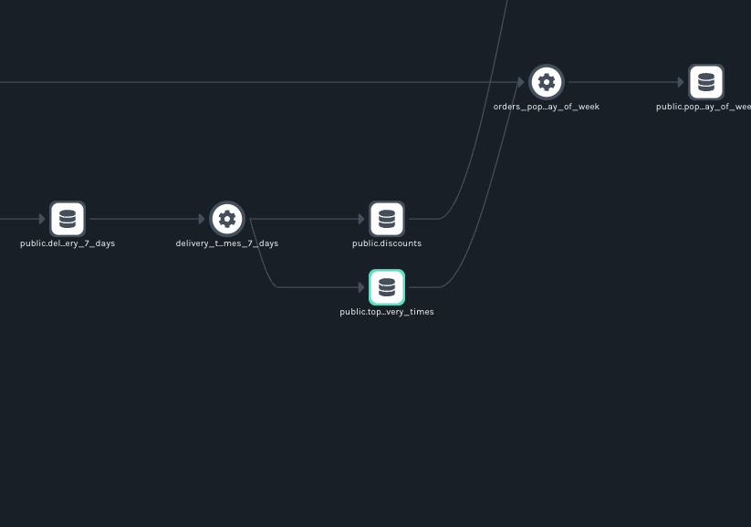
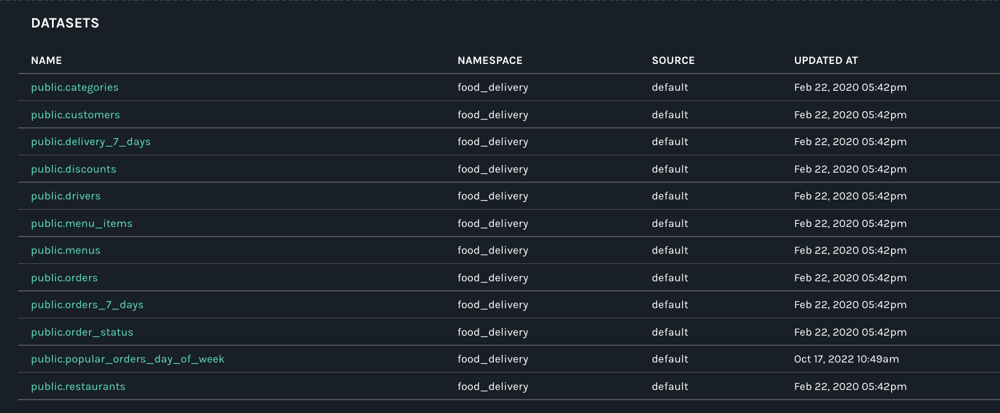
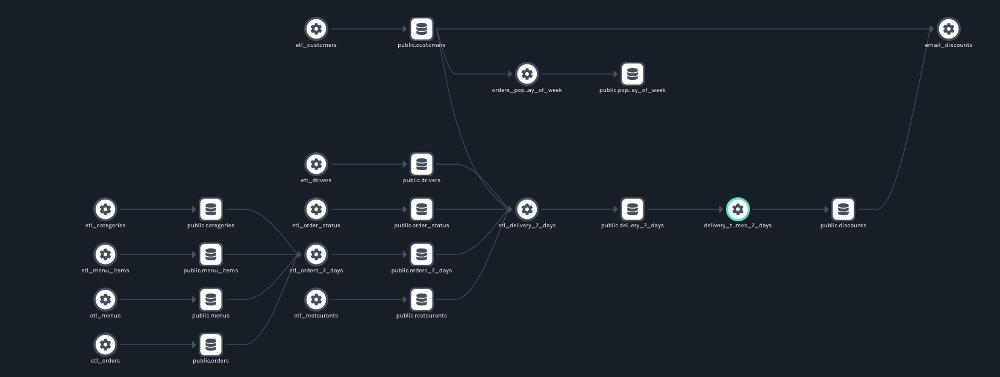

Read on to learn how to use the new soft-delete feature to clean up your lineage graphs.

<!--truncate-->

## Background

An exciting new feature is coming to the Marquez UI: the ability to “soft delete” datasets and jobs. Once work on the feature is finished, users will be able to hide inactive datasets and jobs from the UI, allowing for the easy removal of unused or stale metadata. At this point, most of the necessary backend development is complete. 

## Motivations and Goals
The idea for this feature came out of a need to keep deleted or renamed datasets and jobs from cluttering the lineage view in Marquez. In Issue [#1736](https://github.com/MarquezProject/marquez/issues/1736), project co-creator [Julien Le Dem](https://github.com/julienledem) suggested a change to the internal Marquez model to create a “new” version of such a dataset or job – a deleted version – that would not show up in the current lineage view produced by `GET /api/v1/lineage`.  

## How It Works

As noted in pull request [#2032](https://github.com/MarquezProject/marquez/pull/2032), the feature works by adding a new flag, `is_hidden`, to the datasets and jobs a user wishes to hide. Then, it changes the jobs_view and adds a datasets_view that hides any rows where the is_hidden flag is set to true. Currently, the feature operates via API endpoint.

Conveniently, the soft-delete condition is reversed whenever the job or dataset is updated because the new version automatically reverts the flag. This allows Marquez users to preserve dataset and job histories regardless of deletion status.

The code to create a dataset migration view where the flag is used as a condition (`api/src/main/resources/marquez/db/migration/R__3_Datasets_view.sql`):

```
CREATE OR REPLACE VIEW datasets_view
AS
SELECT uuid,
    type,
    created_at,
    updated_at,
    namespace_uuid,
    source_uuid,
    name,
    physical_name,
    description,
    current_version_uuid,
    last_modified_at,
    namespace_name,
    source_name,
    is_deleted
FROM datasets
WHERE is_hidden IS FALSE;
```

The new API endpoint in DatasetResource.java (`api/src/main/java/marquez/api/DatasetResource.java`):

```
@Timed
@ResponseMetered
@ExceptionMetered
@DELETE
@Path("{dataset}")
@Produces(APPLICATION_JSON)
public Response delete(
    @PathParam("namespace") NamespaceName namespaceName,
    @PathParam("dataset") DatasetName datasetName) {
throwIfNotExists(namespaceName);

Dataset dataset =
    datasetService
        .findDatasetByName(namespaceName.getValue(), datasetName.getValue())
        .orElseThrow(() -> new DatasetNotFoundException(datasetName));

datasetService
    .delete(namespaceName.getValue(), datasetName.getValue())
    .orElseThrow(() -> new DatasetNotFoundException(datasetName));
return Response.ok(dataset).build();
}
```

## Querying and Viewing Datasets

Let’s try out the soft-delete feature on the `public.top_delivery_times` dataset in the `food_delivery` namespace that comes with Marquez out of the box. For more information about installing Marquez and using `--seed` for sample metadata when running Marquez, see the project [quickstart](https://marquezproject.ai/quickstart).

First, verify that the dataset exists using the UI and the API.

To check via the API, run this command on the command line:

```
curl http://localhost:5000/api/v1/namespaces/food_delivery/datasets | jq
```

This command returns all the datasets in the `food_delivery` namespace. `top_delivery_times` should be at or near the end of the output.

Alternatively, you could also query the database for this specific database with this command: 

```
curl http://localhost:5000/api/v1/namespaces/food_delivery/datasets/public.top_delivery_times | jq)
```

The output should look something like this:

```
{
      "id": {
        "namespace": "food_delivery",
        "name": "public.top_delivery_times"
      },
      "type": "DB_TABLE",
      "name": "public.top_delivery_times",
      "physicalName": "public.top_delivery_times",
      "createdAt": "2020-02-22T22:42:42Z",
      "updatedAt": "2020-02-22T22:42:42Z",
      "namespace": "food_delivery",
      "sourceName": "default",
      "fields": [
        {
          "name": "order_id",
          "type": "INTEGER",
          "tags": [],
          "description": "The ID of the order."
        },
        {
          "name": "order_placed_on",
          "type": "TIMESTAMP",
          "tags": [],
          "description": "An ISO-8601 timestamp representing the date/time the order was placed."
        },
        {
          "name": "order_dispatched_on",
          "type": "TIMESTAMP",
          "tags": [],
          "description": "An ISO-8601 timestamp representing the date/time the order was dispatched."
        },
        {
          "name": "order_delivered_on",
          "type": "TIMESTAMP",
          "tags": [],
          "description": "An ISO-8601 timestamp representing the date/time the order was delivered."
        },
        {
          "name": "order_delivered_time",
          "type": "TIMESTAMP",
          "tags": [],
          "description": "An ISO-8601 timestamp representing the total time of delivery."
        },
        {
          "name": "customer_email",
          "type": "VARCHAR",
          "tags": [],
          "description": "The email address of the customer."
        },
        {
          "name": "restaurant_id",
          "type": "INTEGER",
          "tags": [],
          "description": "The ID of the restaurant related to the order."
        },
        {
          "name": "driver_id",
          "type": "INTEGER",
          "tags": [],
          "description": "The ID of the driver related to the order."
        }
      ],
      "tags": [],
      "lastModifiedAt": null,
      "lastLifecycleState": "",
      "description": null,
      "currentVersion": "7daad6c6-bbdb-4cf5-bee6-9c42c443732e",
      "columnLineage": null,
      "facets": {
        "schema": {
          "fields": [
            {
              "name": "order_id",
              "type": "INTEGER",
              "description": "The ID of the order."
            },
            {
              "name": "order_placed_on",
              "type": "TIMESTAMP",
              "description": "An ISO-8601 timestamp representing the date/time the order was placed."
            },
            {
              "name": "order_dispatched_on",
              "type": "TIMESTAMP",
              "description": "An ISO-8601 timestamp representing the date/time the order was dispatched."
            },
            {
              "name": "order_delivered_on",
              "type": "TIMESTAMP",
              "description": "An ISO-8601 timestamp representing the date/time the order was delivered."
            },
            {
              "name": "order_delivered_time",
              "type": "TIMESTAMP",
              "description": "An ISO-8601 timestamp representing the total time of delivery."
            },
            {
              "name": "customer_email",
              "type": "VARCHAR",
              "description": "The email address of the customer."
            },
            {
              "name": "restaurant_id",
              "type": "INTEGER",
              "description": "The ID of the restaurant related to the order."
            },
            {
              "name": "driver_id",
              "type": "INTEGER",
              "description": "The ID of the driver related to the order."
            }
          ],
          "_producer": "https://github.com/MarquezProject/marquez/blob/main/docker/metadata.json",
          "_schemaURL": "https://openlineage.io/spec/facets/1-0-0/SchemaDatasetFacet.json"
        }
      },
      "deleted": false
    }
  ]
```

In the UI, you can see the dataset in the `delivery_times_7_days` job:



## Deleting Datasets

To delete this dataset, query the datasets endpoint with a DELETE API request:

```
curl -X DELETE http://localhost:5000/api/v1/namespaces/food_delivery/datasets/public.top_delivery_times | jq
```

It will output the dataset. Subsequent requests for the dataset will return 404s:

```
{
  "code": 404,
  "message": "Dataset 'top_delivery_times' not found."
}
```

The UI will be updated accordingly. Note that the dataset is nowhere to be found in the `DATASETS` view or lineage map:





## What’s Next

A new endpoint to make namespaces deletable is in progress ([Issue #2095](https://github.com/MarquezProject/marquez/issues/2095) & [PR #2172](https://github.com/MarquezProject/marquez/pull/2172)). The main goal of this addition is to automate the deletion of a large number of datasets and jobs where doing so individually would be a nuisance.

The frontend work is in the design stage. Some questions remain: How should the UI be modified to permit the selection of jobs and datasets for deletion? Should there be a new clickable element in every dataset and job in the graph? Should datasets and jobs be deletable within search results?

Whoever takes on this task will have a shaping role in the discussion and ultimate form of this key addition.

## Getting Started

Contributions to this ongoing effort at implementing a soft delete option Marquez are welcome. If you are interested in contributing, opening an [issue](https://github.com/MarquezProject/marquez/issues) is a good way to get started. 

Check out our [new contributor guide](https://github.com/OpenLineage/OpenLineage/blob/main/CONTRIBUTING.md) to learn more about how to contribute to the project.