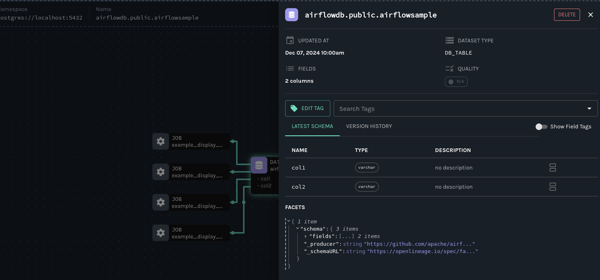

import Tabs from '@theme/Tabs'; import TabItem from '@theme/TabItem';

## Table of Contents

1. [Prerequisites](#prerequisites)
2. [Get and start Marquez](#get-marquez)
3. [Configure Apache Airflow to send events to Marquez](#configure-airflow)
4. [View Airflow operational analytics and data lineage in Marquez](#view-airflow)
5. [Next steps](#next-steps)
6. [Feedback](#feedback)

# Prerequisites {#prerequisites}

Before you begin, make sure you have installed:

<Tabs groupId="prereqs">
<TabItem value="macos" label="MacOS/Linux">

* [Docker 17.05+](https://docs.docker.com/install)
* [Docker Compose](https://docs.docker.com/compose/install)
* [Airflow 2.8+](https://airflow.apache.org/docs/apache-airflow/stable/start.html)
* [PostgreSQL 14+](https://www.postgresql.org)

</TabItem>
<TabItem value="windows" label="Windows">

* [Git Bash](https://gitforwindows.org/)
* [PostgreSQL 14+](https://www.postgresql.org/)
* [Docker 17.05+](https://docs.docker.com/install)
* [Docker Compose](https://docs.docker.com/compose/install)
* [Airflow 2.8+](https://airflow.apache.org/docs/apache-airflow/stable/start.html)

</TabItem>
</Tabs>

## Get and Start Marquez {#get-marquez}

To checkout the Marquez source code, run:

<Tabs groupId="get">
<TabItem value="macos" label="MacOS/Linux">

```bash
$ git clone https://github.com/MarquezProject/marquez && cd marquez
```

</TabItem>
<TabItem value="windows" label="Windows">

```bash
$ git config --global core.autocrlf false
$ git clone https://github.com/MarquezProject/marquez && cd marquez
```

</TabItem>
</Tabs>

Both Airflow and Marquez require port 5432 for their metastores, but the Marquez services are much easier to configure, even on the fly. So start Marquez with an alternate port:

<Tabs groupId="start">
<TabItem value="macos" label="MacOS/Linux">

```bash
$ ./docker/up.sh --db-port 2345
```

</TabItem>
<TabItem value="windows" label="Windows">

Verify that Postgres and Bash are in your `PATH`, then run:

```bash
$ sh ./docker/up.sh --db-port 2345
```

</TabItem>
</Tabs>

To view the Marquez UI and verify it's running, open [http://localhost:3000](http://localhost:3000). The UI allow you to discover dependencies between jobs and the datasets they produce and consume via the lineage graph, view run-level metadata of current and previous job runs, and get a high-level view of current and historical operations.

## Configure Airflow to send events to Marquez {#configure-airflow}

1. To configure Airflow to emit OpenLineage events to Marquez, you need to define an OpenLineage transport and namespace. This is easy to do using environment variables. Run:

	```bash
	$ export AIRFLOW__OPENLINEAGE__TRANSPORT='{"type": "http", "url": "http://localhost:5000", "endpoint": "api/v1/lineage"}'
	```

	```bash
	$ export AIRFLOW__OPENLINEAGE__NAMESPACE='my-team-airflow-instance'
	```

2. To add the required Airflow OpenLineage Provider package to your Airflow environment, run:

	```bash
	$ pip install apache-airflow-providers-openlineage
	```

3. To enable adding a Postgres connection for this tutorial, run:

	```bash
	$ pip install apache-airflow-providers-postgres
	```

4. Now add both packages to `requirements.txt`:

	```txt
	apache-airflow-providers-openlineage
	apache-airflow-providers-postgres
	```

5. Create a database in your local Postgres instance and create an Airflow Postgres connection. For help, see: #add URL

6. Add a flaky DAG to Airflow that will _often_ create a table in the Postgres database:

	```py
	from __future__ import annotations
	import time
	import random

	import pendulum
	from airflow.decorators import dag, task
	from airflow.operators.empty import EmptyOperator
	from airflow.providers.common.sql.operators.sql import SQLExecuteQueryOperator

	SQL_1="""CREATE TABLE IF NOT EXISTS airflowsample (
	    col1 VARCHAR(255), 
	    col2 VARCHAR(255)
	)"""

	SQL_2="""DROP TABLE airflowsample"""

	@dag(
	    schedule='@hourly',
	    start_date=pendulum.datetime(2021, 1, 1, tz="UTC"),
	    catchup=False,
	    tags=["example"],
	    dag_display_name="Flaky DAG",
	)

	def flaky_dag():

	    sample_task_1 = EmptyOperator(
	        task_id="sample_task_1",
	        task_display_name="Sample Task 1",
	    )

	    @task(
	        task_display_name="Sample Task 2",
	    )
	    def sample_task_2():
	        pers = [0, 60, 120, 'fail']
	        per = random.choice(pers)
	        time.sleep(per)

	    sample_task_3 = SQLExecuteQueryOperator(
	        task_id="sample_task_3",
	        sql=SQL_1,
	        conn_id="postgres_default",
	    )

	    sample_task_4 = SQLExecuteQueryOperator(
	        task_id="sample_task_4",
	        sql=SQL_2,
	        conn_id="postgres_default",
	    )

	    sample_task_1 >> sample_task_2() >> sample_task_3 >> sample_task_4

	flaky_dag()
	```

7. Run your DAG. To verify that the OpenLineage Provider is configured correctly, check the task logs for an `INFO`-level log reporting the transport type you defined: `OpenLineageClient will use http transport`.

## View Airflow operational analytics and data lineage in Marquez {#view-airflow}

The DataOps view offers a high-level view of historical and in-process operations, including task-level run status and runtime information at a glance:


### Datasets lineage graph

In the Datasets view, you can click on a dataset to inspect a cross-platfrom-capable lineage graph. In this case, you can view the upstream tasks feeding the `airflowsample` table in Airflow: 


:::info

Dependencies in other platforms that modify or consume the same dataset will also appear in the graph.

:::

### Dataset details

Click on the dataset node for a more details, including the schema, the time of the most recent update, and any facets in the OpenLineage event payload: 



### Versioned schema history

Click on the versions tab in the drawer for a versioned schema history:


## Next Steps {#next-steps}


## Feedback {#feedback}

What did you think of this guide? You can reach out to us on [slack](https://join.slack.com/t/marquezproject/shared_invite/zt-2iylxasbq-GG_zXNcJdNrhC9uUMr3B7A) and leave us feedback, or [open a pull request](https://github.com/MarquezProject/marquez/blob/main/CONTRIBUTING.md#submitting-a-pull-request) with your suggestions!

