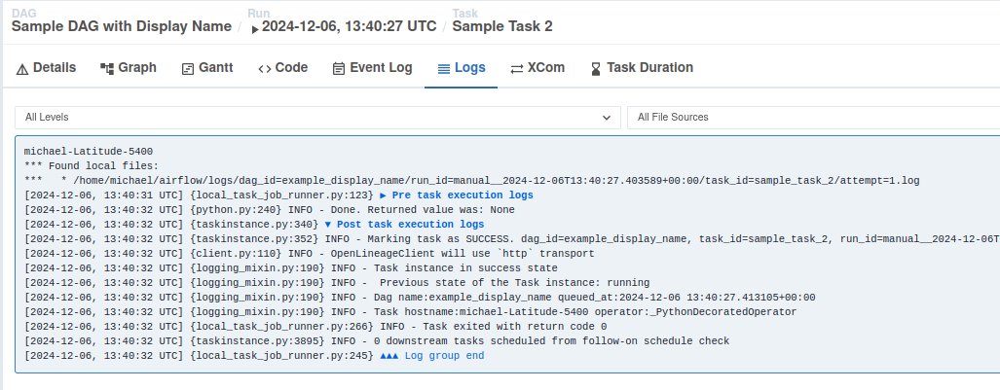
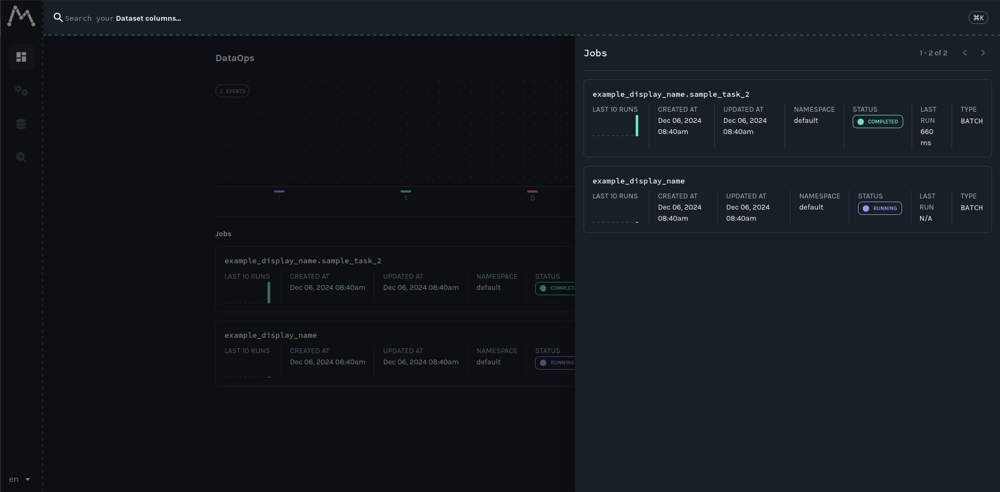
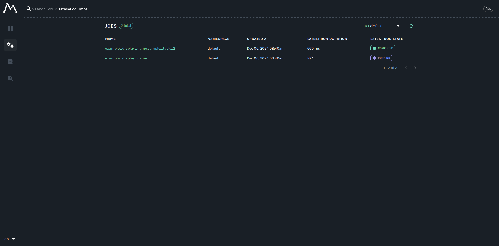
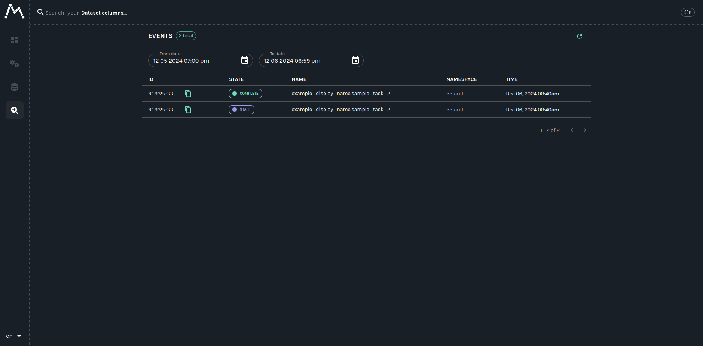

import Tabs from '@theme/Tabs'; import TabItem from '@theme/TabItem';

## Table of Contents

1. [Prerequisites](#prerequisites)
2. [Get and Start Marquez](#get-marquez)
3. [Get Airflow](#get-airflow)
4. [Collecting Live Metadata](#collecting-live-metadata)
5. [Summary](#summary)
6. [Next Steps](#next-steps)
7. [Feedback](#feedback)

# Prerequisites {#prerequisites}

Before you begin, make sure you have installed:

<Tabs groupId="prereqs">
<TabItem value="macos" label="MacOS/Linux">

* [Docker 17.05](https://docs.docker.com/install)+
* [Docker Compose](https://docs.docker.com/compose/install)
* [Airflow 2.8+](https://airflow.apache.org/docs/apache-airflow/stable/start.html)

</TabItem>
<TabItem value="windows" label="Windows">

* [Git Bash](https://gitforwindows.org/)
* [PostgreSQL 14](https://www.postgresql.org/)
* [Docker 17.05](https://docs.docker.com/install)+
* [Docker Compose](https://docs.docker.com/compose/install)
* [Airflow 2.8+](https://airflow.apache.org/docs/apache-airflow/stable/start.html)

</TabItem>
</Tabs>

## Get and Start Marquez

To checkout the Marquez source code, run:

<Tabs groupId="get">
<TabItem value="macos" label="MacOS/Linux">

```bash
$ git clone https://github.com/MarquezProject/marquez && cd marquez
```

</TabItem>
<TabItem value="windows" label="Windows">

```bash
$ git config --global core.autocrlf false
$ git clone https://github.com/MarquezProject/marquez && cd marquez
```

</TabItem>
</Tabs>

Both Airflow and Marquez require port 5432 for their metastores, but the Marquez services are much easier to configure on the fly. So start Marquez with an alternate port supplied to the `db-port` parameter:

<Tabs groupId="start">
<TabItem value="macos" label="MacOS/Linux">

```bash
$ ./docker/up.sh --db-port 2345
```

</TabItem>
<TabItem value="windows" label="Windows">

Verify that Postgres and Bash are in your `PATH`, then run:

```bash
$ sh ./docker/up.sh --db-port 2345
```

</TabItem>
</Tabs>

To view the Marquez UI and verify it's running, open [http://localhost:3000](http://localhost:3000). The UI enables you to discover dependencies between jobs and the datasets they produce and consume via the lineage graph, view run-level metadata of current and previous job runs, and much more!

## Configure Airflow to send events to Marquez

To configure Airflow to emit OpenLineage events to Marquez, you need to define an OpenLineage transport. This is easy to do with an environment variable. Run:

```bash
$ export AIRFLOW__OPENLINEAGE__TRANSPORT='{"type": "http", "url": "http://localhost:5000", "endpoint": "api/v1/lineage"}'
```

To add the required Airflow OpenLineage Provider package to your Airflow environment, run:

```bash
pip install apache-airflow-providers-openlineage
```

Run a dag in Airflow. To verify that the OpenLineage Provider is configured correctly, check the task logs for an `INFO`-level log reporting the transport type you defined: 



## View Airflow lineage in Marquez








## Next Steps {#next-steps}


## Feedback {#feedback}

What did you think of this guide? You can reach out to us on [slack](https://join.slack.com/t/marquezproject/shared_invite/zt-2iylxasbq-GG_zXNcJdNrhC9uUMr3B7A) and leave us feedback, or [open a pull request](https://github.com/MarquezProject/marquez/blob/main/CONTRIBUTING.md#submitting-a-pull-request) with your suggestions!

