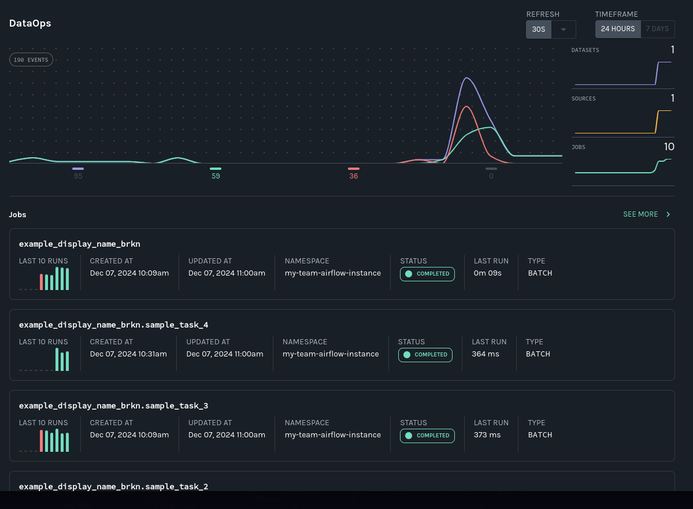

import Tabs from '@theme/Tabs'; import TabItem from '@theme/TabItem';

## Table of Contents

1. [Prerequisites](#prerequisites)
2. [Get and start Marquez](#get-marquez)
3. [Configure Apache Airflow to send events to Marquez](#configure-airflow)
4. [View Airflow operational analytics and data lineage in Marquez](#view-airflow)
5. [Next steps](#next-steps)
6. [Feedback?](#feedback)

# Prerequisites {#prerequisites}

Before you begin, make sure you have installed:

<Tabs groupId="prereqs">
<TabItem value="macos" label="MacOS/Linux">

* [Docker 17.05+](https://docs.docker.com/install)
* [Docker Compose](https://docs.docker.com/compose/install)
* [Airflow 2.8+](https://airflow.apache.org/docs/apache-airflow/stable/start.html)
* [PostgreSQL 14+](https://www.postgresql.org)

</TabItem>
<TabItem value="windows" label="Windows">

* [Git Bash](https://gitforwindows.org/)
* [PostgreSQL 14+](https://www.postgresql.org/)
* [Docker 17.05+](https://docs.docker.com/install)
* [Docker Compose](https://docs.docker.com/compose/install)
* [Airflow 2.8+](https://airflow.apache.org/docs/apache-airflow/stable/start.html)

</TabItem>
</Tabs>

## Get and start Marquez {#get-marquez}

To checkout the Marquez source code, run:

<Tabs groupId="get">
<TabItem value="macos" label="MacOS/Linux">

```bash
$ git clone https://github.com/MarquezProject/marquez && cd marquez
```

</TabItem>
<TabItem value="windows" label="Windows">

```bash
$ git config --global core.autocrlf false
$ git clone https://github.com/MarquezProject/marquez && cd marquez
```

</TabItem>
</Tabs>

Both Airflow and Marquez require port 5432 for their metastores, but the Marquez services are easier to configure. You can also assign the database service to a new port on the fly. To start Marquez using port 2345 for the database, run:

<Tabs groupId="start">
<TabItem value="macos" label="MacOS/Linux">

```bash
$ ./docker/up.sh --db-port 2345
```

</TabItem>
<TabItem value="windows" label="Windows">

Verify that Postgres and Bash are in your `PATH`, then run:

```bash
$ sh ./docker/up.sh --db-port 2345
```

</TabItem>
</Tabs>

To view the Marquez UI and verify it's running, open [http://localhost:3000](http://localhost:3000). The UI allows you to: 
- cross-platform dependencies, meaning you can see the jobs across the tools in your ecosystem that produce or consume a critical table.
- view run-level metadata of current and previous job runs, enabling you to see the latest status of a job and the update history of a dataset.
- get a high-level view of resource usage, allowing you to see trends in your operations.

## Configure Airflow to send events to Marquez {#configure-airflow}

1. To configure Airflow to emit OpenLineage events to Marquez, you need to define an OpenLineage transport. One way you can do this is by using an environment variable. To use `http` and send events to the Marquez API running locally on port `5000`, run:

	```bash
	$ export AIRFLOW__OPENLINEAGE__TRANSPORT='{"type": "http", "url": "http://localhost:5000", "endpoint": "api/v1/lineage"}'
	```

2. You also need to define a namespace for Airflow jobs. It can be any string. Run:

	```bash
	$ export AIRFLOW__OPENLINEAGE__NAMESPACE='my-team-airflow-instance'
	```

3. To add the required Airflow OpenLineage Provider package to your Airflow environment, run:

	```bash
	$ pip install apache-airflow-providers-openlineage
	```

4. To enable adding a Postgres connection for this tutorial, run:

	```bash
	$ pip install apache-airflow-providers-postgres
	```

5. Now add both packages to `requirements.txt`:

	```txt
	apache-airflow-providers-openlineage
	apache-airflow-providers-postgres
	```

6. Create a database in your local Postgres instance and create an Airflow Postgres connection using the default ID (`postgres_default`). For help with the former, see: [Postgres Documentation](https://www.postgresql.org/docs/). For help with the latter, see: [Managing Connections](https://airflow.apache.org/docs/apache-airflow/stable/howto/connection.html#managing-connections).

7. Add a flaky DAG to Airflow that will _often_ create a table in the Postgres database:

	```py
	from __future__ import annotations
	import time
	import random

	import pendulum
	from airflow.decorators import dag, task
	from airflow.operators.empty import EmptyOperator
	from airflow.providers.common.sql.operators.sql import SQLExecuteQueryOperator
	from airflow.datasets import Dataset

	SQL="""CREATE TABLE IF NOT EXISTS airflowsample (
	    col1 VARCHAR(255), 
	    col2 VARCHAR(255)
	)"""

	@dag(
	    schedule='@hourly',
	    start_date=pendulum.datetime(2021, 1, 1, tz="UTC"),
	    catchup=False,
	    tags=["example"],
	    dag_display_name="Flaky DAG",
	)

	def example_display_name_brkn():

	    sample_task_1 = EmptyOperator(
	        task_id="sample_task_1",
	        task_display_name="Sample Task 1",
	    )

	    sample_task_2 = SQLExecuteQueryOperator(
	        task_id="sample_task_3",
	        sql=SQL,
	        conn_id="postgres_default",
	    )

	    @task(
	        task_display_name="Sample Task 3",
	        outlets=[Dataset("sample_pg_table")]
	    )
	    def sample_task_3():
	        pers = [0, 60, 120, 'fail']
	        per = random.choice(pers)
	        time.sleep(per)

	    sample_task_1 >> sample_task_2 >> sample_task_3()

	example_display_name_brkn()

	```

8. Add another DAG that updates (and then drops) the Postgres table:

	```py
	from __future__ import annotations
	import time
	import random

	import pendulum
	from airflow.decorators import dag, task
	from airflow.operators.empty import EmptyOperator
	from airflow.providers.common.sql.operators.sql import SQLExecuteQueryOperator
	from airflow.datasets import Dataset

	SQL_1="INSERT INTO airflowsample (col1) VALUES ('row')"

	SQL_2="DROP TABLE airflowsample"

	@dag(
	    schedule=[Dataset("sample_pg_table")],
	    start_date=pendulum.datetime(2021, 1, 1, tz="UTC"),
	    catchup=False,
	    tags=["example"],
	)

	def example_insert_brkn():

	    sample_task_1 = EmptyOperator(
	        task_id="sample_insert_task_1",
	        task_display_name="Sample Task 1",
	    )

	    sample_task_2 = SQLExecuteQueryOperator(
	        task_id="sample_insert_task_2",
	        sql=SQL_1,
	        conn_id="postgres_default",
	    )

	    sample_task_3 = SQLExecuteQueryOperator(
	        task_id="sample_insert_task_3",
	        sql=SQL_2,
	        conn_id="postgres_default",
	    )

	    sample_task_1 >> sample_task_2 >> sample_task_3

	example_insert_brkn()

	```

	This DAG is scheduled on the first one using an Airflow Dataset, so it will run automatically when `Flaky DAG` completes a run.

8. Run your DAGs by triggering the `Flaky DAG`. To verify that the OpenLineage Provider is configured correctly, check the task logs for an `INFO`-level log reporting the transport type you defined. In this case, the log will say: `OpenLineageClient will use http transport`.

## View Airflow operational analytics and data lineage in Marquez {#view-airflow}

The DataOps view offers a high-level view of historical and in-process operations, including task-level run status and runtime information:



### Datasets lineage graph

In the Datasets view, click on the dataset to get a cross-platform-capable lineage graph. In this case, you will be able to see the upstream tasks across the two DAGs in your environment that feed the `airflowsample` table in Airflow:


:::info

Dependencies in other platforms that modify or consume the same dataset will also appear in this graph.

:::

### Leveraging the Marquez graph

When data produced by multiple tools in your data ecosystem arrives late or becomes stale, root-cause analysis is much easier when you know:
- what jobs and datasets are upstream.
- what the run status of each upstream job is.
- how each upstream job has performed recently.
- whether quality issues have affected upstream datasets.

In the Marquez lineage graph, you can click on an upstream job node to see information including:
- the latest run status.
- the last runtime.
- the time last started.
- the time last finished.


You can also access a versioned table schema history from the Marquez graph, so you can see at a glance if data quality in a critical table has become compromised and when a loss occurred:


## Next Steps {#next-steps}

Continue your journey with Marquez by consulting the following resources:
- [Backfilling Airflow DAGs Using Marquez](https://openlineage.io/docs/guides/airflow-backfill-dags)
- [Using Marquez with dbt](https://openlineage.io/docs/guides/dbt)
- [Using OpenLineage with Spark](https://openlineage.io/docs/guides/spark)

## Feedback? {#feedback}

What did you think of this guide? You can reach out to us on [slack](https://join.slack.com/t/marquezproject/shared_invite/zt-2iylxasbq-GG_zXNcJdNrhC9uUMr3B7A) and leave us feedback, or [open a pull request](https://github.com/MarquezProject/marquez/blob/main/CONTRIBUTING.md#submitting-a-pull-request) with your suggestions!
