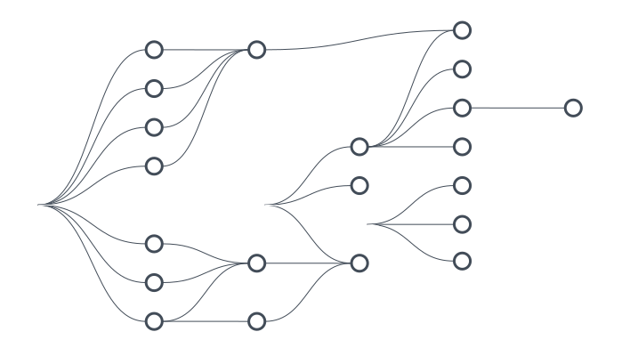

## Why Marquez?

Marquez enables highly flexible [data lineage](https://en.wikipedia.org/wiki/Data_lineage) queries across _all datasets_, while reliably and efficiently associating (_upstream_, _downstream_) dependencies between jobs and the datasets they produce and consume.

## Why manage and utilize metadata?

## Design

Marquez is a modular system and has been designed as a highly scalable, highly extensible platform-agnostic solution for metadata management. It consists of the following system components:

* **Metadata Repository**: Stores all job and dataset metadata, including a complete history of job runs and job-level statistics (i.e. total runs, average runtimes, success/failures, etc).
* **Metadata API**: RESTful API enabling a diverse set of clients to begin interacting with metadata around dataset production and consumption.
* **Metadata UI**: Used for dataset discovery, connecting multiple datasets and exploring their dependency graph.

 

To ease adoption and enable a diverse set of data processing applications to build metadata collection as a core requirement into their design, Marquez implements the OpenLineage [specification](https://github.com/OpenLineage/OpenLineage/blob/main/spec/OpenLineage.yml). OpenLineage provides support for [Java](https://github.com/OpenLineage/OpenLineage/tree/main/client/java) and [Python](https://github.com/OpenLineage/OpenLineage/tree/main/client/python) as well as many [integrations](https://openlineage.io/integration).

The Metadata API is an abstraction for recording information around the production and consumption of datasets. It's a low-latency, highly-available stateless layer responsible for encapsulating both metadata persistence and aggregation of lineage information. The API allows clients to collect and/or obtain dataset information to/from the [Metadata Repository](https://www.lucidchart.com/documents/view/f918ce01-9eb4-4900-b266-49935da271b8/0).

Metadata needs to be collected, organized, and stored in a way to allow for rich exploratory queries via the [Metadata UI](https://github.com/MarquezProject/marquez/tree/main/web). The Metadata Repository serves as a catalog of dataset information encapsulated and cleanly abstracted away by the Metadata API.

## Data Model

Marquez's data model emphasizes immutability and timely processing of datasets. Datasets are first-class values produced by job runs. A job run is linked to _versioned_ code, and produces one or more immutable _versioned_ outputs. Dataset changes are recorded at different points in job execution via lightweight API calls, including the success or failure of the run itself.

The diagram below shows the metadata collected and cataloged for a given job over multiple runs, and the time-ordered sequence of changes applied to its input dataset.

`Job:` A job has an `owner`, unique `name`, `version`, and optional `description`. A job will define one or more _versioned_ inputs as dependencies, and one or more _versioned_ outputs as artifacts. Note that it's possible for a job to have only input, or only output datasets defined.

`Job Version:` A read-only _immutable_ `version` of a job, with a unique referenceable `link` to code preserving the reproducibility of builds from source. A job version associates one or more input and output datasets to a job definition (important for lineage information as data moves through various jobs over time). Such associations catalog provenance links and provide powerful visualizations of the flow of data.

`Dataset:` A dataset has an `owner`, unique `name`, `schema`, `version`, and optional `description`. A dataset is contained within a datasource. A `datasource` enables the grouping of physical datasets to their physical source. A version `pointer` into the historical set of changes is present for each dataset and maintained by Marquez. When a dataset change is committed back to Marquez, a distinct version ID is generated, stored, then set to `current` with the pointer updated internally.

`Dataset Version:` A read-only _immutable_ `version` of a dataset. Each version can be read independently and has a unique ID mapped to a dataset change preserving its state at some given point in time. The _latest_ version ID is updated only when a change to the dataset has been recorded. To compute a distinct version ID, Marquez applies a versioning function to a set of properties corresponding to the datasets underlying datasource.

## Contributing

We're excited you're interested in contributing to Marquez! We'd love your help, and there are plenty of ways to contribute:

* Fix or [report](https://github.com/MarquezProject/marquez/issues/new) a bug
* Fix or improve documentation
* Pick up a ["good first issue"](https://github.com/MarquezProject/marquez/labels/good%20first%20issue), then send a pull request our way

We feel that a welcoming community is important and we ask that you follow the [Contributor Covenant Code of Conduct](https://github.com/MarquezProject/marquez/blob/main/CODE_OF_CONDUCT.md) in all interactions with the community.

If you're interested in using or learning more about Marquez, reach out to us on our [slack](https://join.slack.com/t/marquezproject/shared_invite/zt-29w4n8y45-Re3B1KTlZU5wO6X6JRzGmA) channel and follow [@MarquezProject](https://twitter.com/MarquezProject) for updates. We also encourage new comers to [join](https://lists.lfaidata.foundation/g/marquez-technical-discuss/ics/invite.ics?repeatid=32038) our monthly community meeting!

