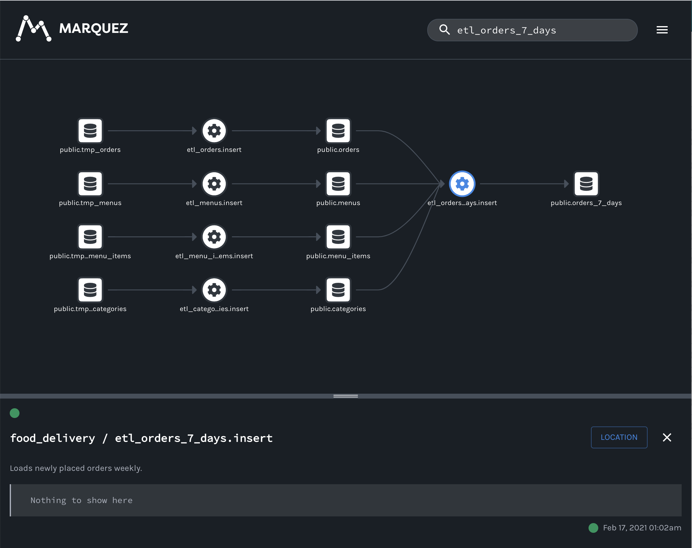
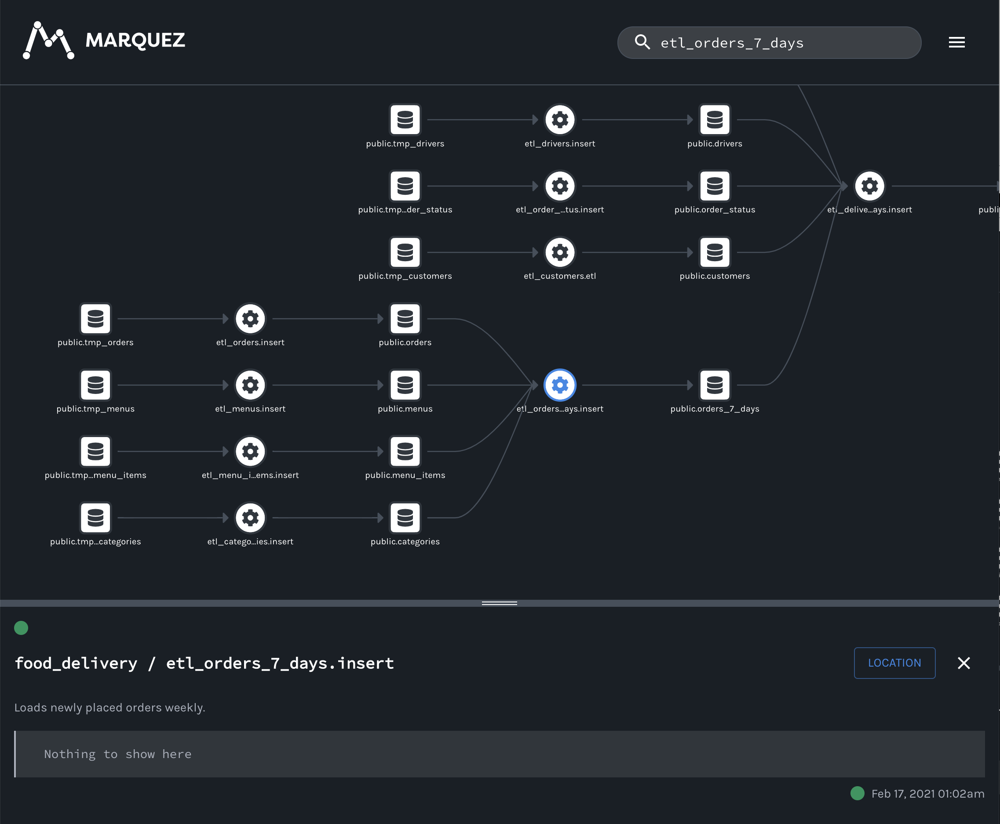

# [Airflow](https://airflow.apache.org) Example

In this example, we'll walk you through how to enable an **Airflow DAG** to send lineage metadata to **Marquez**.

**What you’ll learn:**

* Collect DAG Metadata with Marquez
* Explore inter-DAG dependencies using Marquez

> **Note:** We've added [`marquez-airflow`](https://github.com/MarquezProject/marquez/tree/main/integrations/airflow) to `requirements.txt` to automatically send DAG metadata to Marquez.

## Step 1: Setup

To setup the example, run:

```bash
$ ./docker/up.sh
```

> **Tip:** Use the `--pull` to pull a tagged image.

**The `docker/up.sh` will:**

* Start Airflow and install `marquez-airflow` used to collect DAG metadata
* Start Marquez
* Start Postgres

To view the Airflow UI and verify it's running, open http://localhost:8080. When the DAGs complete successfully, browse to http://localhost:3000 to begin exploring DAG metadata via the Marquez UI. You should see the following lineage graph for [`etl_orders_7_days`](https://github.com/MarquezProject/marquez/blob/main/examples/airflow/dags/etl_orders_7_days.py):



## Step 2: Collect DAG Metadata with Marquez

Under [`dags/`](),

```python
from datetime import datetime
from marquez_airflow import DAG
from airflow.operators.postgres_operator import PostgresOperator
from airflow.operators.sensors import ExternalTaskSensor
from airflow.utils.dates import days_ago

default_args = {
    'owner': 'datascience',
    'depends_on_past': False,
    'start_date': days_ago(1),
    'email_on_failure': False,
    'email_on_retry': False,
    'email': ['datascience@example.com']
}

dag = DAG(
    'etl_delivery_7_days',
    schedule_interval='@once',
    catchup=False,
    is_paused_upon_creation=True,
    default_args=default_args,
    description='Loads new deliveries for the week.'
)

t1 = PostgresOperator(
    task_id='if_not_exists',
    postgres_conn_id='food_delivery_db',
    sql='''
    CREATE TABLE IF NOT EXISTS delivery_7_days (
      order_id            INTEGER REFERENCES orders(id),
      order_placed_on     TIMESTAMP NOT NULL,
      order_dispatched_on TIMESTAMP NOT NULL,
      order_delivered_on  TIMESTAMP NOT NULL,
      customer_email      VARCHAR(64) NOT NULL,
      customer_address    VARCHAR(64) NOT NULL,
      discount_id         INTEGER REFERENCES discounts(id),
      menu_id             INTEGER REFERENCES menus(id),
      restaurant_id       INTEGER REFERENCES restaurants(id),
      restaurant_address  VARCHAR(64) NOT NULL,
      menu_item_id        INTEGER REFERENCES menu_items(id),
      category_id         INTEGER REFERENCES categories(id),
      driver_id           INTEGER REFERENCES drivers(id)
    );''',
    dag=dag
)

t2 = PostgresOperator(
    task_id='tuncate',
    postgres_conn_id='food_delivery_db',
    sql='TRUNCATE TABLE delivery_7_days;',
    dag=dag
)

t3 = PostgresOperator(
    task_id='insert',
    postgres_conn_id='food_delivery_db',
    sql='''
    INSERT INTO delivery_7_days (order_id, order_placed_on, order_dispatched_on, order_delivered_on, customer_email, customer_address, discount_id, menu_id, restaurant_id, restaurant_address, menu_item_id, category_id, driver_id)
      SELECT o.order_id, o.placed_on AS order_placed_on,
        (SELECT transitioned_at FROM order_status WHERE order_id = o.order_id AND status = 'DISPATCHED') AS order_dispatched_on,
        (SELECT transitioned_at FROM order_status WHERE order_id = o.order_id AND status = 'DELIVERED') AS order_delivered_on,
        c.email AS customer_email, c.address AS customer_address, o.discount_id, o.menu_id, o.restaurant_id, r.address, o.menu_item_id, o.category_id, d.id AS driver_id
        FROM orders_7_days AS o
       INNER JOIN order_status AS os
          ON os.order_id = o.order_id
       INNER JOIN customers AS c
          ON c.id = os.customer_id
       INNER JOIN restaurants AS r
          ON r.id = os.restaurant_id
       INNER JOIN drivers AS d
          ON d.id = os.driver_id
       WHERE os.transitioned_at >= NOW() - interval '7 days'
    ''',
    dag=dag
)

t1 >> t2 >> t3
```

## Step 3: Explore inter-DAG Dependencies




