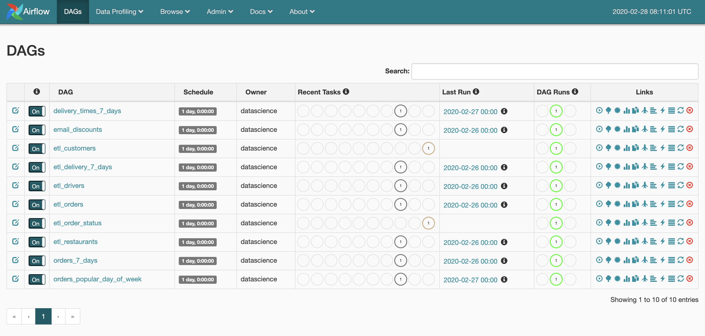

# Debugging [Airflow](https://airflow.apache.org) DAGs with [Marquez](https://marquezproject.github.io/marquez)

In this example, you'll be introduced to the core concepts of Airflow: _DAGs_, _operators_, and _tasks_. You’ll write your very first DAG and learn how workflows are defined and executed in Airflow using pre-defined datasets and sources.

## Quickstart

The easiest way to get up and running is with Docker. To start Airflow, run:

```bash
$ ./docker/up.sh
```

> **Tip:** Use the `--pull` to pull a tagged image.

Airflow listens on port `8080`. To view the Airflow UI and verify it's running, open http://localhost:8080. Then, browse to http://localhost:3000 to begin exploring DAG metadata via the Marquez UI.

# Airflow

[Airflow](https://airflow.apache.org) is a platform to programmatically author, schedule, and monitor workflows. Below we define some general concepts, but we encourage you to review [Airflow's concept doc](https://airflow.apache.org/docs/stable/concepts.html). 

### DAGs

A `DAG` (or [Directed Acyclic Graph](https://en.wikipedia.org/wiki/Directed_acyclic_graph)) is a collection of `Tasks`. It represents an entire workflow by describing the relationships and dependencies between tasks.

### Tasks

A `Task` represents a unit of work within a workflow. Each task is an implementation of an `Operator`, for example, a [PostgresOperator](https://airflow.apache.org/docs/stable/_api/airflow/operators/postgres_operator/index.html#airflow.operators.postgres_operator.PostgresOperator) to execute a SQL query, or a [PythonOperator](https://airflow.apache.org/docs/stable/_api/airflow/operators/python_operator/index.html#airflow.operators.python_operator.PythonOperator) to execute a Python function.

### Operators

While `DAGs` describe how to run a workflow, `Operators` determine what actually gets done by a task.

# UI

To start, you'll see a list of DAGs. The Airflow [scheduler](https://airflow.apache.org/docs/stable/scheduler.html) will search for DAGs under `dags/`, but also periodically scan the directory for new workflows. To the left of each DAG, the toggle has been switch to `ON`. This means that the DAG is ready to run. By default, DAGs are `OFF` ([an option](https://github.com/apache/airflow/blob/master/airflow/config_templates/default_airflow.cfg#L111) that users can easily configure).



We encourage you to explore and become familiar with the UI. For a quick overview of how to edit variables, visualize your DAG execution and even  view underlying code, see [Airflow's UI / screenshots docs](https://airflow.apache.org/docs/stable/ui.html).

# Next Step

Next, we'll jump into an example DAG. We'll also cover the basics of defining tasks and combining those tasks into DAGs.
