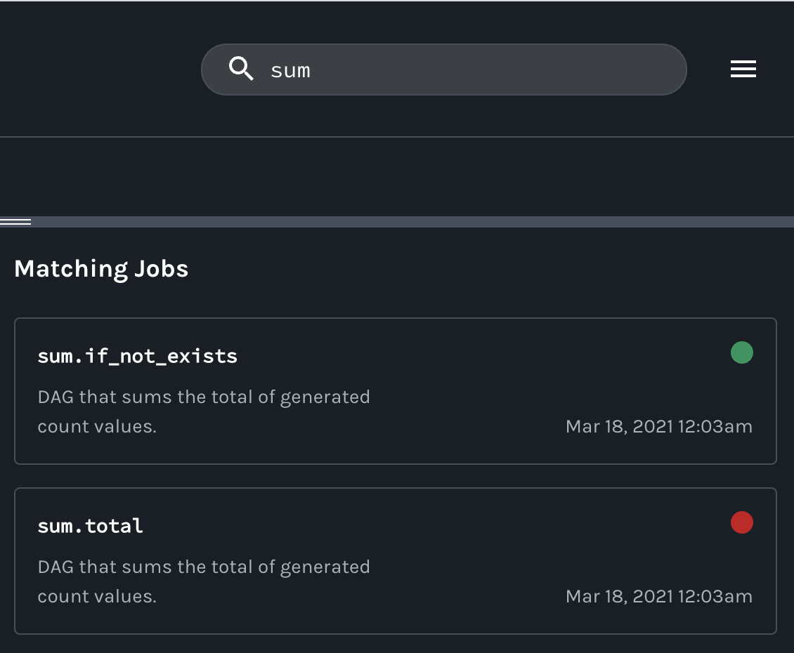

# [Airflow](https://airflow.apache.org) Example

In this example, we'll walk you through how to enable an **Airflow DAG** to send lineage metadata to **Marquez**. The example will help demonstrate some of the features of Marquez.

### What you’ll learn:

* Enable Marquez in Airflow
* Write your very first Marquez enabled DAG
* Troubleshoot a failing DAG using Marquez

## Prerequisites

Before you begin, make sure you have installed:

* [Docker 17.05](https://docs.docker.com/install)+
* [Docker Compose](https://docs.docker.com/compose/install)

> **Note:** We recommend that you have allocated at least **2 CPUs** and **8 GB** of memory to Docker.

## Step 1: Enable Marquez in Airflow

* To download and install the latest [`marquez-airflow`](https://pypi.org/project/marquez-airflow) when starting Airflow, you'll need to create a `requirements.txt` file with the following content:

  ```
  marquez-airflow
  ```

* Next, we'll need to specify where to send DAG metadata. To do so, create a config file named `marquez.env` with the following environment variables:

  ```bash
  MARQUEZ_BACKEND=http             # Collect metadata using HTTP backend
  MARQUEZ_URL=http://marquez:5000  # The URL of the HTTP backend
  MARQUEZ_NAMESPACE=example        # The namespace associated with the collected metadata
  ```
  > **Note:** The `marquez.env` config file will be used by the `airflow`, `airflow_scheduler`, and `airflow_worker` containers to send lineage metadata to Marquez.
  
* Your `examples/airflow/` directory should now contain the following:

  ```
  .
  ├── docker/
  ├── docs/
  ├── marquez.env
  └── requirements.txt
  ```

## Step 2: Write Airflow DAGs using Marquez

First, let's create the `dags/` folder where our example DAGs will be located:

```bash
$ mkdir dags
```

Then, add the DAGs `counter` and `sum` (defined below) to `dags/`. You'll notice that we're using **`marquez_airflow import DAG`** instead of **`airflow import DAG`**. When writing our DAGs, using `marquez_airflow` will enable Marquez to observe the DAG and automatically collect task-level metadata.

### DAG `counter`:

Under `dags/`, create a file named `counter.py` and copy in the following code:

```python
import random

from marquez_airflow import DAG
from airflow.operators.postgres_operator import PostgresOperator
from airflow.utils.dates import days_ago

default_args = {
    'owner': 'datascience',
    'depends_on_past': False,
    'start_date': days_ago(1),
    'email_on_failure': False,
    'email_on_retry': False,
    'email': ['datascience@example.com']
}

dag = DAG(
    'counter',
    schedule_interval='*/1 * * * *',
    catchup=False,
    is_paused_upon_creation=False,
    default_args=default_args,
    description='DAG that generates a new count value between 1-10.'
)

t1 = PostgresOperator(
    task_id='if_not_exists',
    postgres_conn_id='example_db',
    sql='''
    CREATE TABLE IF NOT EXISTS counts (
      value INTEGER
    );''',
    dag=dag
)

t2 = PostgresOperator(
    task_id='inc',
    postgres_conn_id='example_db',
    sql='''
    INSERT INTO counts (value)
         VALUES (%(value)s)
    ''',
    parameters={
      'value': random.randint(1, 10)
    },
    dag=dag
)

t1 >> t2

```

### DAG `sum`:

Under `dags/`, create a file named `sum.py` and copy in the following code:

```python
from marquez_airflow import DAG
from airflow.operators.postgres_operator import PostgresOperator
from airflow.utils.dates import days_ago

default_args = {
    'owner': 'datascience',
    'depends_on_past': False,
    'start_date': days_ago(1),
    'email_on_failure': False,
    'email_on_retry': False,
    'email': ['datascience@example.com']
}

dag = DAG(
    'sum',
    schedule_interval='*/5 * * * *',
    catchup=False,
    is_paused_upon_creation=False,
    default_args=default_args,
    description='DAG that sums the total of generated count values.'
)

t1 = PostgresOperator(
    task_id='if_not_exists',
    postgres_conn_id='example_db',
    sql='''
    CREATE TABLE IF NOT EXISTS sums (
      value INTEGER
    );''',
    dag=dag
)

t2 = PostgresOperator(
    task_id='total',
    postgres_conn_id='example_db',
    sql='''
    INSERT INTO sums (value)
        SELECT SUM(c.value) FROM counts AS c;
    ''',
    dag=dag
)

t1 >> t2

```

At this point, you should have the following under your `examples/airflow/` directory:

```
.
├── dags
│   ├── counter.py
│   └── sum.py
├── docker/
├── docs/
├── marquez.env
└── requirements.txt
```

## Step 3: Start Airflow with Marquez

Now that we have our DAGs defined using Marquez, let’s run the example!. To start Airflow, run:

```bash
$ docker-compose up
```

> **Tip:** Use `-d` to run in detached mode.

**The above command will:**

* Start Airflow and install `marquez-airflow` used to collect DAG metadata
* Start Marquez
* Start Postgres

To view the Airflow UI and verify it's running, open http://localhost:8080. You can also browse to http://localhost:3000 to view the Marquez UI.

## Step 4: View Collected Metadata

To view DAG metadata collected by Marquez from Airflow, browse to the Marquez UI by visiting http://localhost:3000. Then, use the _search_ bar in the upper right-side of the page and search for the `counter.inc` job. To view lineage metadata for `counter.inc`, click on the job from the drop-down list:

> **Note:** If the `counter.inc` job is not in the drop-down list, check to see if Airflow has successfully executed the DAG.


If you take a quick look at the lineage graph for `counter.inc`, you should see `public.counts` as an output dataset and `sum.total` as a downstream job!


## Step 5: Troubleshoot Failing DAG with Marquez

In this step, let's quickly walk through a simple troubleshooting scenario where DAG `sum` begins to fail as the result of column `value` in table `counts ` being renamed to `value_1_to_10`. So, let's get to it!

Let's say team `A` owns the DAG `counter`. Team `A` decides to update the `t1` task in `counter` to rename the `values` column in the `counts` table:

```diff
t1 = PostgresOperator(
-   task_id='if_not_exists',
+   task_id='alter_column',
    postgres_conn_id='example_db',
-   sql='''
-   CREATE TABLE IF NOT EXISTS counts (
-     value INTEGER
-   );''',
+   sql='''
+   ALTER TABLE counts RENAME COLUMN value TO value_1_to_10;
+   ''',
    dag=dag
)
```

You should begin to see the DAG `sum` failing as the result of the column rename:


With the DAG run metadata now showing a _failed_ run state:



To fix the DAG `sum`, update `t2` in `sum.py` to use the new column name:

```diff
t2 = PostgresOperator(
    task_id='total',
    postgres_conn_id='example_db',
    sql='''
    INSERT INTO sums (value)
-       SELECT SUM(c.value) FROM counts AS c;
+       SELECT SUM(c.value_1_to_10) FROM counts AS c;
    ''',
    dag=dag
)
```

Now, you should to see the DAG `sum` running successfully as the result of code change:


With the DAG run metadata now showing a _completed_ run state:


## Feedback

What did you think of this example? You can reach out to us on [slack](http://bit.ly/MarquezSlack) and leave us feedback, or [open a pull request](https://github.com/MarquezProject/marquez/blob/main/CONTRIBUTING.md#submitting-a-pull-request) with your suggestions!  
