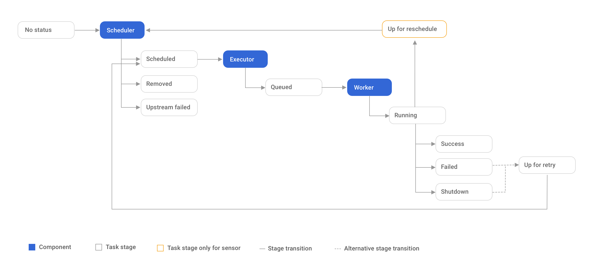

# Airflow task lifecycle

This document describes the airflow task lifecycle and describes how marquez hooks into tasks to obtain information.

## Airflow lifecycle overview
https://airflow.apache.org/docs/apache-airflow/stable/concepts.html#task-lifecycle

The happy flow consists of the following stages:
1. No status (scheduler created empty task instance, a job and run with nominal start/end time is reported to marquez)
2. Scheduled (scheduler determined task instance needs to run)
3. Queued (scheduler sent task to executor to run on the queue)
4. Running (worker picked up a task and is now running it)
5. Success/Skipped/Failed (task completed, marquez is notified of the task's actual start/stop time with the status of the task instance)

## Marquez Interaction
The Marquez airflow integration is only called from the scheduler instance. The scheduler periodically polls task instances to check the states of the current tasks. When the scheduler finds a state transitions in a `success`, `skipped`, or `failed` state, it notifies the dag via a `handle_callback` function. Since marquez relies on the scheduler to be notified of a state transition, there may be a delay from when a task transitions state to when it is reported to marquez.