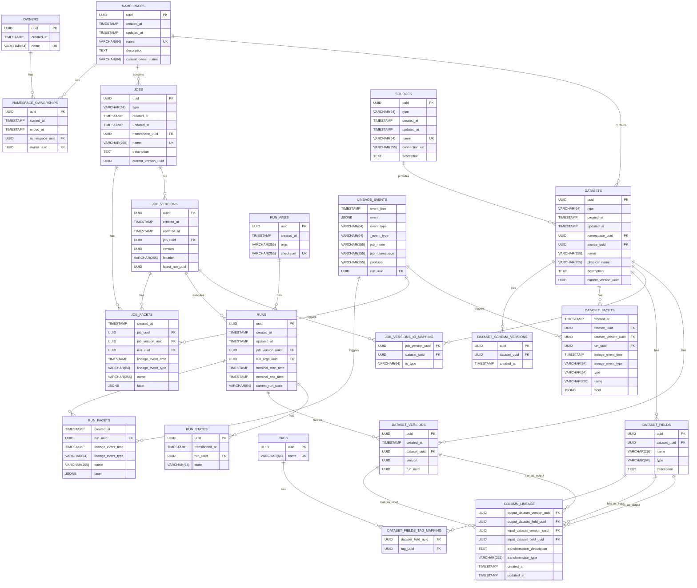

# Marquez Data Model

This diagram represents the complete data model for the Marquez metadata service.

## Model Description

The Marquez data model is organized into several logical sections:

1. **Core Entities**
   - Namespaces: Top-level containers for organizing datasets and jobs
   - Owners: Manages ownership of namespaces
   - Sources: Represents data source connections

2. **Dataset Related**
   - Datasets: Represents data sources (tables, streams)
   - Fields: Column information for datasets
   - Versions: Tracks dataset changes
   - Column Lineage: Tracks relationships between columns

3. **Job Related**
   - Jobs: Represents data processing jobs
   - Versions: Tracks job changes
   - IO Mappings: Links jobs to input/output datasets

4. **Run Related**
   - Runs: Tracks job executions
   - States: Job execution states
   - Arguments: Run parameters

5. **Lineage Related**
   - Lineage Events: OpenLineage event tracking
   - Facets: Additional metadata for datasets, jobs, and runs

## Key Features

- UUID-based primary keys
- Timestamp tracking for all entities
- Foreign key relationships for data integrity
- JSONB fields for flexible metadata storage
- Comprehensive versioning support
- Detailed lineage tracking at both dataset and column levels 