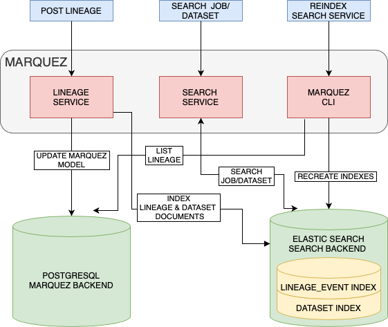

# Proposal: Search Service @ Marquez

Author(s): @pawel-big-lebowski

Created: 2022-10-20

## Overview

Extensive search capabilities is an awaited feature discussed during community meeting on September 22nd 2022
(see [meeting notes](https://wiki.lfaidata.foundation/pages/viewpage.action?pageId=18481442#MarquezCommunityMeetings&Calendar-Discussiontopics))
which lead to creating Marquez Issue [#2171](https://github.com/MarquezProject/marquez/issues/2171]).
Some of missing capabilities include: searching by job facet, content of the processed SQL, dataset field names, etc.

Current architecture of Marquez consists of Java rest service with PostgreSQL backend. This may be not sufficient
to implement such rich search capabilities. On the other hand, the simplicity of current Marquez architecture is
extremely practical as fresh install can be easily done in minutes. It requires only database backend to run.

### Why should we introduce external search backend?

It's worth asking **Why relational database backend is not enough?**. Currently, Marquez supports full text searching
based on PostgreSQL database. This has some limitations that cannot be overcome within existing stack.

 * Users want to search by anything (any table in Marquez backend database) and being able to do SQL
`LIKE` on any column of any Marquez table could be a tedious task which could kill database at the end.
 * Within current Marquez architecture it is really important to have service up and running, so that incoming lineage
events get saved in database. We don't want dummy search query to stop loading the events.
 * We cannot create TEXT index on all the text fields. Creating index on jsonb columns could be dangerous as we know the
size of such fields can be counted in megabytes.

[ElasticSearch](https://www.elastic.co) is widely used open-source search engine.
It is beneficial to have its capabilities in Marquez because:
 * It is designed to index and search JSON documents and OpenLineage events are JSONs by definition.
 * It is capable of searching by selected JSON fields or whole documents like OpenLineage event.

### Pluggable Marquez Search Engine

Some users find it extremely useful to use Marquez as UI for browsing OpenLineage events that is really
easy to install. For those, additional search service backend could be an overkill.
We still want to have an option to run Marquez without extra architecture component
which will mean limited search capabilities but with simple installation steps.

Similarly to database configuration, `yaml` configuration could contain extra section:
```
search:
  engine: [ElasticSearch, ...]
  enabled: true
  # engine specific properties
  elastic.url: http://my-elastic-cluster:9200
```

### Search Service in action

<p align="center">
  
</p>

 * Marquez CLI should be capable of indexing existing `lineage_events` table.
 * Additionally, each event will be indexed after being received by Marquez endpoint.
 * Whole events will be indexed except for `spark_plan` and `spark_unknown` fields. Extra config entry will be added to allow other facets being blacklisted from indexing.
 * Two indexes in ElasticSearch (ES) need to be created:
   * `lineage_event`: to contain whole lineage events,
   * `dataset`: to contain elements of `inputs` and `outputs`.
 * ElasticSearch returns found documents, so additional `dataset` index is required. Otherwise, when searching for
datasets, returning whole OpenLineage event would not be sufficient.
 * Whenever lineage event is received in Marquez, it is sent to ElasticSearch indexes. Keep in mind that assuring uniqueness on
Elastic side may be difficult, so in case of sending same events multiple times, Marquez will have a single copy of that (as long
as it's a single run id), but SearchService will contain duplicate entries.
 * A user sends request to `/api/v1/search` with a query specified. Additional filter may be used to specify if `dataset`, `job` or both are to be searched.
 * Current implementation returns instances of `SearchResult` class containing:
 ```
  ResultType type; // enum DATASET or JOB
  String name;
  Instant updatedAt;
  NamespaceName namespace;
  NodeId nodeId;
```
 * In order to find datasets, ES will query `dataset` index. When searching for jobs, `run` and `job` subtrees of `lineage` index will be queried.
 * A response from Search Service Backend will contain runId for jobs, and (namespace, name) tuples for datasets. `SearchResult` will
be created based on Search Service Backend response.

### Search service interface

ElasticSearch is a great example of a search service backend, but we are open to support any other
implementations. Integration of the search service backend with Marquez should rely on the following interfaces:

```java
interface SearchService {

   /**
    * Clears all indexed documents
    */
  void clear();

   /**
    * Index multiple events.
    *
    * @param events
    */
  void index(List<LineageEvent> events);

   /**
    * Index a single event.
    *
    * @param event
    */
  void index(LineageEvent event);

   /**
    * Returns all datasets and jobs that match the provided query; matching of datasets and jobs are
    * string based and case-insensitive.
    *
    * @param query Query containing pattern to match.
    * @param filter The filter to apply to the query result.
    * @param sort The sort to apply to the query result.
    * @param limit The limit to apply to the query result.
    * @return A SearchResult object.
    */
   List<SearchResult> search(String query, SearchFilter filter, SearchSort sort, int limit);
}
```

Current implementation of `SearchDao` should be renamed into `SimpleSearchDao` and used by a `SimpleSearchService`
with empty `index` methods.

----
SPDX-License-Identifier: Apache-2.0
Copyright 2018-2023 contributors to the Marquez project.
