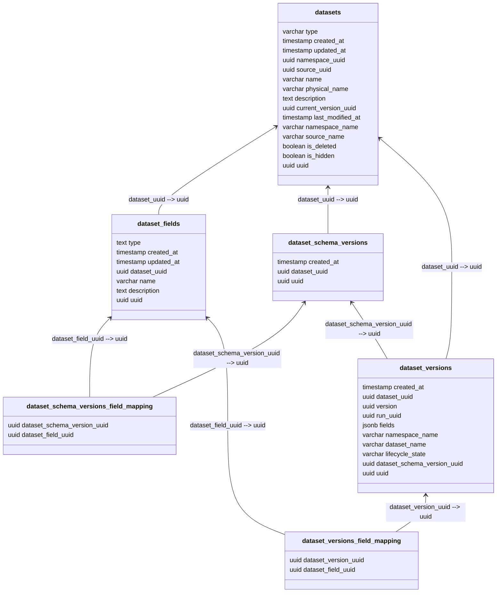

# Proposal: Version dataset schemas separately to datasets

Author(s): [@davidjgoss](https://github.com/davidjgoss)

Created: 2023-11-21

Discussion: <https://github.com/MarquezProject/marquez/issues/2676>

## Overview

Many real-world jobs have these characteristics:

- Runs very frequently
- Output dataset schema(s) change infrequently

Because of Marquez's philosophy of versioning every output dataset on every run, this means a lot of data is generated that is for all intents and purposes duplicate, in the `dataset_versions_field_mapping` table.

Taking an oversimplified example, a dataset with a stable 20-column schema that is written to by a job that runs every 10 minutes for 30 days will result in 864,000 rows in `dataset_versions_field_mapping` when arguably there are only 20 meaningful rows of data. This is regardless of how many of those columns are actually touched by the job.

A dataset must still be versioned each time it occurs as an output, since it may contain facets that relate to the state of its structure and/or data at that moment in time beyond just the schema - including column-level lineage. But the schema itself doesn't need to be re-versioned unless it has actually changed.

## Proposal

(This is not intended to alter any user-facing behaviour, only to reduce the volume and duplication at the database level.)

The concept of a "dataset schema version" is added to the model. Its content is the fields belonging to the dataset schema, in the form of a mappings to dataset fields. We'll refer to this as a "schema version" for brevity.

The first time a dataset is encountered as a job output (or, the next time after deploying this change), a schema version is created, and associated with the new dataset version. The schema version is the source of truth for fields for that dataset version when queried.

Each time that dataset is encountered as a job output thereafter, the schema is compared against the current schema version. If it is considered equal, a new schema version isn't created, and the new dataset version references the current schema version.

With the oversimplified example above, this would then result in:

- 1 row in `dataset_schema_versions`
- 20 rows in `dataset_schema_versions_field_mapping`

### Equality

Two schemas will be considered equal if they contain the same fields, as keyed by `name` and `type` - as such, a changed `description` is not considered a schema change. Order is also not significant - we would order the fields alphabetically before doing the check.

### Input datasets

When Marquez encounters a dataset as an input in an event, and the dataset already exists, it will not re-version it (as it would for an output), and thus any schema differences are merged onto the current dataset version. When we introduce dataset schema versions, we do _not_ want to modify the existing schema version in this case, as its contents should be immutable. Instead, we would create a new schema version with the amended schema, and update the dataset version to reference that schema version.

## Implementation

### Schema changes

- New table `dataset_schema_versions` added with columns:
  - `created_at` (timestamp)
  - `dataset_uuid` (fk to `datasets`)
  - `uuid` (pk)
- New table `dataset_schema_versions_field_mapping` added
  - `dataset_schema_version_uuid` (fk to `dataset_schema_versions`)
  - `dataset_field_uuid` (fk to `dataset_fields`)
- New column `dataset_schema_version_uuid` added to existing table `dataset_versions`

The diagram below shows a subset of the Marquez schema including the new tables and thematically-related tables.



Note that unlike `dataset_versions` we have not included a `version` column on the new table. Per [#2071](./2071-update-versioning.md), this concept will be recast as a `external_version` for the `dataset_versions` case, and doesn't seem useful for _this_ case.

### Phase 1 (introduction)

- Make database schema changes (above)
- Change code in these places to create or reference `dataset_schema_versions` and `dataset_schema_versions_field_mapping` as needed based on equality logic (above):
  - `DatasetVersionDao::upsertDatasetVersion` (for legacy Datasets API)
  - `OpenLineageDao::upsertLineageDataset` (for OpenLineage API)
- Include new tables in database clean and retention jobs

For the equality check, the idea is to basically `.toString()` the ordered collection of `name`+`type` pairs, generate a UUID from that with `UUID::nameUUIDFromBytes`, and use that for the primary key `dataset_schema_versions.uuid`. Then, when we encounter the dataset again, generate a new UUID the same way and search for a matching `dataset_schema_versions` row. With a targeted index this should make it fast, and also mean we can reuse _any_ schema version and not just the last one.

Once done, this will mean we are dual-writing to old and new tables, but not reading from the new ones yet.

### Phase 2 (migration)

- Add Flyway script to migrate data from `dataset_versions_field_mapping` to the new tables
- Change code to stop writing to and reading from `dataset_versions_field_mapping` in favour of `dataset_schema_versions` and `dataset_schema_versions_field_mapping`

For the migration, the pseudo-script would be:

```
foreach dataset_versions where dataset_schema_version_uuid is null
  create dataset_schema_version
  foreach dataset_versions_field_mapping
    create dataset_schema_versions_field_mapping
  set dataset_versions.dataset_schema_version_uuid
```

Once done, this will mean we are dealing only with the new tables for both writes and reads. Note that this script could be very long-running.

### Phase 3 (cleanup)

- Drop `dataset_versions_field_mapping` table

## Next Steps

Pull request for phase 1.

## License Footer

SPDX-License-Identifier: Apache-2.0
Copyright 2018-2023 contributors to the Marquez project.
