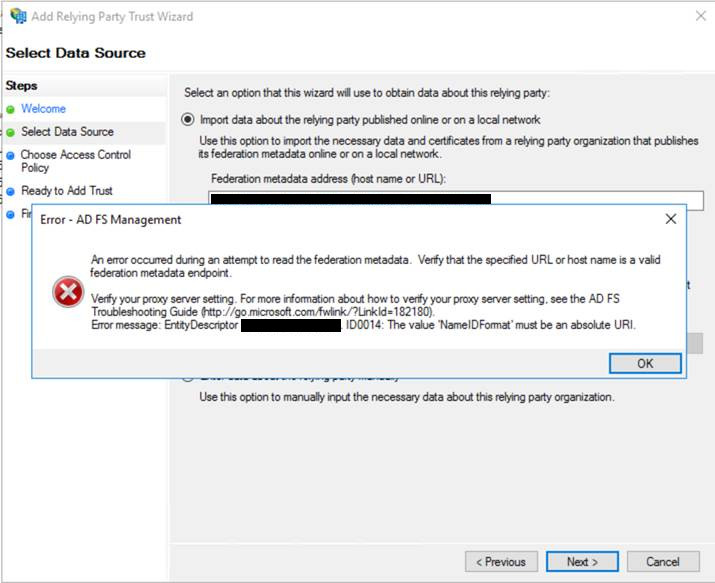

Active Directory Federation Services
====================================

This document attempts to describe a complete solution for integrating with AD FS.

# Creating a self-signed certificate

Create a folder to contain your keys and certificates.

Download [mellon_create_metadata.sh](https://github.com/UNINETT/mod_auth_mellon/blob/master/mellon_create_metadata.sh)

Create a new key, certificate and relying party XML as follows:

  ./mellon_create_metadata.sh acme_tools_com https://acme_tools.com/adfs/postResponse

## Retrieve AD FS Certificate

Use retrieve_adfs_certificate.sh to get your AD FS server's signing certificate:

  ./retrieve_adfs_certificate.sh https://adfs.acme_tools.com/ > adfs.acme_tools.com.crt

# Create Relying Party

Copy the `acme_tools_com.xml` to your AD FS server. Use the AD FS management relying party wizard to import this XML, creating a relying party. Create claim rules to pass authentication information to your application.

This example assumes you will pass in the UPN.

# Create a Passport framework

Create a separate file for passport configuration (assumed to be config/passport.js).

```javascript
var
  fs = require('fs')
  , passport = require('passport')
  , SamlStrategy = require('passport-saml').Strategy
;

passport.serializeUser(function(user, done) {
  done(null, user);
});
passport.deserializeUser(function(user, done) {
  done(null, user);
});

passport.use(new SamlStrategy(
  {
    entryPoint: 'https://adfs.acme_tools.com/adfs/ls/',
    issuer: 'acme_tools_com',
    callbackUrl: 'https://acme_tools.com/adfs/postResponse',
    privateCert: fs.readFileSync('/path/to/acme_tools_com.key', 'utf-8'),
    cert: fs.readFileSync('/path/to/adfs.acme_tools.com.crt', 'utf-8'),
  // other authn contexts are available e.g. windows single sign-on
    authnContext: 'http://schemas.microsoft.com/ws/2008/06/identity/authenticationmethod/password',
  // not sure if this is necessary?
    acceptedClockSkewMs: -1,
    identifierFormat: null,
  // this is configured under the Advanced tab in AD FS relying party
    signatureAlgorithm: 'sha256',
    RACComparison: 'exact', // default to exact RequestedAuthnContext Comparison Type
  },
  function(profile, done) {
    return done(null,
      {
        upn: profile['http://schemas.xmlsoap.org/ws/2005/05/identity/claims/upn'],
        // e.g. if you added a Group claim
        group: profile['http://schemas.xmlsoap.org/claims/Group']
    });
  }
));

module.exports = passport;
```

# Express Application

```javascript
  var passport = require('passport');
  var express = require('express');
  ... etc.

  var app = express();
  require('./config/passport.js');

  ... add the usual express pro-forma

  app.use(passport.initialize());
  app.use(passport.session());

  app.get('/login',
    passport.authenticate('saml', { failureRedirect: '/', failureFlash: true }),
    function(req, res) {
      res.redirect('https://acme_tools.com');
    }
  );
  app.post('/adfs/postResponse',
    passport.authenticate('saml', { failureRedirect: '/', failureFlash: true }),
    function(req, res) {
      res.redirect('https://acme_tools.com');
    }
  );
  app.get('/secure', validUser, routes.secure);

  function validUser(req, res, next) {
    if (!req.user) {
      res.redirect('https://acme_tools.com/login');
    }
    next();
  }

  var server = http.createServer(app);
```
# Troubleshooting

## ADFS 2016

If you are setting up an ADFS 2016 server, you might run into the following issue with the previous settings:

```
An error occurred during an attempt to read the federation metadata. Verify that the specified URL or host name is a valid federation metadata endpoint.

Verify your proxy server setting. For more information about how to verify you proxy sever setting, see the AD FS Troubleshooting Guide http://go.microsoft.com/fwlink/?LinkId=182180).
Error message: EntityDescriptor 'acme_tools_com'. ID0014: The value 'NamelDFormat' must be an absolute URI.
```



If you remove the `identifierFormat`, it works as expected.
